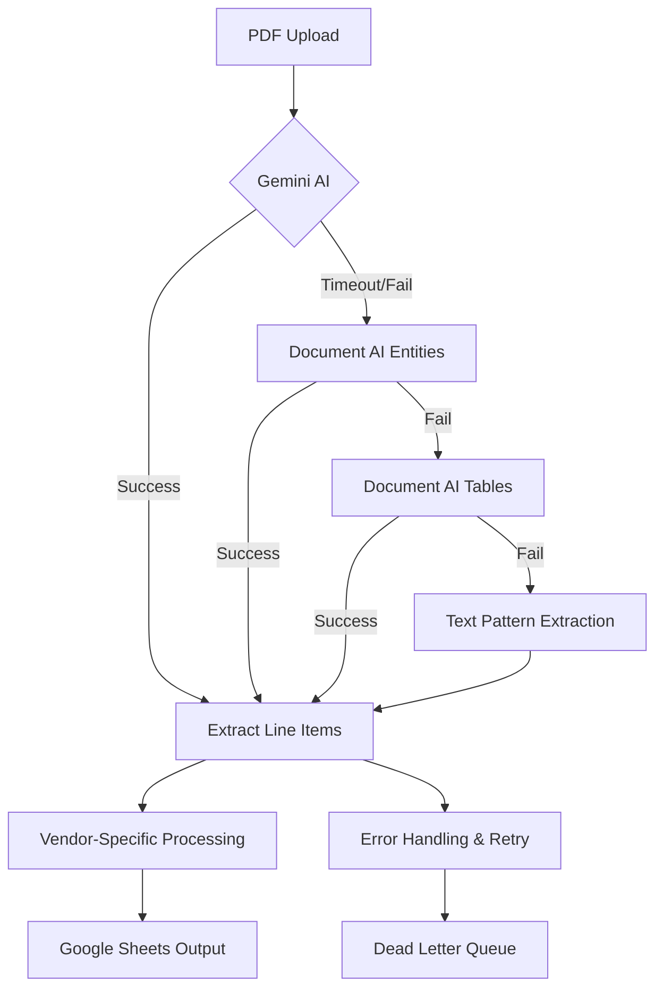

# Phase [N]: [Invoice Processing Business Goal]

## Executive Summary
**Business Objective**: [Specific invoice processing improvement]
**Success Criteria**: [Measurable accuracy, speed, and vendor coverage targets]
**Timeline**: [Duration with AI service integration milestones]
**Risk Level**: [Low|Medium|High with primary concerns]
**Resource Requirements**: [AI quotas, test data, infrastructure needs]

## Pre-Phase Checklist (Day 0 - Before Starting)

### 1. Prerequisites Validation
- [ ] Google Cloud Function environment ready
- [ ] Document AI processor configured and tested
- [ ] Google Sheets API access verified
- [ ] Test invoice datasets available for all target vendors
- [ ] Google Secret Manager configured for API keys
- [ ] Zapier webhook endpoint tested with timeout requirements

### 2. Safety & Backup Measures
```bash
# Backup current Cloud Function version
gcloud functions describe process_invoice --region=us-central1 > backup_function_config.yaml

# Export current Google Sheets data
# [Specific backup commands for current processing state]

# Create rollback deployment package
cp main.py main_backup_$(date +%Y%m%d).py
```

### 3. Risk Mitigation Setup
- [ ] Multi-tier processing fallback verified (Gemini → Document AI → Text parsing)
- [ ] Performance monitoring baseline established for current processing times
- [ ] Error handling and logging configured for AI service failures
- [ ] Manual processing workflow documented for critical failures

## Implementation Strategy

### Dependencies & Architecture



**Critical Path Analysis**:
- PDF Processing → AI Service Selection → Line Item Extraction → Vendor Pattern Application → Google Sheets Write
- **Bottlenecks**: AI service response times, Google Sheets API rate limits, large PDF processing
- **Parallel Tracks**: Vendor pattern development, test dataset creation, monitoring implementation

### Technical Integration Points
- **AI Services**: Document AI (primary), Gemini AI (when re-enabled), with timeout and retry handling
- **Google Sheets API**: Column B:G writing with rate limit management and batch operations
- **Google Secret Manager**: Secure API key storage and rotation
- **Zapier Integration**: Webhook processing with 160-second timeout compliance
- **PDF Processing**: Secure handling without file system exposure, memory management for large files

## Detailed Implementation Plan

### Phase [N].1: [Component] (Day X - Time Period)

#### Scope & Objectives
- **Primary Goal**: [Specific technical outcome]
- **Business Value**: [Processing improvement impact]  
- **Success Criteria**: [Validation requirements]

#### Implementation Steps
```bash
# Step 1: Develop and test vendor-specific patterns
python test_scripts/test_[vendor]_processing.py
python document_ai_explorer.py test_invoices/[vendor]_sample.pdf --save-json

# Step 2: Implement algorithmic extraction functions
# Add to main.py following pattern-based approach (no hardcoding)

# Step 3: Test multi-tier processing fallback
python test_scripts/test_integrated_main.py

# Step 4: Performance validation within timeout limits
python test_scripts/test_performance_validation.py
```

#### Validation & Testing
- [ ] Process 10 sample invoices with >85% accuracy
- [ ] Verify processing completes within 120 seconds (buffer for 160s limit)
- [ ] Test fallback behavior when primary AI service fails
- [ ] Validate Google Sheets output format and column alignment

#### Rollback Plan
```bash
# If this phase fails, execute:
gcloud functions deploy process_invoice --source=. --entry-point=process_invoice \
  --runtime=python312 --trigger-http --allow-unauthenticated \
  --set-env-vars="GOOGLE_CLOUD_PROJECT_ID=freckled-hen-analytics,..." \
  --timeout=540s --memory=1GiB

# Restore previous main.py version
cp main_backup_[date].py main.py
```

### Phase [N].2: [Next Component] (Day Y - Time Period)
[Same detailed structure as above]

## Quality Assurance & Testing Strategy for Invoice Processing

### Testing Levels
- **Unit Testing**: Pattern extraction functions, vendor detection algorithms, data normalization
- **Integration Testing**: Document AI service calls, Google Sheets writes, Zapier webhook processing
- **Performance Testing**: 160-second timeout compliance, large PDF handling, concurrent processing
- **Accuracy Testing**: Vendor-specific invoice processing against known ground truth datasets
- **Error Recovery Testing**: AI service failures, malformed PDFs, Google Sheets API limits

### Performance Requirements
- **Processing Time**: Standard invoice (< 5MB) in under 60 seconds, complex invoice in under 120 seconds
- **Accuracy**: >90% line item extraction accuracy for supported vendors
- **Availability**: 99.5% uptime with graceful degradation during AI service outages
- **Scalability**: Handle 100+ invoices per day with consistent performance

### Monitoring & Observability
- **Metrics to Track**: Processing success rate, accuracy by vendor, AI service response times, timeout frequency
- **Alerting Strategy**: AI service failures, processing accuracy drops below 80%, timeout increases
- **Dashboard Requirements**: Real-time processing status, vendor accuracy trends, performance metrics

## Deployment & Operations for Cloud Functions

### Deployment Strategy
- **Environment Progression**: Local testing → staging validation → production deployment
- **Feature Flags**: Vendor-specific processing toggles, AI service selection controls
- **Configuration Management**: Environment variables for all settings, no hardcoded values
- **Rollback Procedures**: Previous function version deployment, configuration rollback

### Production Readiness
- [ ] **Infrastructure**: Auto-scaling configured, memory limits appropriate, timeout settings optimized
- [ ] **Security**: Secret Manager integration, PDF processing sandboxing, input validation
- [ ] **Documentation**: Processing logic documentation, troubleshooting guides, vendor pattern explanations
- [ ] **Support**: Monitoring dashboards, error alerting, escalation procedures for processing failures

## Risk Management for Invoice Processing

### High Priority Risks
1. **[Risk Name]** (Probability: [High|Medium|Low], Impact: [High|Medium|Low])
   - **Description**: [What could go wrong]
   - **Mitigation**: [Specific preventive measures]
   - **Contingency**: [Response if risk materializes]

### External Dependencies
- **Google Cloud Document AI**: 99.9% SLA, contact via support tickets, fallback to text parsing
- **Google Sheets API**: Rate limits and quota management, retry logic, temporary local storage
- **Google Secret Manager**: API key storage, rotation procedures, fallback authentication

### Technical Debt & Trade-offs
- **Shortcuts Taken**: [Documented technical debt incurred]
- **Future Refactoring**: [Planned improvements and timeline]
- **Performance Trade-offs**: [Accepted limitations and improvement plans]

## Communication & Stakeholder Management

### Progress Reporting for Invoice Processing
- **Daily**: Processing accuracy metrics, vendor pattern development, blocker identification
- **Weekly**: Overall accuracy trends, new vendor support status, performance improvements
- **Phase Gates**: Accuracy milestone achievements, vendor coverage expansion, performance benchmarks

### Success Metrics Dashboard
- **Business KPIs**: Invoice processing time reduction, manual review reduction, accuracy improvements
- **Technical KPIs**: Processing speed, AI service success rates, error frequency, timeout compliance
- **Project KPIs**: Vendor support expansion, pattern development velocity, deployment reliability

## Post-Phase Activities

### Validation Checklist
- [ ] **Business Objectives Met**: Processing accuracy targets achieved, vendor support expanded
- [ ] **Technical Quality**: Performance within limits, error handling robust, monitoring comprehensive
- [ ] **Documentation Complete**: Pattern logic documented, troubleshooting guides updated
- [ ] **Team Knowledge Transfer**: Vendor pattern expertise distributed, debugging skills shared

### Lessons Learned & Iteration for Invoice Processing
- **What Worked Well**: Successful AI integration patterns, effective vendor detection methods
- **Process Improvements**: Pattern development workflow, testing methodology enhancements
- **Technical Insights**: AI service behavior learnings, performance optimization discoveries

### Next Phase Preparation
- **Handoff Requirements**: Clear vendor patterns documented, test datasets prepared for Senior Engineer
- **Dependency Resolution**: AI service access verified, test infrastructure prepared
- **Resource Allocation**: Development capacity for algorithm implementation, testing time allocation