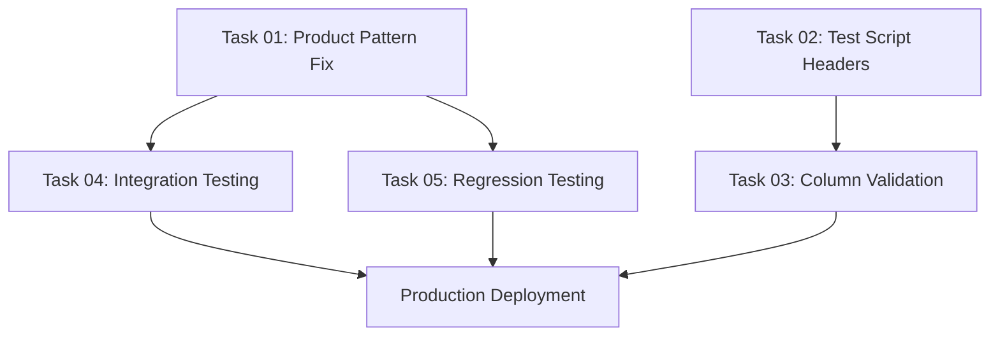

# Task 00: Phase 01 Creative-Coop Critical Fix - Summary & Coordination

## Phase Overview

This task coordination file links all atomic tasks for Phase 01: Creative-Coop Critical Column Misalignment Fix. The goal is to fix the critical P0 issue where Creative-Coop invoice CS003837319_Error 2.PDF returns 0 results instead of the expected 5+ line items.

## Root Cause Summary

**Primary Issue**: Creative-Coop uses XS-prefixed product codes (XS9826A, XS8911A, etc.) but the current product detection patterns only look for D-prefixed codes (`D[A-Z]\d{4}[A-Z]?`).

**Secondary Issue**: Test scripts include "Column A" headers but only write 6 columns of data, creating visual misalignment.

**Business Impact**: Staff are losing confidence in automation due to 0 results from Creative-Coop invoices.

## Task Dependencies & Execution Order



## Atomic Task Breakdown

### Task 01: Creative-Coop Product Code Pattern Fix ⭐ CRITICAL
**File**: `task-01-creative-coop-product-pattern-fix.md`
**Objective**: Update 5 regex patterns in main.py to support XS-prefixed codes
**Success Criteria**: CS003837319_Error 2.PDF extracts 5+ line items (currently 0)
**Dependencies**: None (can start immediately)
**Estimated Time**: 2-3 hours

**TDD Approach**:
- **RED**: Write tests showing current XS-code detection failure
- **GREEN**: Update patterns: `r"\b((?:D[A-Z]\d{4}|XS\d+)[A-Z]?)\b"`
- **REFACTOR**: Centralize patterns for maintainability

### Task 02: Test Script Column Header Fix
**File**: `task-02-test-script-column-header-fix.md`  
**Objective**: Remove "Column A" references from test scripts
**Success Criteria**: All test scripts output 6-column B:G format
**Dependencies**: None (independent of Task 01)
**Estimated Time**: 1-2 hours

**TDD Approach**:
- **RED**: Show test scripts have 7 headers but 6 data columns
- **GREEN**: Update to standardized 6-column headers
- **REFACTOR**: Create shared header constants

### Task 03: Column Alignment Validation
**File**: `task-03-column-alignment-validation.md`
**Objective**: Add proactive monitoring for column misalignment  
**Success Criteria**: Validation catches wrong column counts before Google Sheets writes
**Dependencies**: Task 02 (test script fixes)
**Estimated Time**: 2-3 hours

**TDD Approach**:
- **RED**: Show current lack of column validation
- **GREEN**: Implement validation functions with error logging
- **REFACTOR**: Integrate validation into Google Sheets write pipeline

### Task 04: Creative-Coop Integration Testing
**File**: `task-04-creative-coop-integration-testing.md`
**Objective**: End-to-end testing of Creative-Coop processing
**Success Criteria**: Comprehensive test coverage for XS-code processing
**Dependencies**: Task 01 (pattern fix must be implemented first)
**Estimated Time**: 2-3 hours

**TDD Approach**:
- **RED**: Show CS003837319_Error 2.PDF currently fails (0 items)
- **GREEN**: Verify 5+ items extracted after pattern fix
- **REFACTOR**: Create reusable test utilities

### Task 05: Regression Testing for Existing Vendors
**File**: `task-05-regression-testing-vendor-processing.md`
**Objective**: Ensure no regression in HarperCollins, OneHundred80, Rifle Paper
**Success Criteria**: All existing vendors maintain 100% accuracy
**Dependencies**: Task 01 (must test after pattern changes)
**Estimated Time**: 3-4 hours

**TDD Approach**:
- **RED**: Establish current accuracy baselines
- **GREEN**: Verify maintained accuracy after changes
- **REFACTOR**: Automated regression test suite

## Critical Success Metrics

### Primary Success Criteria
- [ ] **CS003837319_Error 2.PDF processes successfully**: 0 → 5+ line items extracted
- [ ] **XS-code detection works**: XS9826A, XS8911A, XS9649A, etc. detected
- [ ] **Column alignment fixed**: All output in proper B:G columns (6 columns)
- [ ] **No regression**: HarperCollins maintains 100% accuracy
- [ ] **Processing speed**: Completes within Zapier 160-second timeout

### Quality Assurance Requirements
- [ ] All tests pass (RED → GREEN achieved for each task)
- [ ] Code coverage ≥ 90% for modified functions
- [ ] Performance within timeout limits
- [ ] Comprehensive error handling
- [ ] Structured logging with correlation IDs

## Implementation Timeline

### Emergency Fix (Day 1)
- **Hours 1-2**: Task 01 - Product Pattern Fix
- **Hours 3-4**: Task 02 - Test Script Header Fix  
- **Hours 5-6**: Task 03 - Column Validation
- **Deploy**: Emergency deployment with critical fix

### Validation & Testing (Day 1-2)
- **Hours 7-9**: Task 04 - Integration Testing
- **Hours 10-12**: Task 05 - Regression Testing
- **Final Deploy**: Complete deployment with full validation

## Risk Mitigation

### High Priority Risks
1. **Breaking existing vendors** → Comprehensive regression testing (Task 05)
2. **Pattern fix doesn't work** → Thorough integration testing (Task 04)  
3. **Column misalignment persists** → Validation monitoring (Task 03)

### Rollback Plan
```bash
# Emergency rollback if needed
cp main_backup_$(date +%Y%m%d_%H%M%S).py main.py
gcloud functions deploy process_invoice --source=.
```

## Testing Strategy

### Test-Driven Development Requirements
- **Every task uses RED-GREEN-REFACTOR methodology**
- **Write failing tests first** (RED)
- **Implement minimal fix** (GREEN)  
- **Improve design** (REFACTOR)
- **No task is complete without comprehensive tests**

### Critical Test Requirements
- Pattern matching tests for both D-codes and XS-codes
- End-to-end Creative-Coop processing tests
- Regression tests for all existing vendors
- Column alignment validation tests
- Performance tests within timeout limits

## CRITICAL CODING PRINCIPLE Compliance

**NEVER hard-code solutions in main.py. ALWAYS find a logic method that produces the correct output.**

All pattern fixes must be:
- ✅ **Algorithmic**: Use regex patterns and logical rules
- ✅ **Reusable**: Work across different Creative-Coop invoices  
- ✅ **Pattern-based**: Extract information using pattern matching
- ❌ **NOT hardcoded**: No if/else for specific product codes

## Success Definition

This phase is successful when:

1. **Creative-Coop Processing Works**: CS003837319_Error 2.PDF extracts 5+ line items
2. **Column Alignment Fixed**: All output consistently in Google Sheets B:G columns  
3. **No Regression**: All existing vendors continue working correctly
4. **Stakeholder Confidence Restored**: Staff see immediate automation improvement
5. **Monitoring in Place**: Future issues detected proactively

**CRITICAL SUCCESS METRIC**: Staff enthusiasm for automation restored by seeing Creative-Coop invoices process correctly in properly aligned columns.

## Files Created by This Phase

### Task Files
- `.claude/tasks/pending/task-01-creative-coop-product-pattern-fix.md`
- `.claude/tasks/pending/task-02-test-script-column-header-fix.md`
- `.claude/tasks/pending/task-03-column-alignment-validation.md`
- `.claude/tasks/pending/task-04-creative-coop-integration-testing.md`
- `.claude/tasks/pending/task-05-regression-testing-vendor-processing.md`

### Test Files (To Be Created)
- `test_scripts/test_creative_coop_pattern_detection.py`
- `test_scripts/test_column_header_alignment.py`
- `test_scripts/test_column_alignment_validation.py`
- `test_scripts/test_creative_coop_integration.py`
- `test_scripts/test_vendor_processing_regression.py`

### Code Modifications
- `/Volumes/Working/Code/GoogleCloud/invoice-processor-fn/main.py` (5 regex pattern updates)
- Multiple test scripts (remove "Column A" headers)
- New validation functions and monitoring

## Next Steps

1. **Review all task files** for completeness and technical accuracy
2. **Start with Task 01** (highest priority - product pattern fix)
3. **Follow TDD methodology** strictly for each task
4. **Test thoroughly** before moving to next task
5. **Deploy incrementally** with proper rollback capability

This coordinated approach ensures the critical Creative-Coop processing issue is resolved while maintaining system reliability and preventing regression.