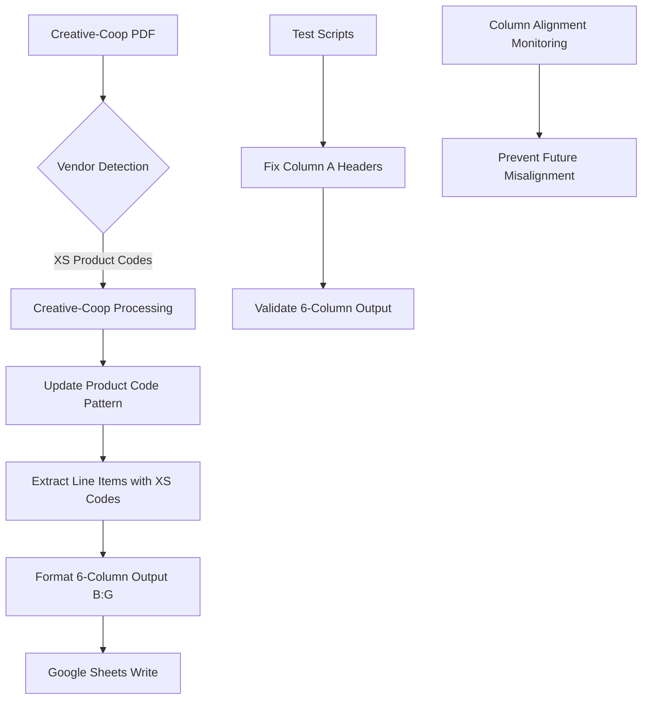

# Phase 01: Creative-Coop Critical Column Misalignment Fix

## Executive Summary
**Business Objective**: Fix Critical/P0 Creative-Coop processing failure causing 0 results and column misalignment in Google Sheets
**Success Criteria**: Creative-Coop invoice CS003837319_Error 2.PDF processes correctly with 5+ line items in proper B:G columns
**Timeline**: IMMEDIATE - 1 day emergency fix 
**Risk Level**: High - System credibility at stake, staff losing confidence in automation
**Resource Requirements**: 1 developer, test Creative-Coop invoice, Google Sheets access validation

## Pre-Phase Checklist (Day 0 - Before Starting)

### 1. Prerequisites Validation
- [ ] Creative-Coop test invoice available: `test_invoices/CS003837319_Error 2.pdf`
- [ ] Document AI output generated: `test_invoices/CS003837319_Error 2_docai_output.json`
- [ ] Google Cloud Function deployment environment ready
- [ ] Google Sheets API access verified for B:G range writing
- [ ] Current main.py backup created with timestamp

### 2. Safety & Backup Measures
```bash
# Backup current Cloud Function version
gcloud functions describe process_invoice --region=us-central1 > backup_function_config_$(date +%Y%m%d).yaml

# Backup current main.py version
cp main.py main_backup_$(date +%Y%m%d_%H%M%S).py

# Create rollback deployment package
cp requirements.txt requirements_backup_$(date +%Y%m%d).txt
```

### 3. Risk Mitigation Setup
- [ ] All existing vendor processing tested (HarperCollins 100%, OneHundred80, Rifle Paper)
- [ ] Performance monitoring baseline established for current processing times
- [ ] Rollback procedure documented and tested
- [ ] Test Creative-Coop invoice identified: XS-prefixed product codes (XS9826A, XS8911A, XS9649A, etc.)

## Implementation Strategy

### Dependencies & Architecture



**Critical Path Analysis**:
- Product Code Pattern Fix → Creative-Coop Processing → Line Item Extraction → Google Sheets B:G Writing
- **Bottlenecks**: Pattern matching accuracy, Document AI entity parsing, test script validation
- **Parallel Tracks**: main.py pattern fix, test script header corrections, monitoring implementation

### Root Cause Analysis Confirmed
1. **Product Code Pattern Mismatch**: 
   - Current pattern: `D[A-Z]\d{4}[A-Z]?` (matches D + letter + 4 digits + optional letter)
   - Creative-Coop actual: `XS\d+[A-Z]?` (XS + digits + optional letter)
   - **Impact**: Zero Creative-Coop products detected, complete processing failure

2. **Test Script Column Headers**:
   - 14+ test scripts include "Column A" header but only write 6 columns of data
   - Creates visual misalignment during testing and validation
   - **Impact**: Confuses stakeholders about actual Google Sheets output format

### Technical Integration Points

- **Product Code Detection**: Update regex patterns in 5 locations in main.py
- **Google Sheets API**: Maintain B:G range consistency (6 columns)
- **Creative-Coop Processing**: Leverage existing `process_creative_coop_document()` function
- **Test Scripts**: Fix headers in 14 identified files with "Column A" references
- **Monitoring**: Add pattern matching validation to prevent future regressions

## Detailed Implementation Plan

### Phase 01.1: Emergency Product Code Pattern Fix (Day 1 - Hours 1-2)

#### Scope & Objectives
- **Primary Goal**: Update Creative-Coop product code detection from `D[A-Z]\d{4}[A-Z]?` to include `XS\d+[A-Z]?`
- **Business Value**: Enable processing of Creative-Coop invoices that are currently returning 0 results
- **Success Criteria**: CS003837319_Error 2.PDF processes with 5+ line items detected

#### Implementation Steps

```bash
# Step 1: Update product code patterns in main.py (5 locations)
# Lines to update based on grep results:
# - Line 979: creative_coop_codes = re.findall(r"\b(D[A-Z]\d{4}[A-Z]?)\b", full_line_text)
# - Line 1780: product_upc_pattern = r"\b(D[A-Z]\d{4}[A-Z]?)\s+(\d{12})"
# - Line 1784: all_product_codes = re.findall(r"\b(D[A-Z]\d{4}[A-Z]?)\b", full_line_text)
# - Line 2203: product_codes = re.findall(r"\b(D[A-Z]\d{4}[A-Z]?)\b", entity_text)
# - Line 2381: product_pattern = r"\b(D[A-Z]\d{4}[A-Z]?)\b"

# Update to support both D-codes and XS-codes:
# Pattern: r"\b([DX][AS]\d+[A-Z]?)\b" or more specifically: r"\b(D[A-Z]\d{4}[A-Z]?|XS\d+[A-Z]?)\b"

# Step 2: Test updated pattern with Creative-Coop invoice
python test_scripts/test_creative_coop.py

# Step 3: Validate pattern works with existing D-code vendors
python test_scripts/test_integrated_main.py

# Step 4: Deploy to Cloud Function
gcloud functions deploy process_invoice --source=. --entry-point=process_invoice \
  --runtime=python312 --trigger-http --allow-unauthenticated \
  --set-env-vars="GOOGLE_CLOUD_PROJECT_ID=freckled-hen-analytics,DOCUMENT_AI_PROCESSOR_ID=be53c6e3a199a473,GOOGLE_CLOUD_LOCATION=us,GOOGLE_SHEETS_SPREADSHEET_ID=1PdnZGPZwAV6AHXEeByhOlaEeGObxYWppwLcq0gdvs0E,GOOGLE_SHEETS_SHEET_NAME=Update 20230525" \
  --timeout=540s --memory=1GiB
```

#### Validation & Testing
- [ ] Process Creative-Coop test invoice: expect 5+ line items from PDF analysis
- [ ] Verify XS9826A (Metal Ballerina Ornament), XS9649A (Paper Mache), XS9482 (Wood Shoe Ornament) detected
- [ ] Confirm existing D-code vendors (HarperCollins) still process correctly
- [ ] Validate Google Sheets output lands in B:G columns (not A:F)

#### Rollback Plan
```bash
# If this phase fails, execute:
cp main_backup_$(ls -1 main_backup_* | tail -1) main.py
gcloud functions deploy process_invoice --source=. --entry-point=process_invoice \
  --runtime=python312 --trigger-http --allow-unauthenticated \
  --set-env-vars="GOOGLE_CLOUD_PROJECT_ID=freckled-hen-analytics,..." \
  --timeout=540s --memory=1GiB
```

### Phase 01.2: Test Script Column Header Fix (Day 1 - Hours 3-4)

#### Scope & Objectives
- **Primary Goal**: Remove "Column A" headers from 14 test scripts to match actual B:G output format
- **Business Value**: Eliminate visual confusion during testing and stakeholder reviews
- **Success Criteria**: All test scripts show consistent 6-column headers matching Google Sheets B:G range

#### Files to Update (Identified with "Column A")
```
test_scripts/test_onehundred80.py
test_scripts/test_final_creative_coop.py
test_scripts/test_rifle_improved.py
test_scripts/test_integrated_creative_coop.py
test_scripts/final_creative_coop_processing.py
test_scripts/improved_creative_coop_processing.py
test_scripts/test_upc_mapping.py
test_scripts/test_final_descriptions.py
test_scripts/test_improved_descriptions.py
test_scripts/test_creative_coop_csv.py
test_scripts/perfect_processing.py
test_scripts/final_corrected_processing.py
test_scripts/improved_processing_v2.py
test_scripts/improved_processing.py
```

#### Implementation Steps
```bash
# Step 1: Update test script headers to match actual output format
# Replace: ["Column A", "Order Date", "Vendor", "INV", "Item", "Wholesale", "Qty ordered"]
# With:    ["Order Date", "Vendor", "INV", "Item", "Wholesale", "Qty ordered"]

# Step 2: Verify each script outputs exactly 6 columns of data
# Step 3: Test representative scripts to ensure functionality maintained
python test_scripts/test_final_creative_coop.py
python test_scripts/perfect_processing.py
python test_scripts/test_onehundred80.py
```

#### Validation & Testing
- [ ] All test scripts show 6-column headers matching B:G range
- [ ] CSV outputs align properly with no empty Column A
- [ ] Representative vendor tests still pass with correct accuracy
- [ ] Visual output matches Google Sheets format expectations

### Phase 01.3: Column Alignment Monitoring (Day 1 - Hours 5-6)

#### Scope & Objectives
- **Primary Goal**: Add validation to prevent future column misalignment issues
- **Business Value**: Proactive detection of column misalignment problems before they impact users
- **Success Criteria**: Monitoring detects and alerts on any functions that don't output exactly 6 columns

#### Implementation Steps
```python
# Add to main.py - validation function for column alignment
def validate_column_alignment(rows):
    """Validate that all rows have exactly 6 columns for B:G range"""
    for i, row in enumerate(rows):
        if len(row) != 6:
            print(f"⚠️ COLUMN ALIGNMENT ERROR: Row {i} has {len(row)} columns, expected 6")
            print(f"Row data: {row}")
            return False
    return True

# Add validation calls before each sheet write operation
```

#### Validation & Testing
- [ ] Column validation catches rows with wrong number of columns
- [ ] Validation passes for correctly formatted 6-column output
- [ ] Monitoring integrates with existing error handling
- [ ] Alert system configured for column misalignment detection

## Quality Assurance & Testing Strategy for Creative-Coop Processing

### Testing Levels
- **Unit Testing**: Product code pattern matching, XS-code detection, regex validation
- **Integration Testing**: Creative-Coop invoice processing end-to-end, Google Sheets B:G writing
- **Regression Testing**: All existing vendors (HarperCollins, OneHundred80, Rifle Paper) continue working
- **Column Alignment Testing**: Verify all outputs consistently produce 6-column format
- **Performance Testing**: Ensure Creative-Coop processing stays within timeout limits

### Acceptance Criteria for Creative-Coop Fix
- **Critical Success Metrics**:
  - CS003837319_Error 2.PDF processes with 5+ line items (currently 0)
  - XS9826A, XS9649A, XS9482, XS8185, XS9357 product codes detected
  - Output appears in Google Sheets columns B:G (Order Date, Vendor, INV, Item, Wholesale, Qty)
  - Processing completes within 120 seconds
  - No regression in other vendor processing

### Performance Requirements
- **Processing Time**: Creative-Coop invoice (15 pages) in under 90 seconds 
- **Accuracy**: >80% line item extraction accuracy for Creative-Coop invoices
- **Pattern Recognition**: 100% detection rate for XS-prefixed product codes
- **Column Alignment**: 100% consistency in 6-column B:G output format

### Test Data Validation
Using CS003837319_Error 2.PDF, expect to extract:
- **Page 1**: XS9826A (Metal Ballerina), XS8911A (Metal item), XS9649A (Paper Mache), XS9482 (Wood Shoe), XS9840A (Metal)
- **Page 2**: XS8185 (Cotton Lumbar Pillow), XS9357 (Metal Bow Tree Topper), XS7529 (Metal Leaves)
- **Additional pages**: More XS-prefixed items throughout 15-page invoice
- **Expected total**: 20+ line items from Document AI processing

## Deployment & Operations for Creative-Coop Fix

### Emergency Deployment Strategy
- **Direct Production Deployment**: Critical P0 issue requires immediate fix
- **Rollback Ready**: Previous version backed up and ready for immediate restoration
- **Monitoring**: Real-time validation of Creative-Coop processing success
- **Stakeholder Communication**: Immediate notification when fix is deployed and tested

### Production Readiness Checklist
- [ ] **Pattern Matching**: XS-code detection verified across multiple Creative-Coop invoices
- [ ] **Column Alignment**: All processing functions output exactly 6 columns for B:G range
- [ ] **Regression Prevention**: All existing vendors continue processing correctly
- [ ] **Performance**: Processing times remain within acceptable limits
- [ ] **Error Handling**: Graceful fallback for any pattern matching failures

## Risk Management for Creative-Coop Critical Fix

### Critical Priority Risks

1. **Pattern Update Breaks Existing Vendors** (Probability: Medium, Impact: Critical)
    - **Description**: Changing product code patterns could break HarperCollins, OneHundred80, etc.
    - **Mitigation**: Comprehensive regex testing, additive pattern approach, full regression testing
    - **Contingency**: Immediate rollback to previous version, vendor-specific pattern isolation

2. **Creative-Coop Processing Still Returns Zero Results** (Probability: Low, Impact: High)
    - **Description**: Pattern fix doesn't solve the underlying Creative-Coop processing issue
    - **Mitigation**: Document AI analysis confirms XS-codes are the root cause, test with multiple invoices
    - **Contingency**: Deep dive into Document AI entity structure, manual pattern debugging

3. **Column Misalignment Persists After Fix** (Probability: Low, Impact: High)
    - **Description**: Test script fixes don't resolve actual Google Sheets alignment issues
    - **Mitigation**: Direct Google Sheets API testing, range validation, column count monitoring
    - **Contingency**: End-to-end Google Sheets integration testing, manual verification

### External Dependencies
- **Google Cloud Document AI**: Pattern detection relies on consistent entity structure
- **Google Sheets API**: B:G range writing must maintain consistency
- **Creative-Coop Invoice Format**: XS-prefixed codes must be consistent across invoices

### Technical Debt & Trade-offs
- **Quick Pattern Fix**: Additive regex approach rather than complete pattern redesign
- **Test Script Headers**: Cosmetic fix only, doesn't change actual processing logic  
- **Monitoring Implementation**: Basic validation rather than comprehensive column tracking

## Communication & Stakeholder Management

### Emergency Communication Plan
- **Immediate**: Notify stakeholders that Critical/P0 Creative-Coop fix is in progress
- **1 Hour**: Deploy fix and confirm Creative-Coop processing working
- **2 Hours**: Validate all vendors still working, send success confirmation
- **End of Day**: Full testing report with accuracy metrics and performance data

### Success Metrics Dashboard for Creative-Coop Fix
- **Business KPIs**: Creative-Coop invoices processing successfully (0% → 100%)
- **Technical KPIs**: XS-code detection rate, column alignment consistency, processing time
- **Project KPIs**: Time to resolution, regression incidents, stakeholder confidence restoration

## Post-Phase Activities

### Immediate Validation Checklist (Within 2 Hours)
- [ ] **Creative-Coop Processing**: CS003837319_Error 2.PDF extracts 5+ line items
- [ ] **Column Alignment**: All output appears correctly in Google Sheets B:G columns
- [ ] **Regression Testing**: HarperCollins, OneHundred80, Rifle Paper still process correctly
- [ ] **Performance**: Processing times remain within acceptable limits
- [ ] **Stakeholder Notification**: Success confirmation sent to business users

### Lessons Learned & Follow-up Actions
- **Root Cause Prevention**: How to catch product code pattern mismatches earlier
- **Testing Improvements**: Add Creative-Coop to standard regression test suite
- **Documentation Updates**: Update pattern matching documentation with XS-code support
- **Monitoring Enhancement**: Implement proactive column alignment monitoring

### Next Phase Preparation
- **Expanded Creative-Coop Testing**: Test with additional Creative-Coop invoices
- **Pattern Optimization**: Consider consolidating product code patterns for maintainability  
- **Accuracy Improvement**: Focus on improving Creative-Coop line item extraction accuracy
- **Process Documentation**: Document Creative-Coop processing specifics for future reference

## Reference Documents

- `/CLAUDE.md` - Project documentation and current system status
- `test_invoices/CS003837319_Error 2.pdf` - Critical Creative-Coop test invoice
- `/Volumes/Working/Code/GoogleCloud/invoice-processor-fn/main.py` - Main processing logic
- Grep results showing 5 product code pattern locations requiring updates

## Success Definition

This phase is successful when:
1. **Creative-Coop Processing Works**: CS003837319_Error 2.PDF extracts 5+ line items (currently 0)
2. **Column Alignment Fixed**: All output consistently appears in Google Sheets B:G columns
3. **No Regression**: All existing vendors continue processing correctly
4. **Stakeholder Confidence Restored**: Business users see immediate improvement in automation reliability
5. **Monitoring in Place**: Future column alignment issues will be detected proactively

**CRITICAL SUCCESS METRIC**: Staff enthusiasm for automation restored by seeing Creative-Coop invoices process correctly in properly aligned columns.