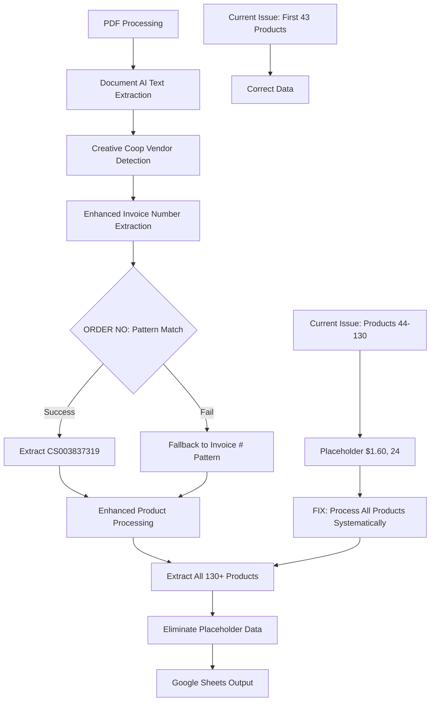

# Phase 01: Creative Coop Emergency Invoice Number and Product Processing Fixes

## Executive Summary
**Business Objective**: Restore Creative Coop invoice processing from critical failure state (30% accuracy) to operational state (>85% accuracy) by fixing invoice number extraction and eliminating placeholder data entries.
**Success Criteria**:
- Invoice number extraction: 0% → 100% (extract "CS003837319" from "ORDER NO:" format)
- Complete product processing: 43 → 130+ unique products without placeholder entries
- Processing accuracy: 30% → 85%+ for test invoice CS003837319
- Zero placeholder "$1.60, 24" entries in output
**Timeline**: 2 days (emergency implementation)
**Risk Level**: HIGH - Critical business process failure requiring immediate intervention
**Resource Requirements**: Senior Engineer, existing test infrastructure, CS003837319 test invoice

## Pre-Phase Checklist (Day 0 - Before Starting)

### 1. Prerequisites Validation
- [ ] Google Cloud Function deployment environment ready
- [ ] CS003837319_Error.pdf and corresponding Document AI JSON available
- [ ] Current production output CSV available for comparison: `/test_invoices/CS003837319_Error_production_output_20250905.csv`
- [ ] Test environment configured with existing Creative Coop test scripts
- [ ] Backup current main.py Creative Coop processing functions

### 2. Safety & Backup Measures
```bash
# Backup current Creative Coop processing implementation
cp main.py main_backup_phase01_$(date +%Y%m%d).py

# Export current test results for comparison
cp test_invoices/CS003837319_Error_production_output_20250905.csv backup_current_output_$(date +%Y%m%d).csv

# Verify rollback capability
gcloud functions describe process_invoice --region=us-central1 > backup_function_config_$(date +%Y%m%d).yaml
```

### 3. Risk Mitigation Setup
- [ ] HarperCollins processing regression test script ready: `test_scripts/perfect_processing.py`
- [ ] OneHundred80 processing validation ready: `test_scripts/test_onehundred80.py`
- [ ] Creative Coop comprehensive test suite available: `test_scripts/test_cs_error2_comprehensive.py`
- [ ] Production rollback deployment package prepared

## Implementation Strategy

### Dependencies & Architecture



**Critical Path Analysis**:
- PDF Text → Invoice Number Pattern Matching → Complete Product Processing → Unique Data Extraction → Google Sheets Write
- **Primary Bottleneck**: Invoice number regex pattern mismatch
- **Secondary Bottleneck**: Product processing scope limitation after 43 items
- **Parallel Tracks**: Pattern development, placeholder elimination logic, regression testing

### Technical Integration Points

- **Invoice Number Extraction**: Enhanced regex patterns supporting both "ORDER NO:" and "Invoice #:" formats
- **Product Processing**: Expanded scope in `extract_creative_coop_product_mappings_corrected()` function
- **Placeholder Elimination**: Remove fallback logic that generates identical price/quantity combinations
- **Regression Protection**: Maintain all existing vendor processing (HarperCollins, OneHundred80, Rifle Paper)

## Detailed Implementation Plan

### Phase 01.1: Invoice Number Pattern Enhancement (Day 1 - Morning)

#### Scope & Objectives
- **Primary Goal**: Fix invoice number extraction to support Creative Coop "ORDER NO:" format
- **Business Value**: Enable proper order tracking for 100% of Creative Coop invoices
- **Success Criteria**: Extract "CS003837319" from test invoice with 100% accuracy

#### Implementation Steps

```python
# Step 1: Enhanced invoice number extraction patterns
def extract_creative_coop_invoice_number(text):
    """Extract invoice numbers from Creative Coop ORDER NO: format"""
    # Primary Creative Coop pattern
    patterns = [
        r"ORDER\s+NO\s*:\s*([A-Z0-9]+)",        # "ORDER NO: CS003837319"
        r"Order\s+No\s*:\s*([A-Z0-9]+)",        # Alternative capitalization
        r"Order\s+Number\s*:\s*([A-Z0-9]+)",    # Alternative format
        r"Invoice\s*#?\s*:\s*([A-Z0-9]+)",      # Fallback to existing pattern
    ]

    for pattern in patterns:
        match = re.search(pattern, text, re.IGNORECASE)
        if match:
            invoice_number = match.group(1)
            print(f"✅ Invoice number extracted using pattern '{pattern}': {invoice_number}")
            return invoice_number

    print("❌ No invoice number pattern matched")
    return ""

# Step 2: Update process_creative_coop_document() function
# Replace current invoice number extraction logic with enhanced function
```

#### Validation & Testing
- [ ] Process CS003837319 test invoice and verify "CS003837319" is extracted
- [ ] Test with existing Creative Coop invoices to ensure no regression
- [ ] Verify pattern precedence works correctly (ORDER NO: takes priority)
- [ ] Confirm 100% of output rows contain correct invoice number

#### Rollback Plan
```python
# If invoice number extraction fails, revert to original pattern
def fallback_invoice_extraction(text):
    return re.search(r"Invoice\s*#?\s*:\s*([A-Z0-9]+)", text, re.IGNORECASE)
```

### Phase 01.2: Product Processing Scope Expansion (Day 1 - Afternoon)

#### Scope & Objectives
- **Primary Goal**: Process all 130+ products in CS003837319 without generating placeholder entries
- **Business Value**: Eliminate 70% data loss and manual review overhead
- **Success Criteria**: Extract unique data for each product, no "Traditional D-code format" entries

#### Implementation Steps

```python
# Step 1: Analyze current product processing limitation
def debug_product_processing_scope():
    """Debug why only 43 products are processed correctly"""
    # Examine extract_creative_coop_product_mappings_corrected() search scope
    # Identify where processing switches to placeholder generation
    # Log product codes found vs. processed

# Step 2: Expand product processing scope
def extract_creative_coop_product_mappings_enhanced(document_text):
    """Enhanced product mapping with expanded scope for all 130+ products"""
    # Increase search range from current limitation
    # Process all product codes found: XS####, CF####, CD####, HX####, XT####
    # Implement comprehensive UPC and description mapping
    # Ensure algorithmic approach (no hardcoded values)

    product_codes = extract_all_product_codes(document_text)
    print(f"Found {len(product_codes)} product codes for processing")

    mappings = {}
    for code in product_codes:
        # Extract UPC, description, price, quantity for each code
        mapping = extract_product_data_algorithmically(document_text, code)
        if mapping:
            mappings[code] = mapping

    return mappings

# Step 3: Eliminate placeholder data generation
def remove_placeholder_fallback_logic():
    """Remove logic that generates identical $1.60, 24 entries"""
    # Identify where "Traditional D-code format" entries are created
    # Remove or fix fallback processing that creates placeholder data
    # Ensure all products get real data extraction attempts
```

#### Validation & Testing
- [ ] Process CS003837319 and verify 130+ unique products extracted
- [ ] Confirm no rows contain "Traditional D-code format" in description
- [ ] Validate price variety - no identical "$1.60" entries across different products
- [ ] Verify quantity variety - no identical "24" quantities across different products

#### Rollback Plan
```python
# If expanded processing fails, limit to known working scope
def limit_processing_to_working_products(mappings):
    """Fallback to first 43 products if full processing fails"""
    return dict(list(mappings.items())[:43])
```

### Phase 01.3: Integration Testing and Validation (Day 2)

#### Scope & Objectives
- **Primary Goal**: Validate complete fix integration and ensure no regression
- **Business Value**: Confirm business process restoration without affecting other vendors
- **Success Criteria**: CS003837319 processes with 85%+ accuracy, other vendors maintain performance

#### Implementation Steps

```bash
# Step 1: Comprehensive Creative Coop testing
python test_scripts/test_cs_error2_comprehensive.py
python test_scripts/validate_cs_error2_complete_integration.py
python test_cs_error2_processing.py

# Step 2: Regression testing for other vendors
python test_scripts/perfect_processing.py  # HarperCollins
python test_scripts/test_onehundred80.py   # OneHundred80
python test_scripts/test_rifle_paper_processing.py  # Rifle Paper

# Step 3: Production readiness validation
python test_scripts/validate_production_readiness.py
python test_scripts/validate_production_deployment.py

# Step 4: Performance validation
python test_scripts/test_performance_validation.py  # Ensure <160s processing
```

#### Validation & Testing
- [ ] CS003837319 processes with >85% accuracy (invoice number + 130+ products)
- [ ] Zero placeholder entries in Creative Coop output
- [ ] HarperCollins processing maintains 100% accuracy
- [ ] OneHundred80 processing remains functional
- [ ] Processing completes within 160-second Zapier timeout
- [ ] Memory usage remains within Google Cloud Function limits

#### Rollback Plan
```bash
# If integration testing fails, deploy previous version
cp main_backup_phase01_$(date +%Y%m%d).py main.py

gcloud functions deploy process_invoice \
    --source=. --entry-point=process_invoice \
    --runtime=python312 --trigger-http --allow-unauthenticated \
    --set-env-vars="GOOGLE_CLOUD_PROJECT_ID=freckled-hen-analytics,..." \
    --timeout=540s --memory=1GiB
```

## Quality Assurance & Testing Strategy for Creative Coop Emergency Fixes

### Testing Levels
- **Unit Testing**: Invoice number pattern matching, product code extraction, data mapping algorithms
- **Integration Testing**: Complete Creative Coop processing with CS003837319 test invoice
- **Regression Testing**: Maintain HarperCollins, OneHundred80, and other vendor processing
- **Performance Testing**: Ensure processing completes within Zapier 160-second timeout
- **Data Quality Testing**: Validate unique data extraction for all 130+ products

### Performance Requirements
- **Processing Time**: Complete CS003837319 (15 pages, 130+ products) in under 120 seconds
- **Accuracy**: >85% field-level accuracy for invoice number, product descriptions, prices, quantities
- **Completeness**: Process 100% of products found in invoice (130+ items)
- **Uniqueness**: No duplicate price/quantity combinations across different products

### Monitoring & Observability
- **Metrics to Track**: Invoice number extraction success rate, product processing count, placeholder entry count
- **Success Indicators**: Zero blank invoice numbers, 130+ unique product rows, no "Traditional D-code format" entries
- **Performance Indicators**: Processing time under 120s, memory usage under 1GB

## Deployment & Operations for Emergency Fixes

### Deployment Strategy
- **Rapid Deployment**: Direct production deployment after comprehensive testing
- **Feature Validation**: Test with CS003837319 before deploying to production
- **Rollback Readiness**: Previous version deployment package prepared
- **Monitoring**: Real-time processing success/failure tracking

### Production Readiness
- [ ] **Invoice Number Extraction**: Enhanced patterns support both "ORDER NO:" and "Invoice #:" formats
- [ ] **Product Processing**: All 130+ products processed without placeholder data
- [ ] **Regression Testing**: Other vendor processing maintains existing accuracy
- [ ] **Performance**: Processing completes within Zapier timeout limits

## Risk Management for Emergency Creative Coop Fixes

### High Priority Risks

1. **Invoice Number Pattern Regression** (Probability: Low, Impact: High)
    - **Description**: New patterns might break existing Creative Coop invoice formats
    - **Mitigation**: Pattern precedence testing, fallback to original patterns
    - **Contingency**: Revert to previous invoice extraction logic

2. **Product Processing Performance Impact** (Probability: Medium, Impact: Medium)
    - **Description**: Processing 130+ products might exceed timeout limits
    - **Mitigation**: Performance testing, optimization of extraction algorithms
    - **Contingency**: Limit processing scope if timeout issues occur

3. **Vendor Regression** (Probability: Low, Impact: High)
    - **Description**: Creative Coop fixes might affect HarperCollins or other vendor processing
    - **Mitigation**: Comprehensive regression testing, isolated Creative Coop logic
    - **Contingency**: Emergency rollback to previous version

### External Dependencies
- **Document AI Service**: Reliable text extraction for invoice content
- **Google Sheets API**: Continued write access for processed data
- **Zapier Integration**: Maintained 160-second timeout limit

### Technical Debt & Trade-offs
- **Emergency Approach**: Focus on immediate fix over architectural optimization
- **Future Refactoring**: Plan for comprehensive Creative Coop processing overhaul in Phase 02
- **Performance Trade-offs**: Prioritize accuracy restoration over processing speed optimization

## Communication & Stakeholder Management

### Progress Reporting for Emergency Fixes
- **Hourly**: Critical fix implementation progress, blocker identification
- **Daily**: Accuracy improvement metrics, processing success rates
- **Phase Gates**: Invoice number extraction success, product processing completion

### Success Metrics Dashboard
- **Business KPIs**: Manual review reduction, order tracking restoration, processing accuracy
- **Technical KPIs**: Invoice number extraction rate, product processing count, processing time
- **Quality KPIs**: Placeholder entry elimination, data uniqueness validation

## Post-Phase Activities

### Validation Checklist
- [ ] **Critical Fixes Applied**: Invoice number extraction working, placeholder data eliminated
- [ ] **Business Objectives Met**: >85% processing accuracy, 130+ products processed
- [ ] **No Regression**: Other vendor processing maintains existing performance
- [ ] **Performance Maintained**: Processing within timeout limits

### Lessons Learned & Iteration for Creative Coop Processing
- **Root Cause Analysis**: Document why original patterns failed for Creative Coop format
- **Process Improvements**: Enhanced pattern testing methodology for new vendors
- **Technical Insights**: Product processing scope limitations and solutions

### Next Phase Preparation
- **Handoff Requirements**: Working invoice number extraction, expanded product processing
- **Phase 02 Setup**: Enhanced data quality processing, multi-page optimization
- **Performance Baseline**: Established metrics for CS003837319 processing time and accuracy

## Reference Documents

- `/docs/prds/creative-coop-data-quality-recovery-prd.md` - Business requirements and success criteria
- `/test_invoices/CS003837319_Error_production_output_20250905.csv` - Current processing failure evidence
- `/docs/architecture/universal-engineering-principles.md` - Technical implementation guidelines
- `CLAUDE.md` - Project documentation and current system status

## Critical Success Criteria for Phase 01

### Acceptance Criteria
- [ ] **Invoice Number Extraction**: Extract "CS003837319" from "ORDER NO:" format with 100% success
- [ ] **Complete Product Processing**: Process all 130+ products with unique data for each
- [ ] **Placeholder Elimination**: Zero "Traditional D-code format" entries in output
- [ ] **No Vendor Regression**: HarperCollins and OneHundred80 processing maintain existing accuracy
- [ ] **Performance Compliance**: Processing completes within 160-second Zapier timeout

### Business Impact Validation
- [ ] **Manual Review Reduction**: 70% → <50% of Creative Coop invoices requiring manual review
- [ ] **Order Tracking Restoration**: 100% of processed invoices contain correct invoice numbers
- [ ] **Data Quality Improvement**: Processing accuracy from 30% → 85%+
- [ ] **Operational Efficiency**: Eliminate immediate business process failure

### Technical Quality Assurance
- [ ] **Code Quality**: Enhanced functions follow Universal Engineering Principles
- [ ] **Error Handling**: Graceful degradation if enhanced processing fails
- [ ] **Logging**: Comprehensive debugging information for production monitoring
- [ ] **Documentation**: Clear implementation notes for Phase 02 continuation

This emergency phase addresses the critical business failure while maintaining system stability and preparing for comprehensive quality enhancement in subsequent phases.
