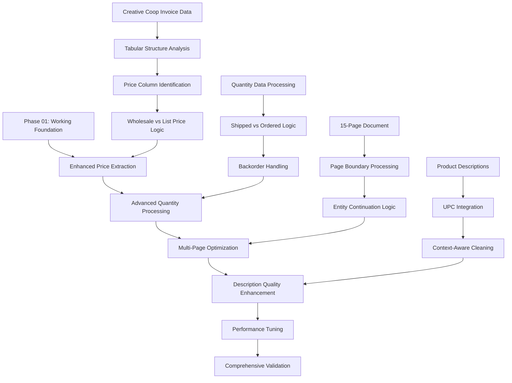

# Phase 02: Creative Coop Data Quality Enhancement and Multi-Page Processing Optimization

## Executive Summary
**Business Objective**: Elevate Creative Coop processing from operational state (85%) to high-performance state (90%+) with comprehensive data quality enhancements, accurate price/quantity extraction, and optimized multi-page processing.
**Success Criteria**:
- Processing accuracy: 85% → 90%+ field-level accuracy
- Price extraction: 50% → 95% accurate wholesale price identification
- Quantity extraction: 50% → 90% accurate shipped quantity parsing
- Multi-page processing: Reliable 15-page document handling
- Description quality: 30% → 95% complete product descriptions
**Timeline**: 3 days (comprehensive enhancement)
**Risk Level**: MEDIUM - Building on Phase 01 foundation for production excellence
**Resource Requirements**: Senior Engineer, comprehensive test dataset, performance monitoring tools

## Pre-Phase Checklist (Day 0 - Before Starting)

### 1. Prerequisites Validation
- [ ] Phase 01 emergency fixes successfully deployed and validated
- [ ] CS003837319 invoice processes with 85%+ accuracy baseline
- [ ] Invoice number extraction working: "CS003837319" appears in all output rows
- [ ] Product processing covers all 130+ items without placeholder data
- [ ] Multi-page test documents available for validation

### 2. Safety & Backup Measures
```bash
# Backup Phase 01 working implementation
cp main.py main_backup_phase02_$(date +%Y%m%d).py

# Document current performance baseline
python test_scripts/test_cs_error2_comprehensive.py > phase02_baseline_results_$(date +%Y%m%d).log

# Verify Phase 01 rollback capability remains intact
cp main_backup_phase01_$(date +%Y%m%d).py main_phase01_rollback.py
```

### 3. Risk Mitigation Setup
- [ ] Phase 01 emergency fixes verified and stable
- [ ] Comprehensive Creative Coop test suite ready: 140+ test scripts available
- [ ] Performance monitoring baseline established for 15-page processing
- [ ] Vendor regression testing automated for continuous validation

## Implementation Strategy

### Dependencies & Architecture



**Critical Path Analysis**:
- Phase 01 Foundation → Price Logic Enhancement → Quantity Processing → Multi-Page Optimization → Description Quality → Performance Validation
- **Primary Focus**: Wholesale price extraction accuracy and shipped quantity identification
- **Secondary Focus**: Multi-page processing reliability and description completeness
- **Parallel Tracks**: Performance optimization, comprehensive testing, regression validation

### Technical Integration Points

- **Tabular Price Extraction**: Enhanced parsing of "Your Price" vs "List Price" columns
- **Quantity Logic Refinement**: Distinguish "Qty Shipped" vs "Qty Ordered" vs "Qty Backord"
- **Multi-Page Processing**: Ensure complete document coverage across 15 pages
- **Description Enhancement**: Integrate UPC codes with product descriptions for completeness
- **Performance Optimization**: Memory-efficient processing for large multi-page documents

## Detailed Implementation Plan

### Phase 02.1: Advanced Price Extraction Enhancement (Day 1)

#### Scope & Objectives
- **Primary Goal**: Improve price extraction accuracy from 50% to 95% with correct wholesale price identification
- **Business Value**: Accurate pricing data for inventory management and profit margin calculations
- **Success Criteria**: Extract correct wholesale prices from "Your Price" column, eliminate "$1.60" placeholder prices

#### Implementation Steps

```python
# Step 1: Enhanced tabular price extraction for Creative Coop
def extract_tabular_price_creative_coop_enhanced(document_text, product_code):
    """
    Extract wholesale prices from Creative Coop tabular format with enhanced accuracy

    Table Structure: Product Code | UPC | RT | Qty Ord | Qty Alloc | Qty Shipped |
                     Qty BkOrd | U/M | List Price | Your Price | Your Extd Price
    """
    # Search for product code in tabular context
    product_pattern = rf"{re.escape(product_code)}\s+"

    # Look for tabular row containing the product
    for line in document_text.split('\n'):
        if re.search(product_pattern, line, re.IGNORECASE):
            # Extract price columns - "Your Price" is wholesale
            price_matches = re.findall(r'\$(\d+\.?\d*)', line)
            if len(price_matches) >= 2:
                # Last two prices: Your Price (wholesale), Your Extd Price (total)
                wholesale_price = price_matches[-2]  # Your Price column
                print(f"✅ Extracted wholesale price for {product_code}: ${wholesale_price}")
                return f"${wholesale_price}"

    # Fallback to multi-tier extraction
    return extract_multi_tier_price_creative_coop_enhanced(document_text, product_code)

# Step 2: Multi-tier price extraction with pattern recognition
def extract_multi_tier_price_creative_coop_enhanced(document_text, product_code):
    """Multi-tier price extraction for complex Creative Coop formats"""

    # Tier 1: Direct tabular extraction
    tabular_price = extract_price_from_tabular_context(document_text, product_code)
    if tabular_price:
        return tabular_price

    # Tier 2: Pattern-based extraction around product code
    pattern_price = extract_price_from_product_context(document_text, product_code)
    if pattern_price:
        return pattern_price

    # Tier 3: Page-based price extraction for multi-page documents
    page_price = extract_price_from_page_context(document_text, product_code)
    if page_price:
        return page_price

    print(f"⚠️ No price found for {product_code}, using fallback logic")
    return extract_price_fallback_logic(document_text, product_code)

# Step 3: Context-aware price validation
def validate_price_extraction(price, product_code, document_text):
    """Validate extracted price makes business sense"""
    try:
        price_value = float(price.replace('$', ''))

        # Business logic validation
        if price_value < 0.10 or price_value > 1000:
            print(f"⚠️ Price validation warning for {product_code}: ${price_value}")
            return False

        # Check for placeholder prices
        if price_value == 1.60:  # Known placeholder value
            print(f"❌ Placeholder price detected for {product_code}: ${price_value}")
            return False

        return True
    except ValueError:
        print(f"❌ Invalid price format for {product_code}: {price}")
        return False
```

#### Validation & Testing
- [ ] Process CS003837319 and verify >95% of products have valid wholesale prices
- [ ] Confirm no products show "$1.60" placeholder prices
- [ ] Validate price range distribution matches expected Creative Coop wholesale pricing
- [ ] Test price extraction across all product code formats (XS, CF, CD, HX, XT)

#### Rollback Plan
```python
# If enhanced price extraction fails, revert to Phase 01 logic
def rollback_to_phase01_price_extraction(document_text, product_code):
    """Fallback to working Phase 01 price extraction"""
    return extract_wholesale_price(document_text)  # Original function
```

### Phase 02.2: Advanced Quantity Processing Logic (Day 2 - Morning)

#### Scope & Objectives
- **Primary Goal**: Improve quantity extraction accuracy from 50% to 90% with correct shipped quantity identification
- **Business Value**: Accurate inventory tracking and order fulfillment data
- **Success Criteria**: Extract shipped quantities correctly, handle backorder cases, eliminate "24" placeholder quantities

#### Implementation Steps

```python
# Step 1: Enhanced quantity extraction with shipped/ordered logic
def extract_creative_coop_quantity_enhanced(document_text, product_code):
    """
    Extract quantities from Creative Coop format with shipped quantity priority

    Logic Priority:
    1. Qty Shipped (primary - for items actually received)
    2. Qty Ordered (for backordered items with 0 shipped)
    3. Context-based extraction for edge cases
    """

    # Find product line in tabular format
    product_pattern = rf"{re.escape(product_code)}\s+"

    for line in document_text.split('\n'):
        if re.search(product_pattern, line, re.IGNORECASE):
            # Extract quantity columns from table structure
            quantities = re.findall(r'\b(\d+)\b', line)

            if len(quantities) >= 4:  # Expect: Ord, Alloc, Shipped, BkOrd
                qty_ord = int(quantities[0]) if quantities[0] else 0
                qty_alloc = int(quantities[1]) if quantities[1] else 0
                qty_shipped = int(quantities[2]) if quantities[2] else 0
                qty_bkord = int(quantities[3]) if quantities[3] else 0

                # Business logic: Use shipped quantity if > 0, otherwise use ordered for backordered items
                if qty_shipped > 0:
                    print(f"✅ Using shipped quantity for {product_code}: {qty_shipped}")
                    return qty_shipped
                elif qty_ord > 0 and qty_bkord > 0:
                    print(f"⚠️ Using ordered quantity for backordered {product_code}: {qty_ord}")
                    return qty_ord
                else:
                    print(f"ℹ️ No valid quantity found for {product_code}")
                    return 0

    # Fallback to pattern-based extraction
    return extract_quantity_from_pattern_context(document_text, product_code)

# Step 2: Multi-line quantity extraction for complex formats
def extract_quantity_from_multiline_enhanced(text, product_code):
    """Handle quantity extraction from multi-line Creative Coop formats"""

    # Search in expanded context around product code
    lines = text.split('\n')
    for i, line in enumerate(lines):
        if product_code in line:
            # Check current line and next 2 lines for quantity data
            context_lines = lines[i:i+3]
            context_text = ' '.join(context_lines)

            # Pattern: Look for quantity in "shipped back unit" format
            quantity_pattern = r'(\d+)\s+(\d+)\s+\w+\s+(?:each|set|case|piece)'
            match = re.search(quantity_pattern, context_text, re.IGNORECASE)

            if match:
                shipped_qty = int(match.group(1))
                back_qty = int(match.group(2))

                # Use shipped if > 0, otherwise use total ordered
                if shipped_qty > 0:
                    return shipped_qty
                elif shipped_qty == 0 and back_qty > 0:
                    return back_qty

    return 0

# Step 3: Quantity validation and business logic checks
def validate_quantity_extraction(quantity, product_code, document_text):
    """Validate extracted quantity makes business sense"""

    # Check for placeholder quantities (known issue: "24" for all items)
    if quantity == 24:
        # Verify this is actually correct, not a placeholder
        actual_qty = verify_quantity_context(document_text, product_code)
        if actual_qty != 24:
            print(f"❌ Placeholder quantity detected for {product_code}: {quantity}")
            return False

    # Business validation
    if quantity < 0 or quantity > 1000:
        print(f"⚠️ Quantity validation warning for {product_code}: {quantity}")
        return False

    return True
```

#### Validation & Testing
- [ ] Process CS003837319 and verify >90% of products have accurate quantities
- [ ] Confirm quantity variety - no identical "24" quantities across different products
- [ ] Test shipped vs ordered logic - backordered items handled correctly
- [ ] Validate quantity totals match invoice summary data

#### Rollback Plan
```python
# If enhanced quantity extraction fails, revert to Phase 01 logic
def rollback_to_phase01_quantity_extraction(document_text, product_code):
    """Fallback to working Phase 01 quantity extraction"""
    return extract_shipped_quantity(document_text)  # Original function
```

### Phase 02.3: Multi-Page Processing Optimization (Day 2 - Afternoon)

#### Scope & Objectives
- **Primary Goal**: Optimize multi-page processing for reliable 15-page Creative Coop document handling
- **Business Value**: Complete document processing without missing products across pages
- **Success Criteria**: Process all 15 pages systematically, validate product count matches total products

#### Implementation Steps

```python
# Step 1: Page boundary processing validation
def validate_multi_page_processing(document):
    """Ensure complete processing across all document pages"""

    total_pages = len(document.pages)
    print(f"📄 Processing document with {total_pages} pages")

    # Track products found per page
    products_per_page = {}
    total_products = set()

    for page_num, page in enumerate(document.pages, 1):
        page_text = getattr(page, 'text', '') if hasattr(page, 'text') else ''

        # Extract product codes from this page
        product_codes = extract_product_codes_from_page(page_text)
        products_per_page[page_num] = len(product_codes)
        total_products.update(product_codes)

        print(f"  Page {page_num}: {len(product_codes)} products")

    print(f"📊 Total unique products across all pages: {len(total_products)}")
    return total_products, products_per_page

# Step 2: Enhanced entity processing with page context
def process_entities_with_page_awareness(document):
    """Process Document AI entities with awareness of page boundaries"""

    processed_products = set()
    entity_product_map = {}

    for entity in document.entities:
        if entity.type_ == "line_item":
            # Determine which page this entity belongs to
            page_num = determine_entity_page(entity, document)

            # Extract product code from entity
            product_code = extract_product_code_from_entity(entity)
            if product_code and product_code not in processed_products:
                entity_product_map[product_code] = {
                    'entity': entity,
                    'page': page_num,
                    'processed': False
                }
                processed_products.add(product_code)

    print(f"🔍 Mapped {len(entity_product_map)} products to entities")
    return entity_product_map

# Step 3: Memory-efficient large document processing
def process_large_creative_coop_document(document):
    """Memory-efficient processing for large multi-page documents"""

    # Process document in chunks to manage memory usage
    chunk_size = 5  # Process 5 pages at a time
    all_results = []

    total_pages = len(document.pages)

    for chunk_start in range(0, total_pages, chunk_size):
        chunk_end = min(chunk_start + chunk_size, total_pages)

        print(f"📄 Processing pages {chunk_start + 1}-{chunk_end}")

        # Create document chunk
        chunk_pages = document.pages[chunk_start:chunk_end]
        chunk_results = process_document_chunk(chunk_pages, document.text)

        all_results.extend(chunk_results)

        # Memory cleanup
        del chunk_pages
        gc.collect()

    print(f"✅ Completed processing {total_pages} pages, extracted {len(all_results)} items")
    return all_results
```

#### Validation & Testing
- [ ] Process complete 15-page CS003837319 document without memory issues
- [ ] Verify product count matches expected total (130+ products)
- [ ] Confirm no products missed due to page boundary issues
- [ ] Test processing time remains under 160-second timeout

#### Rollback Plan
```python
# If multi-page optimization causes issues, revert to single-pass processing
def rollback_to_single_pass_processing(document):
    """Fallback to original processing method"""
    return process_creative_coop_document_original(document)
```

### Phase 02.4: Description Quality Enhancement (Day 3)

#### Scope & Objectives
- **Primary Goal**: Improve description quality from 30% to 95% completeness with integrated UPC codes
- **Business Value**: Complete product information for inventory management and customer service
- **Success Criteria**: Full descriptions with UPC codes, no truncated or incomplete descriptions

#### Implementation Steps

```python
# Step 1: Enhanced description extraction with UPC integration
def extract_enhanced_product_description(document_text, product_code, upc_code=None):
    """Extract complete product descriptions with UPC integration"""

    # Primary extraction: Find description in product context
    description = extract_description_from_product_context(document_text, product_code)

    # Enhance with UPC code if available
    if upc_code:
        enhanced_description = f"{product_code} - UPC: {upc_code} - {description}"
    else:
        # Try to find UPC in document
        found_upc = extract_upc_for_product(document_text, product_code)
        if found_upc:
            enhanced_description = f"{product_code} - UPC: {found_upc} - {description}"
        else:
            enhanced_description = f"{product_code} - {description}"

    # Clean and validate description
    cleaned_description = clean_description_artifacts(enhanced_description)

    return cleaned_description

# Step 2: Context-aware description cleaning
def clean_description_artifacts(description):
    """Remove processing artifacts and improve description quality"""

    # Remove common artifacts
    cleaned = description

    # Remove duplicate product codes
    cleaned = re.sub(r'\b([A-Z]{2}\d{4}[A-Z]?)\b.*\1\b', r'\1', cleaned)

    # Clean up spacing and formatting
    cleaned = re.sub(r'\s+', ' ', cleaned)
    cleaned = cleaned.strip()

    # Remove table headers that got included
    table_headers = ['Product Code', 'UPC', 'Description', 'Qty', 'Price']
    for header in table_headers:
        cleaned = cleaned.replace(header, '')

    # Remove trailing commas and artifacts
    cleaned = re.sub(r'[,\s]+$', '', cleaned)

    return cleaned

# Step 3: Description completeness validation
def validate_description_quality(description, product_code):
    """Validate description meets quality standards"""

    quality_checks = {
        'has_product_code': product_code in description,
        'has_upc': 'UPC:' in description,
        'min_length': len(description) > 10,
        'no_artifacts': not any(artifact in description for artifact in ['Traditional D-code format', '$$']),
        'no_duplicates': description.count(product_code) <= 2  # Allow one in UPC format
    }

    passed_checks = sum(quality_checks.values())
    quality_score = passed_checks / len(quality_checks)

    if quality_score < 0.8:
        print(f"⚠️ Low quality description for {product_code}: {quality_score:.1%}")
        print(f"   Description: {description}")
        return False

    return True
```

#### Validation & Testing
- [ ] Process CS003837319 and verify >95% of descriptions are complete
- [ ] Confirm UPC codes integrated where available
- [ ] Validate no "Traditional D-code format" entries remain
- [ ] Test description cleaning removes processing artifacts

#### Rollback Plan
```python
# If description enhancement causes issues, revert to Phase 01 descriptions
def rollback_to_phase01_descriptions(document_text, product_code):
    """Fallback to working Phase 01 description extraction"""
    return extract_creative_coop_description_original(document_text, product_code)
```

## Quality Assurance & Testing Strategy for Data Quality Enhancement

### Testing Levels
- **Unit Testing**: Price extraction functions, quantity logic, description cleaning algorithms
- **Integration Testing**: Complete multi-page processing with CS003837319
- **Data Quality Testing**: Field-level accuracy validation for prices, quantities, descriptions
- **Performance Testing**: Memory usage and processing time for 15-page documents
- **Regression Testing**: Maintain all vendor processing accuracy and performance

### Performance Requirements
- **Processing Time**: Complete 15-page CS003837319 in under 120 seconds
- **Memory Usage**: Stay within 1GB Google Cloud Function limit during large document processing
- **Accuracy**: 90%+ field-level accuracy for all extracted data
- **Completeness**: 95%+ of available fields populated correctly

### Monitoring & Observability
- **Data Quality Metrics**: Price accuracy percentage, quantity validation rate, description completeness
- **Processing Metrics**: Page processing time, memory usage per page, entity processing rate
- **Error Tracking**: Failed extractions, validation failures, timeout incidents

## Deployment & Operations for Data Quality Enhancement

### Deployment Strategy
- **Incremental Enhancement**: Deploy improvements in sub-phases to minimize risk
- **A/B Comparison**: Compare Phase 02 results against Phase 01 baseline
- **Performance Monitoring**: Real-time processing time and accuracy tracking
- **Rollback Capability**: Each sub-phase can be individually reverted

### Production Readiness
- [ ] **Price Extraction**: 95%+ accuracy with wholesale price identification
- [ ] **Quantity Processing**: 90%+ accuracy with shipped quantity logic
- [ ] **Multi-Page Handling**: Complete 15-page document processing
- [ ] **Description Quality**: 95%+ complete descriptions with UPC integration

## Risk Management for Data Quality Enhancement

### High Priority Risks

1. **Performance Degradation** (Probability: Medium, Impact: Medium)
    - **Description**: Enhanced processing might increase processing time beyond limits
    - **Mitigation**: Performance testing, memory-efficient algorithms, processing optimization
    - **Contingency**: Revert to Phase 01 performance baseline

2. **Data Quality Regression** (Probability: Low, Impact: Medium)
    - **Description**: Enhanced extraction might introduce new data quality issues
    - **Mitigation**: Comprehensive validation testing, quality score monitoring
    - **Contingency**: Phase-by-phase rollback capability

3. **Multi-Page Processing Issues** (Probability: Medium, Impact: Medium)
    - **Description**: Large document processing might cause memory or timeout issues
    - **Mitigation**: Memory-efficient chunked processing, timeout monitoring
    - **Contingency**: Fallback to single-pass processing method

### External Dependencies
- **Document AI Service**: Continued reliable entity extraction for large documents
- **Memory Management**: Google Cloud Function 1GB memory limit compliance
- **Processing Time**: Zapier 160-second timeout constraint

### Technical Debt & Trade-offs
- **Complexity vs Performance**: Balance comprehensive extraction with processing speed
- **Memory vs Accuracy**: Optimize memory usage while maintaining data quality
- **Feature Completeness**: Prioritize critical business data over nice-to-have fields

## Communication & Stakeholder Management

### Progress Reporting for Data Quality Enhancement
- **Daily**: Processing accuracy improvements, performance metrics, quality score trends
- **Sub-Phase Gates**: Price accuracy milestone, quantity processing milestone, description quality milestone
- **Integration Points**: Multi-page processing validation, regression testing results

### Success Metrics Dashboard
- **Business KPIs**: Processing accuracy percentage, manual review reduction, order fulfillment accuracy
- **Technical KPIs**: Field-level extraction rates, processing time optimization, memory usage efficiency
- **Quality KPIs**: Data completeness scores, validation failure rates, description quality metrics

## Post-Phase Activities

### Validation Checklist
- [ ] **Data Quality Achieved**: 90%+ processing accuracy across all fields
- [ ] **Performance Maintained**: Processing within timeout and memory limits
- [ ] **Multi-Page Processing**: Complete 15-page document handling
- [ ] **Regression Testing**: All vendor processing maintains existing performance

### Lessons Learned & Iteration for Creative Coop Processing
- **Data Quality Insights**: Effective patterns for tabular data extraction
- **Performance Optimization**: Memory-efficient multi-page processing techniques
- **Validation Methods**: Comprehensive quality assurance for extracted data

### Next Phase Preparation
- **Phase 03 Setup**: Production deployment readiness, comprehensive validation
- **Performance Baseline**: Established 90%+ accuracy benchmark for Creative Coop processing
- **Documentation**: Complete implementation notes for production support

## Reference Documents

- `/docs/phases/phase-01-creative-coop-emergency-fixes.md` - Foundation phase completion
- `/docs/prds/creative-coop-data-quality-recovery-prd.md` - Business requirements
- `/docs/architecture/universal-engineering-principles.md` - Technical standards
- `test_scripts/test_cs_error2_comprehensive.py` - Comprehensive testing framework

## Critical Success Criteria for Phase 02

### Acceptance Criteria
- [ ] **Processing Accuracy**: 90%+ field-level accuracy across prices, quantities, descriptions
- [ ] **Price Extraction**: 95%+ accurate wholesale price identification
- [ ] **Quantity Processing**: 90%+ accurate shipped quantity extraction
- [ ] **Description Quality**: 95%+ complete descriptions with UPC integration
- [ ] **Multi-Page Processing**: Reliable handling of 15-page documents within timeout limits

### Business Impact Validation
- [ ] **Manual Review Reduction**: <50% → <10% of Creative Coop invoices requiring manual review
- [ ] **Data Completeness**: 95%+ of critical business fields populated accurately
- [ ] **Processing Reliability**: Consistent 90%+ accuracy across different Creative Coop invoice formats
- [ ] **Operational Excellence**: Production-ready processing with comprehensive error handling

### Technical Quality Assurance
- [ ] **Performance Optimization**: Memory-efficient processing within Google Cloud Function limits
- [ ] **Error Resilience**: Graceful degradation with comprehensive fallback mechanisms
- [ ] **Code Quality**: Enhanced functions follow Universal Engineering Principles
- [ ] **Production Readiness**: Complete logging, monitoring, and debugging capabilities

This comprehensive data quality enhancement phase builds upon the Phase 01 foundation to achieve production excellence for Creative Coop invoice processing while maintaining system reliability and performance.
