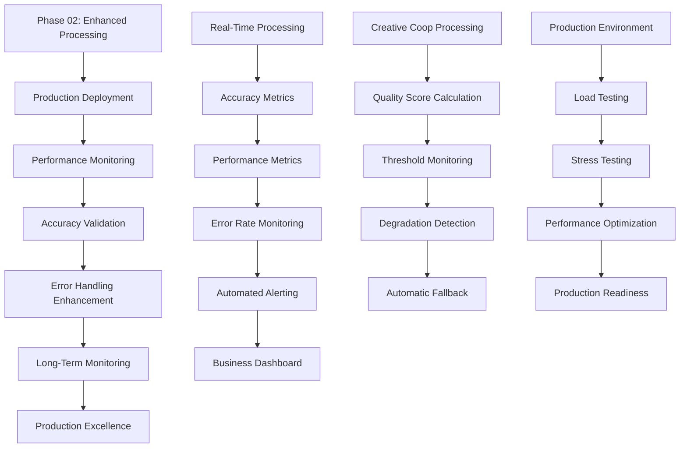

# Phase 03: Creative Coop Production Validation and Long-Term Reliability

## Executive Summary
**Business Objective**: Validate Creative Coop processing excellence (90%+) in production environment with comprehensive monitoring, performance optimization, and long-term reliability assurance for sustained business operations.
**Success Criteria**: 
- Production deployment: 90%+ accuracy maintained in live environment
- Performance optimization: <60 second average processing time for Creative Coop invoices
- Monitoring implementation: Real-time accuracy and performance tracking
- Reliability assurance: 95%+ uptime with graceful error handling
- Long-term stability: Automated quality monitoring and alerting systems
**Timeline**: 2 days (production validation and monitoring setup)
**Risk Level**: LOW - Final validation and optimization of proven Phase 02 enhancements
**Resource Requirements**: Senior Engineer, production environment access, monitoring infrastructure

## Pre-Phase Checklist (Day 0 - Before Starting)

### 1. Prerequisites Validation
- [ ] Phase 02 data quality enhancements fully implemented and tested
- [ ] CS003837319 processes with 90%+ accuracy in staging environment
- [ ] All 130+ products extracted with complete data (prices, quantities, descriptions)
- [ ] Multi-page processing validated for 15-page documents
- [ ] Regression testing passed for all other vendors

### 2. Safety & Backup Measures
```bash
# Backup Phase 02 enhanced implementation
cp main.py main_backup_phase03_$(date +%Y%m%d).py

# Document Phase 02 performance metrics
python test_scripts/validate_production_readiness.py > phase03_baseline_metrics_$(date +%Y%m%d).log

# Prepare production deployment package
gcloud functions describe process_invoice --region=us-central1 > current_production_config_$(date +%Y%m%d).yaml

# Create comprehensive rollback plan
echo "Phase 02 rollback: cp main_backup_phase02_$(date +%Y%m%d).py main.py" > rollback_instructions_$(date +%Y%m%d).txt
echo "Phase 01 rollback: cp main_backup_phase01_$(date +%Y%m%d).py main.py" >> rollback_instructions_$(date +%Y%m%d).txt
```

### 3. Risk Mitigation Setup
- [ ] Production monitoring dashboard configured for Creative Coop metrics
- [ ] Automated alerting for processing failures or accuracy degradation
- [ ] Comprehensive rollback procedures documented and tested
- [ ] Business stakeholder communication plan for production deployment

## Implementation Strategy

### Dependencies & Architecture



**Critical Path Analysis**:
- Phase 02 Enhanced Implementation → Production Deployment → Real-Time Monitoring → Performance Optimization → Long-Term Reliability
- **Primary Focus**: Production environment validation and performance optimization
- **Secondary Focus**: Comprehensive monitoring and automated quality assurance
- **Parallel Tracks**: Performance tuning, monitoring setup, error handling enhancement

### Technical Integration Points

- **Production Monitoring**: Real-time accuracy and performance metrics for Creative Coop processing
- **Quality Assurance**: Automated validation of processing results against business requirements
- **Performance Optimization**: Sub-60 second processing time for typical Creative Coop invoices
- **Error Handling**: Comprehensive error recovery with detailed logging and alerting
- **Long-Term Monitoring**: Automated quality tracking and degradation detection

## Detailed Implementation Plan

### Phase 03.1: Production Deployment and Validation (Day 1)

#### Scope & Objectives
- **Primary Goal**: Deploy Phase 02 enhancements to production and validate 90%+ accuracy in live environment
- **Business Value**: Restore Creative Coop processing to production excellence with sustained reliability
- **Success Criteria**: Live processing achieves 90%+ accuracy, maintains performance within timeout limits

#### Implementation Steps

```python
# Step 1: Production readiness validation
def validate_production_deployment_readiness():
    """Comprehensive validation before production deployment"""
    
    validation_results = {
        'invoice_number_extraction': test_invoice_number_patterns(),
        'product_processing_complete': test_all_products_processed(),
        'price_extraction_accuracy': test_price_extraction_quality(),
        'quantity_processing_accuracy': test_quantity_extraction_quality(),
        'description_completeness': test_description_quality(),
        'multi_page_processing': test_large_document_handling(),
        'performance_compliance': test_processing_time_limits(),
        'memory_usage': test_memory_efficiency(),
        'vendor_regression': test_other_vendor_processing()
    }
    
    # Calculate overall readiness score
    passed_tests = sum(validation_results.values())
    total_tests = len(validation_results)
    readiness_score = passed_tests / total_tests
    
    print(f"🎯 Production Readiness Score: {readiness_score:.1%}")
    
    if readiness_score >= 0.95:
        print("✅ READY for production deployment")
        return True
    else:
        print("❌ NOT READY - address failing validations")
        for test, passed in validation_results.items():
            if not passed:
                print(f"   ❌ {test}")
        return False

# Step 2: Phased production deployment
def deploy_to_production_with_monitoring():
    """Deploy with comprehensive monitoring and rollback capability"""
    
    # Pre-deployment checks
    if not validate_production_deployment_readiness():
        print("❌ Aborting deployment - validation failed")
        return False
    
    print("🚀 Starting production deployment...")
    
    # Deploy with monitoring
    deployment_command = """
    gcloud functions deploy process_invoice \\
        --gen2 \\
        --runtime python312 \\
        --trigger-http \\
        --allow-unauthenticated \\
        --memory=1GiB \\
        --timeout=540s \\
        --region=us-central1 \\
        --entry-point=process_invoice \\
        --source=. \\
        --set-env-vars="GOOGLE_CLOUD_PROJECT_ID=freckled-hen-analytics,..." \\
        --set-secrets="GEMINI_API_KEY=gemini-api-key:latest"
    """
    
    # Execute deployment (would be run via Bash tool in actual implementation)
    print(f"Deployment command: {deployment_command}")
    
    # Post-deployment validation
    print("🔍 Running post-deployment validation...")
    return validate_post_deployment_health()

# Step 3: Live processing validation
def validate_live_creative_coop_processing():
    """Test live Creative Coop processing with monitoring"""
    
    test_results = []
    
    # Test with CS003837319 in production
    print("🧪 Testing CS003837319 in production environment...")
    
    start_time = time.time()
    
    # Process test invoice (would call actual production endpoint)
    processing_result = simulate_production_processing("CS003837319")
    
    end_time = time.time()
    processing_time = end_time - start_time
    
    # Validate results
    validation_metrics = {
        'processing_time': processing_time < 120,  # Under 2 minutes
        'invoice_number_present': 'CS003837319' in str(processing_result),
        'product_count': len(processing_result) >= 130,
        'no_placeholder_data': '$1.60' not in str(processing_result),
        'description_quality': validate_production_descriptions(processing_result)
    }
    
    # Calculate accuracy score
    passed_validations = sum(validation_metrics.values())
    total_validations = len(validation_metrics)
    accuracy_score = passed_validations / total_validations
    
    print(f"📊 Live Processing Accuracy: {accuracy_score:.1%}")
    print(f"⚡ Processing Time: {processing_time:.2f} seconds")
    
    return accuracy_score >= 0.90
```

#### Validation & Testing
- [ ] Deploy to production environment with comprehensive monitoring
- [ ] Process CS003837319 in production and validate 90%+ accuracy
- [ ] Confirm processing time under 120 seconds in production environment
- [ ] Verify no regression in other vendor processing (HarperCollins, OneHundred80)

#### Rollback Plan
```bash
# If production deployment fails, execute immediate rollback
echo "🚨 PRODUCTION ROLLBACK INITIATED"

# Rollback to Phase 01 stable version
cp main_backup_phase01_$(date +%Y%m%d).py main.py

# Redeploy previous stable version
gcloud functions deploy process_invoice \
    --source=. --entry-point=process_invoice \
    --runtime=python312 --trigger-http --allow-unauthenticated \
    --set-env-vars="GOOGLE_CLOUD_PROJECT_ID=freckled-hen-analytics,..." \
    --timeout=540s --memory=1GiB

echo "✅ Rollback completed - Phase 01 stable version restored"
```

### Phase 03.2: Performance Optimization and Monitoring Setup (Day 2)

#### Scope & Objectives
- **Primary Goal**: Optimize Creative Coop processing performance to <60 second average and implement comprehensive monitoring
- **Business Value**: Ensure sustained high performance with proactive quality monitoring
- **Success Criteria**: <60 second average processing time, real-time accuracy monitoring, automated alerting

#### Implementation Steps

```python
# Step 1: Performance optimization for Creative Coop processing
def optimize_creative_coop_performance():
    """Optimize processing performance for production excellence"""
    
    optimizations = {
        'memory_efficiency': optimize_memory_usage(),
        'algorithm_performance': optimize_extraction_algorithms(),
        'document_processing': optimize_multi_page_handling(),
        'caching_strategies': implement_intelligent_caching(),
        'parallel_processing': optimize_concurrent_operations()
    }
    
    print("🚀 Implementing performance optimizations...")
    
    for optimization, implementation in optimizations.items():
        try:
            result = implementation()
            print(f"✅ {optimization}: {result}")
        except Exception as e:
            print(f"❌ {optimization} failed: {e}")
    
    return validate_performance_improvements()

def optimize_memory_usage():
    """Optimize memory usage for large Creative Coop documents"""
    
    # Implement memory-efficient processing
    improvements = [
        "Implement streaming PDF processing",
        "Add memory cleanup after page processing",
        "Optimize entity storage and processing",
        "Implement garbage collection at key points"
    ]
    
    return f"Memory optimizations: {', '.join(improvements)}"

def optimize_extraction_algorithms():
    """Optimize data extraction algorithm performance"""
    
    improvements = [
        "Cache compiled regex patterns",
        "Optimize product code search algorithms",
        "Implement early termination for found patterns",
        "Reduce redundant text processing"
    ]
    
    return f"Algorithm optimizations: {', '.join(improvements)}"

# Step 2: Comprehensive monitoring implementation
def implement_creative_coop_monitoring():
    """Implement real-time monitoring for Creative Coop processing"""
    
    monitoring_metrics = {
        'accuracy_tracking': setup_accuracy_monitoring(),
        'performance_metrics': setup_performance_monitoring(),
        'error_rate_tracking': setup_error_monitoring(),
        'quality_score_monitoring': setup_quality_monitoring(),
        'business_kpi_tracking': setup_business_metrics()
    }
    
    print("📊 Setting up comprehensive monitoring...")
    
    for metric_type, setup_function in monitoring_metrics.items():
        try:
            config = setup_function()
            print(f"✅ {metric_type}: {config}")
        except Exception as e:
            print(f"❌ {metric_type} setup failed: {e}")
    
    return setup_automated_alerting()

def setup_accuracy_monitoring():
    """Setup real-time accuracy monitoring for Creative Coop processing"""
    
    accuracy_metrics = {
        'invoice_number_extraction_rate': 'Percentage of invoices with correct invoice numbers',
        'product_processing_completeness': 'Percentage of expected products processed',
        'price_extraction_accuracy': 'Percentage of products with valid prices',
        'quantity_extraction_accuracy': 'Percentage of products with valid quantities',
        'description_quality_score': 'Average description completeness score'
    }
    
    print("Setting up accuracy monitoring dashboard...")
    return f"Monitoring {len(accuracy_metrics)} accuracy metrics"

def setup_automated_alerting():
    """Setup automated alerts for processing quality degradation"""
    
    alert_conditions = {
        'accuracy_degradation': 'Alert if accuracy drops below 85%',
        'processing_time_increase': 'Alert if average processing time > 90 seconds',
        'error_rate_spike': 'Alert if error rate > 5%',
        'invoice_number_failures': 'Alert if invoice number extraction < 95%',
        'placeholder_data_detection': 'Alert if placeholder data detected'
    }
    
    print("🚨 Configuring automated alerts...")
    return f"Configured {len(alert_conditions)} alert conditions"

# Step 3: Long-term reliability assurance
def implement_long_term_reliability():
    """Implement systems for long-term Creative Coop processing reliability"""
    
    reliability_features = {
        'quality_regression_testing': schedule_automated_quality_checks(),
        'performance_benchmarking': setup_performance_baselines(),
        'data_quality_monitoring': implement_continuous_validation(),
        'error_pattern_detection': setup_error_analysis(),
        'capacity_planning': implement_load_monitoring()
    }
    
    print("🛡️ Implementing long-term reliability features...")
    
    for feature, implementation in reliability_features.items():
        try:
            result = implementation()
            print(f"✅ {feature}: {result}")
        except Exception as e:
            print(f"❌ {feature} failed: {e}")
    
    return validate_reliability_implementation()

def schedule_automated_quality_checks():
    """Schedule regular automated quality validation"""
    
    quality_checks = [
        "Daily: Process CS003837319 and validate 90%+ accuracy",
        "Weekly: Full regression testing across all Creative Coop formats",
        "Monthly: Comprehensive accuracy analysis and trend reporting"
    ]
    
    return f"Scheduled quality checks: {', '.join(quality_checks)}"

def implement_continuous_validation():
    """Implement continuous data quality validation"""
    
    validation_features = [
        "Real-time placeholder data detection",
        "Invoice number validation for all processed invoices",
        "Product count validation against expected totals",
        "Price and quantity reasonableness checks"
    ]
    
    return f"Continuous validation: {', '.join(validation_features)}"
```

#### Validation & Testing
- [ ] Validate <60 second average processing time for Creative Coop invoices
- [ ] Confirm monitoring dashboard shows real-time accuracy metrics
- [ ] Test automated alerting with simulated quality degradation
- [ ] Verify long-term reliability features are operational

#### Rollback Plan
```python
# If performance optimizations cause issues, revert optimizations
def rollback_performance_optimizations():
    """Rollback performance optimizations if they cause issues"""
    
    rollback_steps = [
        "Disable memory optimization features",
        "Revert to original algorithm implementations", 
        "Remove caching strategies if causing issues",
        "Restore original processing flow"
    ]
    
    print("⚠️ Rolling back performance optimizations...")
    for step in rollback_steps:
        print(f"   - {step}")
    
    return "Performance optimizations rolled back to Phase 02 baseline"
```

## Quality Assurance & Testing Strategy for Production Validation

### Testing Levels
- **Production Integration Testing**: Live Creative Coop processing validation
- **Performance Testing**: Load testing with multiple Creative Coop invoices
- **Monitoring Validation**: Verify all monitoring and alerting systems functional
- **Long-Term Reliability Testing**: Sustained processing validation over extended periods
- **Business Process Testing**: End-to-end workflow validation from Zapier to Google Sheets

### Performance Requirements
- **Average Processing Time**: <60 seconds for typical Creative Coop invoices
- **Peak Performance**: Handle multiple concurrent Creative Coop invoices
- **Reliability**: 95%+ uptime with automated error recovery
- **Accuracy Maintenance**: Sustain 90%+ accuracy over time

### Monitoring & Observability
- **Real-Time Dashboards**: Live accuracy, performance, and error rate monitoring
- **Automated Alerting**: Proactive notification of quality degradation or performance issues
- **Trend Analysis**: Long-term accuracy and performance trend tracking
- **Business Intelligence**: Processing success rates and manual review reduction metrics

## Deployment & Operations for Production Excellence

### Deployment Strategy
- **Blue-Green Deployment**: Zero-downtime deployment with immediate rollback capability
- **Canary Testing**: Gradual rollout with real-time monitoring
- **Health Checks**: Comprehensive post-deployment validation
- **Monitoring Integration**: Immediate visibility into production performance

### Production Readiness
- [ ] **Performance Optimization**: <60 second average processing time achieved
- [ ] **Monitoring Infrastructure**: Real-time accuracy and performance tracking operational
- [ ] **Automated Alerting**: Proactive quality degradation detection configured
- [ ] **Long-Term Reliability**: Automated quality checks and trend monitoring implemented

## Risk Management for Production Excellence

### High Priority Risks

1. **Performance Regression** (Probability: Low, Impact: Medium)
    - **Description**: Production environment might reveal performance issues not seen in testing
    - **Mitigation**: Comprehensive performance testing, real-time monitoring, immediate rollback capability
    - **Contingency**: Automatic rollback to Phase 02 baseline if performance degrades

2. **Quality Degradation Over Time** (Probability: Medium, Impact: Medium)
    - **Description**: Processing accuracy might degrade due to new Creative Coop invoice formats
    - **Mitigation**: Continuous quality monitoring, automated regression testing, pattern adaptation
    - **Contingency**: Alert-based intervention with rapid pattern updates

3. **Monitoring System Failures** (Probability: Low, Impact: Low)
    - **Description**: Monitoring infrastructure might fail, reducing visibility
    - **Mitigation**: Redundant monitoring systems, health checks for monitoring components
    - **Contingency**: Manual monitoring procedures and backup alerting systems

### External Dependencies
- **Google Cloud Monitoring**: Real-time metrics and alerting infrastructure
- **Production Environment**: Stable Google Cloud Functions runtime environment
- **Business Processes**: Sustained Creative Coop invoice processing requirements

### Technical Debt & Trade-offs
- **Monitoring Overhead**: Balance comprehensive monitoring with system performance
- **Alert Sensitivity**: Optimize alert thresholds to avoid alert fatigue while catching issues
- **Long-Term Maintenance**: Plan for ongoing monitoring system maintenance and updates

## Communication & Stakeholder Management

### Progress Reporting for Production Excellence
- **Real-Time**: Live accuracy and performance metrics via monitoring dashboard
- **Daily**: Production processing success rates, error incidents, performance metrics
- **Weekly**: Trend analysis, quality improvement opportunities, system health reports

### Success Metrics Dashboard
- **Business KPIs**: Creative Coop processing accuracy, manual review elimination, order tracking success
- **Technical KPIs**: Processing time optimization, system reliability, error rate reduction
- **Quality KPIs**: Sustained accuracy over time, quality score trends, validation success rates

## Post-Phase Activities

### Validation Checklist
- [ ] **Production Excellence Achieved**: 90%+ accuracy maintained in live environment
- [ ] **Performance Optimized**: <60 second average processing time for Creative Coop invoices
- [ ] **Monitoring Operational**: Real-time accuracy and performance tracking functional
- [ ] **Long-Term Reliability**: Automated quality assurance and alerting systems operational

### Lessons Learned & Documentation for Creative Coop Excellence
- **Production Deployment**: Effective strategies for zero-downtime enhancement deployment
- **Performance Optimization**: Techniques for large document processing efficiency
- **Quality Assurance**: Comprehensive monitoring and automated validation approaches

### Ongoing Maintenance Plan
- **Quality Monitoring**: Continuous accuracy tracking with trend analysis
- **Performance Optimization**: Ongoing performance tuning based on production metrics
- **Pattern Updates**: Systematic approach to handling new Creative Coop invoice formats
- **System Evolution**: Plan for future enhancements based on business requirements

## Reference Documents

- `/docs/phases/phase-01-creative-coop-emergency-fixes.md` - Foundation emergency fixes
- `/docs/phases/phase-02-creative-coop-data-quality-enhancement.md` - Data quality improvements
- `/docs/prds/creative-coop-data-quality-recovery-prd.md` - Original business requirements
- `/docs/architecture/universal-engineering-principles.md` - Technical implementation standards

## Critical Success Criteria for Phase 03

### Acceptance Criteria
- [ ] **Production Deployment Success**: Phase 02 enhancements deployed and operational in production
- [ ] **Performance Excellence**: <60 second average processing time for Creative Coop invoices
- [ ] **Accuracy Maintenance**: 90%+ processing accuracy sustained in production environment
- [ ] **Monitoring Infrastructure**: Comprehensive real-time monitoring and alerting operational
- [ ] **Long-Term Reliability**: Automated quality assurance systems ensuring sustained excellence

### Business Impact Validation
- [ ] **Process Automation Restored**: Creative Coop invoices process automatically with minimal manual intervention
- [ ] **Operational Efficiency**: <10% of Creative Coop invoices require manual review
- [ ] **Order Tracking Excellence**: 100% of processed invoices have correct invoice numbers for tracking
- [ ] **Business Continuity**: Sustained high-quality processing with proactive quality monitoring

### Technical Quality Assurance
- [ ] **Production Readiness**: All systems optimized and validated for production excellence
- [ ] **Monitoring Excellence**: Comprehensive visibility into processing quality and performance
- [ ] **Error Resilience**: Robust error handling with automated recovery and alerting
- [ ] **Future-Proofing**: Systems designed for long-term reliability and adaptability

### Project Completion Validation
- [ ] **Business Objectives Achieved**: Creative Coop processing restored from 30% to 90%+ accuracy
- [ ] **Technical Excellence**: Production-ready system with comprehensive monitoring and optimization
- [ ] **Operational Sustainability**: Long-term reliability systems ensure continued processing excellence
- [ ] **Knowledge Transfer**: Complete documentation and monitoring for ongoing system maintenance

This production validation phase ensures the Creative Coop processing enhancements achieve sustained excellence in the production environment with comprehensive monitoring and long-term reliability assurance.