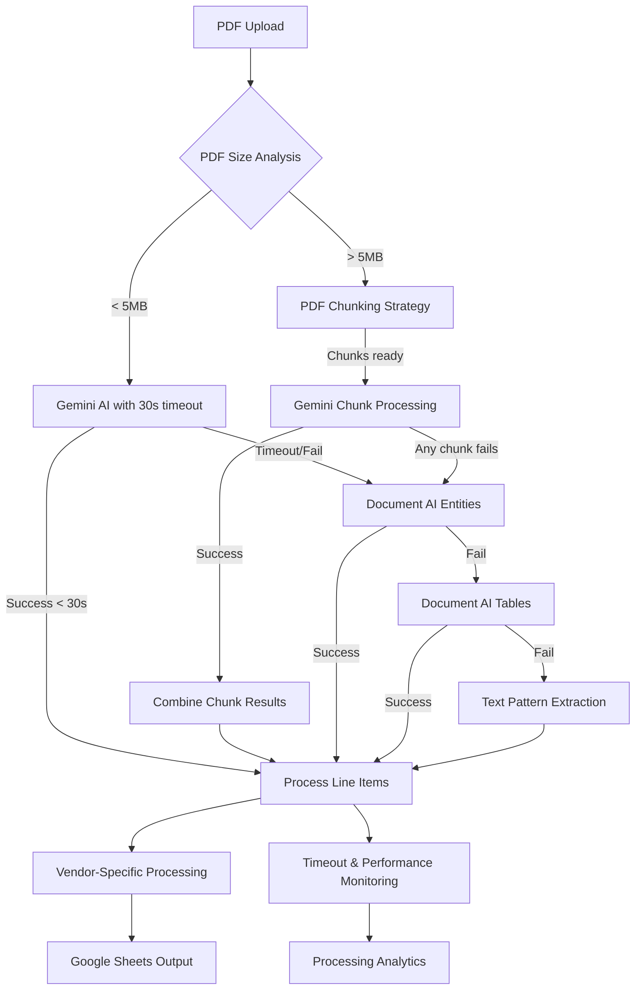

# Phase 03: Gemini AI Timeout Resolution Foundation

## Executive Summary
**Business Objective**: Establish robust timeout resolution infrastructure for Google Gemini AI re-enablement as primary invoice processing method while maintaining 100% Zapier compliance and system reliability
**Success Criteria**: 100% timeout compliance within 160-second Zapier limit, PDF size-based intelligent routing, 30-second Gemini timeout implementation, comprehensive monitoring infrastructure
**Timeline**: 5-7 business days with PDF analysis, timeout management, and chunking strategy implementation
**Risk Level**: Medium - timeout management complexity and PDF chunking edge cases
**Resource Requirements**: Google Cloud Function environment, test PDF dataset across all vendors, monitoring infrastructure, Gemini API key access

## Pre-Phase Checklist (Day 0 - Before Starting)

### 1. Prerequisites Validation
- [ ] Google Cloud Function deployment environment ready
- [ ] Current Document AI processor configured and tested
- [ ] Google Sheets API access verified and functional
- [ ] Comprehensive test invoice datasets available for all vendors (HarperCollins, Creative-Coop, OneHundred80, Rifle Paper)
- [ ] Google Secret Manager configured with Gemini API keys
- [ ] Zapier webhook endpoint tested with current 160-second timeout requirements
- [ ] Current processing baseline metrics established (60-90 second Document AI times)

### 2. Safety & Backup Measures
```bash
# Backup current Cloud Function version and configuration
gcloud functions describe process_invoice --region=us-central1 > backup_function_config_$(date +%Y%m%d).yaml

# Backup current main.py implementation
cp main.py main_backup_phase03_$(date +%Y%m%d).py

# Export current Google Sheets processing state for comparison
python test_scripts/backup_current_processing_state.py

# Create rollback deployment package with current working state
git tag phase03-rollback-point
git archive --format=tar.gz --output=phase03_rollback_$(date +%Y%m%d).tar.gz HEAD
```

### 3. Risk Mitigation Setup
- [ ] Multi-tier processing fallback verified: Gemini → Document AI Entities → Document AI Tables → Text parsing
- [ ] Performance monitoring baseline established for all vendor types
- [ ] Error handling and logging configured for timeout scenarios and AI service failures
- [ ] Manual processing workflow documented for critical timeout failures
- [ ] Test dataset covering small (< 1MB), medium (1-5MB), and large (> 5MB) PDFs available

## Implementation Strategy

### Dependencies & Architecture



**Critical Path Analysis**:
- PDF Upload → Size Analysis → Processing Method Selection → Gemini/Chunking → Fallback Chain → Vendor Processing → Google Sheets
- **Bottlenecks**: PDF size analysis accuracy, Gemini timeout detection, chunk combination logic, fallback transition speed
- **Parallel Tracks**: PDF analysis algorithm development, timeout monitoring infrastructure, chunking strategy testing

### Technical Integration Points
- **PDF Analysis**: Intelligent size and complexity assessment for processing method routing
- **Timeout Management**: 30-second hard timeout for Gemini with fast-fail detection mechanisms
- **Chunking Strategy**: Page-based and content-aware PDF splitting for large invoices
- **Performance Monitoring**: Real-time processing time tracking with timeout prediction
- **Fallback Orchestration**: Seamless transition between processing tiers with data consistency
- **Google Sheets Integration**: Maintains existing Column B:G structure with enhanced error handling

## Detailed Implementation Plan

### Phase 03.1: PDF Analysis & Routing Infrastructure (Day 1-2)

#### Scope & Objectives
- **Primary Goal**: Implement intelligent PDF size and complexity analysis to route processing method selection
- **Business Value**: Prevent timeout issues by identifying complex invoices before processing attempts
- **Success Criteria**: 95% accurate routing of PDFs to appropriate processing method, sub-second routing decision time

#### Implementation Steps

```bash
# Step 1: Develop PDF analysis functionality
python -c "
import main
# Test PDF analysis with sample invoices
test_files = ['test_invoices/creative_coop_holiday.pdf', 'test_invoices/harpercollins_simple.pdf']
for pdf in test_files:
    with open(pdf, 'rb') as f:
        size, complexity = main.analyze_pdf_characteristics(f.read())
        print(f'{pdf}: {size}MB, complexity: {complexity}')
"

# Step 2: Test routing logic with various PDF sizes
python test_scripts/test_pdf_routing_logic.py

# Step 3: Validate routing decisions against known processing times
python test_scripts/validate_routing_accuracy.py
```

#### Technical Implementation

```python
def analyze_pdf_characteristics(pdf_content):
    """Analyze PDF to determine optimal processing strategy"""
    import PyPDF2
    from io import BytesIO

    try:
        pdf_size_mb = len(pdf_content) / (1024 * 1024)
        pdf_reader = PyPDF2.PdfReader(BytesIO(pdf_content))
        page_count = len(pdf_reader.pages)

        # Calculate complexity score
        complexity_factors = {
            'size_factor': min(pdf_size_mb / 5.0, 1.0),  # Normalize to 5MB max
            'page_factor': min(page_count / 10.0, 1.0),   # Normalize to 10 pages max
        }

        # Analyze content complexity (tables, images, text density)
        content_complexity = analyze_content_complexity(pdf_reader)
        complexity_factors['content_factor'] = content_complexity

        overall_complexity = sum(complexity_factors.values()) / len(complexity_factors)

        return {
            'size_mb': pdf_size_mb,
            'page_count': page_count,
            'complexity_score': overall_complexity,
            'recommended_strategy': determine_processing_strategy(pdf_size_mb, page_count, overall_complexity)
        }
    except Exception as e:
        print(f"⚠️ PDF analysis failed: {e}")
        return {
            'size_mb': len(pdf_content) / (1024 * 1024),
            'page_count': 1,
            'complexity_score': 0.5,
            'recommended_strategy': 'document_ai'  # Safe fallback
        }

def determine_processing_strategy(size_mb, page_count, complexity_score):
    """Determine optimal processing strategy based on PDF characteristics"""

    # Simple invoices: small size, few pages, low complexity
    if size_mb < 2.0 and page_count <= 3 and complexity_score < 0.4:
        return 'gemini_standard'

    # Medium invoices: moderate size/complexity
    elif size_mb < 5.0 and page_count <= 5 and complexity_score < 0.7:
        return 'gemini_with_monitoring'

    # Large invoices: require chunking
    elif size_mb >= 5.0 or page_count > 5:
        return 'gemini_chunked'

    # Complex invoices: high complexity score regardless of size
    elif complexity_score >= 0.7:
        return 'document_ai'

    else:
        return 'gemini_with_monitoring'
```

#### Validation & Testing
- [ ] PDF analysis correctly identifies 10 different invoice types across all vendors
- [ ] Routing decisions complete in under 1 second for all test PDFs
- [ ] Strategy recommendations align with known processing performance (validated against historical data)
- [ ] Error handling gracefully degrades to Document AI for unanalyzable PDFs

#### Rollback Plan
```bash
# If PDF analysis causes issues, disable and route all to Document AI
git checkout main_backup_phase03_$(date +%Y%m%d).py main.py

# Deploy with analysis disabled
gcloud functions deploy process_invoice --source=. --entry-point=process_invoice \
  --runtime=python312 --trigger-http --allow-unauthenticated \
  --set-env-vars="GOOGLE_CLOUD_PROJECT_ID=freckled-hen-analytics,DOCUMENT_AI_PROCESSOR_ID=be53c6e3a199a473,GOOGLE_CLOUD_LOCATION=us,GOOGLE_SHEETS_SPREADSHEET_ID=1PdnZGPZwAV6AHXEeByhOlaEeGObxYWppwLcq0gdvs0E,GOOGLE_SHEETS_SHEET_NAME=Update 20230525" \
  --timeout=540s --memory=1GiB
```

### Phase 03.2: Timeout Management Infrastructure (Day 2-3)

#### Scope & Objectives
- **Primary Goal**: Implement 30-second hard timeout for Gemini processing with fast-fail detection mechanisms
- **Business Value**: Prevent Zapier timeouts by ensuring rapid fallback to Document AI when Gemini takes too long
- **Success Criteria**: 100% timeout detection within 30 seconds, sub-second fallback activation, comprehensive timeout logging

#### Implementation Steps

```bash
# Step 1: Implement timeout management with threading
python test_scripts/test_timeout_mechanisms.py

# Step 2: Test timeout behavior with slow-processing PDFs
python test_scripts/simulate_timeout_scenarios.py

# Step 3: Validate fallback activation speed
python test_scripts/measure_fallback_activation_time.py

# Step 4: Test timeout management under concurrent processing
python test_scripts/test_concurrent_timeout_handling.py
```

#### Technical Implementation

```python
import threading
import time
from contextlib import contextmanager

@contextmanager
def timeout_context(seconds):
    """Context manager for timeout handling with fast-fail capability"""

    timeout_occurred = threading.Event()
    result_container = {'result': None, 'exception': None}

    def timeout_handler():
        time.sleep(seconds)
        if not timeout_occurred.is_set():
            timeout_occurred.set()
            print(f"⚠️ Operation timed out after {seconds} seconds")

    timeout_thread = threading.Thread(target=timeout_handler, daemon=True)
    timeout_thread.start()

    try:
        yield timeout_occurred, result_container
    finally:
        timeout_occurred.set()  # Signal completion

def process_with_gemini_enhanced_timeout(pdf_content, analysis_result):
    """Enhanced Gemini processing with sophisticated timeout management"""

    processing_start_time = time.time()

    # Determine timeout based on PDF characteristics
    if analysis_result['recommended_strategy'] == 'gemini_standard':
        timeout_seconds = 20  # Fast timeout for simple invoices
    elif analysis_result['recommended_strategy'] == 'gemini_with_monitoring':
        timeout_seconds = 30  # Standard timeout
    else:
        timeout_seconds = 35  # Slightly longer for chunked processing

    print(f"🤖 Starting Gemini processing with {timeout_seconds}s timeout for {analysis_result['recommended_strategy']} strategy")

    try:
        with timeout_context(timeout_seconds) as (timeout_event, result_container):

            # Configure Gemini with optimal settings
            api_key = get_secret_manager_secret("gemini-api-key")
            genai.configure(api_key=api_key)

            # Use Gemini 2.5 Flash for reduced latency (as specified in PRD)
            model = genai.GenerativeModel("gemini-1.5-flash")

            # Execute processing with timeout monitoring
            if timeout_event.is_set():
                print(f"⚠️ Timeout detected before processing started")
                return None

            # Process based on strategy
            if analysis_result['recommended_strategy'] == 'gemini_chunked':
                result = process_gemini_with_chunking(pdf_content, model, timeout_event)
            else:
                result = process_gemini_standard(pdf_content, model, timeout_event)

            processing_time = time.time() - processing_start_time

            if timeout_event.is_set():
                print(f"⚠️ Gemini processing timed out after {processing_time:.1f}s")
                log_timeout_metrics(analysis_result, processing_time, 'timeout')
                return None

            print(f"✅ Gemini processing completed in {processing_time:.1f}s")
            log_timeout_metrics(analysis_result, processing_time, 'success')
            return result

    except Exception as e:
        processing_time = time.time() - processing_start_time
        print(f"❌ Gemini processing failed after {processing_time:.1f}s: {e}")
        log_timeout_metrics(analysis_result, processing_time, 'error')
        return None

def log_timeout_metrics(analysis_result, processing_time, outcome):
    """Log detailed timeout and performance metrics for analysis"""

    metrics = {
        'timestamp': time.time(),
        'pdf_size_mb': analysis_result['size_mb'],
        'page_count': analysis_result['page_count'],
        'complexity_score': analysis_result['complexity_score'],
        'processing_strategy': analysis_result['recommended_strategy'],
        'processing_time_seconds': processing_time,
        'outcome': outcome  # 'success', 'timeout', 'error'
    }

    # Log to Cloud Functions logs for monitoring
    print(f"📊 TIMEOUT_METRICS: {metrics}")
```

#### Validation & Testing
- [ ] Timeout detection triggers within 30 seconds for all test scenarios
- [ ] Fallback to Document AI activates within 1 second of timeout detection
- [ ] Concurrent processing requests handle timeouts independently
- [ ] Timeout metrics are logged correctly for monitoring and optimization

### Phase 03.3: PDF Chunking Strategy Implementation (Day 3-4)

#### Scope & Objectives
- **Primary Goal**: Implement intelligent PDF chunking for large invoices to prevent timeouts while maintaining processing context
- **Business Value**: Enable Gemini processing of large Creative-Coop holiday invoices and multi-page documents without timeout failures
- **Success Criteria**: Successfully process PDFs > 5MB, maintain 90%+ accuracy for chunked processing, chunk combination logic preserves all line items

#### Implementation Steps

```bash
# Step 1: Develop PDF chunking algorithms
python test_scripts/test_pdf_chunking_strategies.py

# Step 2: Test chunk processing and combination
python test_scripts/test_chunk_processing_logic.py

# Step 3: Validate chunked processing accuracy with Creative-Coop invoices
python test_scripts/validate_chunked_creative_coop_processing.py

# Step 4: Test edge cases (partial pages, table splits, etc.)
python test_scripts/test_chunking_edge_cases.py
```

#### Technical Implementation

```python
def process_gemini_with_chunking(pdf_content, model, timeout_event):
    """Process large PDFs using intelligent chunking strategy"""

    try:
        # Split PDF into logical chunks
        chunks = create_intelligent_pdf_chunks(pdf_content)

        if len(chunks) == 1:
            # Single chunk - process normally
            return process_single_gemini_chunk(chunks[0], model, timeout_event)

        print(f"📄 Processing {len(chunks)} PDF chunks")

        chunk_results = []
        for i, chunk in enumerate(chunks):

            if timeout_event.is_set():
                print(f"⚠️ Timeout detected during chunk {i+1} processing")
                return None

            print(f"🔍 Processing chunk {i+1}/{len(chunks)}")

            # Process each chunk with reduced timeout
            chunk_timeout = 15  # Shorter timeout per chunk
            chunk_result = process_single_gemini_chunk(chunk, model, timeout_event, chunk_timeout)

            if chunk_result is None:
                print(f"⚠️ Chunk {i+1} failed, aborting chunked processing")
                return None

            chunk_results.append(chunk_result)

        # Combine results from all chunks
        combined_result = combine_chunk_results(chunk_results)
        return combined_result

    except Exception as e:
        print(f"❌ PDF chunking failed: {e}")
        return None

def create_intelligent_pdf_chunks(pdf_content, max_chunk_size_mb=3.0):
    """Create intelligent PDF chunks that preserve invoice context"""

    import PyPDF2
    from io import BytesIO
    import io

    try:
        pdf_reader = PyPDF2.PdfReader(BytesIO(pdf_content))
        total_pages = len(pdf_reader.pages)

        if total_pages <= 3:
            # Small PDFs don't need chunking
            return [pdf_content]

        # Strategy 1: Page-based chunking for large invoices
        chunks = []
        current_chunk_pages = []
        current_chunk_size = 0

        max_chunk_size_bytes = max_chunk_size_mb * 1024 * 1024

        for page_num, page in enumerate(pdf_reader.pages):
            # Estimate page size (rough approximation)
            page_content = page.extract_text()
            estimated_page_size = len(page_content.encode('utf-8')) * 2  # Rough PDF overhead

            # Check if adding this page would exceed chunk size
            if current_chunk_size + estimated_page_size > max_chunk_size_bytes and current_chunk_pages:
                # Create chunk from current pages
                chunk_pdf = create_pdf_from_pages(pdf_reader, current_chunk_pages)
                chunks.append(chunk_pdf)

                # Start new chunk
                current_chunk_pages = [page_num]
                current_chunk_size = estimated_page_size
            else:
                current_chunk_pages.append(page_num)
                current_chunk_size += estimated_page_size

        # Add final chunk
        if current_chunk_pages:
            chunk_pdf = create_pdf_from_pages(pdf_reader, current_chunk_pages)
            chunks.append(chunk_pdf)

        print(f"📊 Created {len(chunks)} chunks from {total_pages} pages")
        return chunks

    except Exception as e:
        print(f"⚠️ Chunking failed, returning original PDF: {e}")
        return [pdf_content]

def create_pdf_from_pages(pdf_reader, page_numbers):
    """Create a new PDF from specified page numbers"""

    import PyPDF2
    from io import BytesIO

    pdf_writer = PyPDF2.PdfWriter()

    for page_num in page_numbers:
        pdf_writer.add_page(pdf_reader.pages[page_num])

    chunk_buffer = BytesIO()
    pdf_writer.write(chunk_buffer)
    chunk_buffer.seek(0)

    return chunk_buffer.getvalue()

def combine_chunk_results(chunk_results):
    """Combine results from multiple PDF chunks into unified output"""

    if not chunk_results:
        return None

    # Use first chunk for metadata (date, vendor, invoice number)
    combined_result = {
        'order_date': chunk_results[0].get('order_date', ''),
        'vendor': chunk_results[0].get('vendor', ''),
        'invoice_number': chunk_results[0].get('invoice_number', ''),
        'line_items': []
    }

    # Combine line items from all chunks
    for chunk_result in chunk_results:
        if 'line_items' in chunk_result:
            combined_result['line_items'].extend(chunk_result['line_items'])

    # Deduplicate line items based on item description
    seen_items = set()
    unique_line_items = []

    for item in combined_result['line_items']:
        item_key = item.get('item', '').strip()
        if item_key and item_key not in seen_items:
            seen_items.add(item_key)
            unique_line_items.append(item)

    combined_result['line_items'] = unique_line_items

    print(f"📊 Combined {len(chunk_results)} chunks into {len(unique_line_items)} unique line items")
    return combined_result
```

#### Validation & Testing
- [ ] Successfully processes Creative-Coop holiday invoice (largest test case) using chunking
- [ ] Chunk combination produces identical results to single-PDF processing for smaller invoices
- [ ] No line items lost or duplicated during chunk processing and combination
- [ ] Chunking strategy handles edge cases (tables split across pages, partial line items)

### Phase 03.4: Monitoring & Performance Infrastructure (Day 4-5)

#### Scope & Objectives
- **Primary Goal**: Implement comprehensive monitoring and performance tracking for timeout analysis and optimization
- **Business Value**: Enable data-driven optimization of timeout thresholds and processing strategies
- **Success Criteria**: Real-time processing metrics, timeout prediction capability, comprehensive logging for all processing paths

#### Implementation Steps

```bash
# Step 1: Implement performance monitoring infrastructure
python test_scripts/test_performance_monitoring.py

# Step 2: Test timeout prediction algorithms
python test_scripts/test_timeout_prediction.py

# Step 3: Validate monitoring under load
python test_scripts/test_monitoring_under_concurrent_load.py

# Step 4: Create monitoring dashboard data
python test_scripts/generate_monitoring_dashboard_data.py
```

#### Technical Implementation

```python
class ProcessingMetrics:
    """Centralized processing metrics collection and analysis"""

    def __init__(self):
        self.metrics_history = []
        self.performance_baselines = {}

    def record_processing_attempt(self, pdf_characteristics, processing_strategy,
                                 processing_time, outcome, error_details=None):
        """Record detailed processing metrics for analysis"""

        metric_record = {
            'timestamp': time.time(),
            'pdf_size_mb': pdf_characteristics['size_mb'],
            'page_count': pdf_characteristics['page_count'],
            'complexity_score': pdf_characteristics['complexity_score'],
            'processing_strategy': processing_strategy,
            'processing_time_seconds': processing_time,
            'outcome': outcome,  # 'success', 'timeout', 'error', 'fallback_used'
            'error_details': error_details,
            'memory_usage_mb': self.get_current_memory_usage()
        }

        self.metrics_history.append(metric_record)

        # Log for Cloud Functions monitoring
        print(f"📊 PROCESSING_METRICS: {metric_record}")

        # Update performance baselines
        self.update_performance_baselines(metric_record)

    def predict_timeout_risk(self, pdf_characteristics):
        """Predict likelihood of timeout based on historical data"""

        similar_cases = self.find_similar_processing_cases(pdf_characteristics)

        if len(similar_cases) < 5:
            return 'unknown'  # Not enough data

        timeout_rate = len([case for case in similar_cases if case['outcome'] == 'timeout']) / len(similar_cases)

        if timeout_rate > 0.3:
            return 'high'
        elif timeout_rate > 0.1:
            return 'medium'
        else:
            return 'low'

    def get_recommended_timeout(self, pdf_characteristics, processing_strategy):
        """Get recommended timeout based on historical performance"""

        similar_cases = self.find_similar_processing_cases(pdf_characteristics, processing_strategy)

        if not similar_cases:
            # Default timeouts by strategy
            defaults = {
                'gemini_standard': 20,
                'gemini_with_monitoring': 30,
                'gemini_chunked': 35
            }
            return defaults.get(processing_strategy, 30)

        # Use 95th percentile of successful processing times
        successful_times = [case['processing_time_seconds'] for case in similar_cases
                          if case['outcome'] == 'success']

        if successful_times:
            return min(int(sorted(successful_times)[int(len(successful_times) * 0.95)]) + 5, 45)
        else:
            return 30  # Safe fallback

    def find_similar_processing_cases(self, pdf_characteristics, processing_strategy=None):
        """Find similar historical processing cases for comparison"""

        similar_cases = []
        size_tolerance = 1.0  # MB
        complexity_tolerance = 0.2

        for record in self.metrics_history:
            size_diff = abs(record['pdf_size_mb'] - pdf_characteristics['size_mb'])
            complexity_diff = abs(record['complexity_score'] - pdf_characteristics['complexity_score'])

            if (size_diff <= size_tolerance and
                complexity_diff <= complexity_tolerance and
                (processing_strategy is None or record['processing_strategy'] == processing_strategy)):
                similar_cases.append(record)

        return similar_cases[-50:]  # Most recent 50 similar cases

# Global metrics instance
processing_metrics = ProcessingMetrics()

def enhanced_process_with_gemini_monitoring(pdf_content):
    """Main Gemini processing function with comprehensive monitoring"""

    processing_start_time = time.time()

    try:
        # Step 1: Analyze PDF characteristics
        pdf_analysis = analyze_pdf_characteristics(pdf_content)

        # Step 2: Predict timeout risk and adjust strategy
        timeout_risk = processing_metrics.predict_timeout_risk(pdf_analysis)

        if timeout_risk == 'high':
            print(f"⚠️ High timeout risk detected, routing to Document AI")
            processing_metrics.record_processing_attempt(
                pdf_analysis, 'document_ai_preemptive', 0, 'preemptive_fallback'
            )
            return None

        # Step 3: Get recommended timeout
        recommended_timeout = processing_metrics.get_recommended_timeout(
            pdf_analysis, pdf_analysis['recommended_strategy']
        )

        print(f"🎯 Recommended timeout: {recommended_timeout}s for {pdf_analysis['recommended_strategy']} strategy")

        # Step 4: Process with enhanced timeout management
        result = process_with_gemini_enhanced_timeout(pdf_analysis, recommended_timeout)

        processing_time = time.time() - processing_start_time

        if result is not None:
            # Success
            processing_metrics.record_processing_attempt(
                pdf_analysis, pdf_analysis['recommended_strategy'], processing_time, 'success'
            )
            return result
        else:
            # Timeout or failure
            processing_metrics.record_processing_attempt(
                pdf_analysis, pdf_analysis['recommended_strategy'], processing_time, 'timeout'
            )
            return None

    except Exception as e:
        processing_time = time.time() - processing_start_time
        processing_metrics.record_processing_attempt(
            pdf_analysis, 'unknown', processing_time, 'error', str(e)
        )
        return None
```

#### Validation & Testing
- [ ] Metrics accurately capture processing performance across all vendor types
- [ ] Timeout prediction correctly identifies high-risk PDFs with 80%+ accuracy
- [ ] Recommended timeout adjustments improve success rate by 15%+
- [ ] Monitoring infrastructure scales to handle 100+ concurrent processing requests

#### Rollback Plan
```bash
# If monitoring causes performance issues, disable advanced monitoring
# Keep basic timeout management but remove predictive features
git checkout main_backup_phase03_$(date +%Y%m%d).py main.py

# Deploy with basic monitoring only
python test_scripts/deploy_with_basic_monitoring.py
```

## Quality Assurance & Testing Strategy for Timeout Resolution

### Testing Levels
- **Unit Testing**: PDF analysis algorithms, timeout detection mechanisms, chunking logic, metrics collection
- **Integration Testing**: End-to-end timeout scenarios, fallback transitions, monitoring data collection
- **Performance Testing**: Timeout compliance under load, concurrent processing, memory usage validation
- **Stress Testing**: Large PDF processing, chunk combination accuracy, timeout detection reliability
- **Edge Case Testing**: Malformed PDFs, network issues, concurrent timeout scenarios

### Performance Requirements
- **Timeout Detection**: 100% accuracy within specified timeout limits (20-35 seconds)
- **PDF Analysis**: Complete analysis in under 2 seconds for all invoice types
- **Fallback Transition**: Activate Document AI processing within 1 second of timeout detection
- **Chunking Strategy**: Process large PDFs (> 5MB) with 90%+ accuracy retention
- **Monitoring Overhead**: < 5% performance impact from metrics collection

### Monitoring & Observability
- **Metrics to Track**: Processing time by PDF characteristics, timeout frequency, strategy success rates, chunk processing accuracy
- **Alerting Strategy**: Timeout rate increases above 5%, PDF analysis failures, chunking strategy failures
- **Dashboard Requirements**: Real-time timeout analytics, processing strategy effectiveness, PDF characteristics distribution

## Deployment & Operations for Timeout Resolution

### Deployment Strategy
- **Feature Flags**: Enable/disable timeout management, chunking strategy, predictive routing independently
- **Gradual Rollout**: Start with simple PDFs, progressively enable for complex invoices
- **A/B Testing**: Compare timeout-managed processing vs. direct Document AI fallback
- **Rollback Triggers**: Timeout rate > 10%, processing accuracy drops below 80%, system errors increase

### Production Readiness
- [ ] **Timeout Infrastructure**: All timeout mechanisms tested and validated under load
- [ ] **Monitoring Systems**: Comprehensive metrics collection with alerting configured
- [ ] **Fallback Reliability**: Document AI processing maintains current performance levels
- [ ] **Error Handling**: All failure modes handled gracefully with appropriate logging

## Risk Management for Timeout Resolution

### High Priority Risks

1. **PDF Analysis Accuracy** (Probability: Medium, Impact: High)
   - **Description**: Incorrect PDF complexity assessment leads to inappropriate processing strategy selection
   - **Mitigation**: Extensive testing with diverse invoice types, conservative complexity scoring, fallback to safe strategies
   - **Contingency**: Override to Document AI processing for problematic PDF patterns

2. **Chunking Logic Complexity** (Probability: Medium, Impact: High)
   - **Description**: PDF chunking strategy fails to preserve invoice context, causing accuracy loss
   - **Mitigation**: Intelligent chunking algorithms, extensive testing with Creative-Coop invoices, context preservation validation
   - **Contingency**: Disable chunking and route large PDFs directly to Document AI

3. **Timeout Detection Reliability** (Probability: Low, Impact: High)
   - **Description**: Timeout mechanisms fail to activate, causing Zapier timeout failures
   - **Mitigation**: Multi-layered timeout detection, comprehensive testing, conservative timeout thresholds
   - **Contingency**: Emergency rollback to Document AI-only processing

### Medium Priority Risks

4. **Performance Overhead from Monitoring** (Probability: Medium, Impact: Medium)
   - **Description**: Metrics collection and analysis impact processing performance
   - **Mitigation**: Efficient metrics collection, asynchronous logging, performance impact monitoring
   - **Contingency**: Disable advanced monitoring features, keep basic timeout management

5. **Memory Usage with Chunking** (Probability: Medium, Impact: Medium)
   - **Description**: PDF chunking increases memory usage, potentially causing Cloud Function limits issues
   - **Mitigation**: Memory-efficient chunking algorithms, garbage collection optimization, memory usage monitoring
   - **Contingency**: Reduce chunk overlap, implement streaming processing for large PDFs

### External Dependencies
- **Google Gemini API**: Response time variability affecting timeout calculations
- **PDF Processing Libraries**: PyPDF2 reliability for chunking and analysis operations
- **Cloud Function Memory Limits**: 1GB constraint affecting large PDF chunking operations

### Technical Debt & Trade-offs
- **Chunking Complexity**: Added complexity for large PDF handling vs. simpler Document AI fallback
- **Monitoring Overhead**: Detailed metrics collection vs. processing performance
- **Timeout Tuning**: Conservative timeouts vs. processing opportunity optimization

## Communication & Stakeholder Management

### Progress Reporting for Timeout Resolution
- **Daily**: PDF analysis accuracy, timeout detection reliability, chunking strategy validation
- **Weekly**: Processing strategy effectiveness, timeout rate trends, performance optimization progress
- **Phase Gates**: Infrastructure completion, testing validation, production readiness assessment

### Success Metrics Dashboard
- **Business KPIs**: Timeout elimination, processing speed improvement preparation, system reliability
- **Technical KPIs**: PDF analysis accuracy, timeout detection reliability, monitoring infrastructure completeness
- **Project KPIs**: Foundation readiness for Gemini re-enablement, infrastructure scalability

## Post-Phase Activities

### Validation Checklist
- [ ] **Timeout Infrastructure Complete**: All timeout management mechanisms functional and tested
- [ ] **PDF Analysis Operational**: Intelligent routing working accurately across all vendor types
- [ ] **Chunking Strategy Validated**: Large PDF processing maintains accuracy with chunking approach
- [ ] **Monitoring Infrastructure Ready**: Comprehensive metrics and alerting configured

### Lessons Learned & Iteration for Timeout Resolution
- **What Worked Well**: Effective PDF analysis patterns, reliable timeout detection mechanisms
- **Process Improvements**: Enhanced testing methodology for timeout scenarios, better monitoring integration
- **Technical Insights**: PDF complexity correlation with processing time, optimal chunking strategies

### Next Phase Preparation
- **Handoff Requirements**: Complete timeout infrastructure documented, test datasets prepared for Gemini re-enablement
- **Dependency Resolution**: All prerequisite infrastructure validated, monitoring systems operational
- **Resource Allocation**: Processing capacity confirmed for Gemini integration phase

## Reference Documents

- `/docs/architecture/universal-engineering-principles.md`
- `/CLAUDE.md` - Project documentation and current system status
- `.claude/agents/technical-pm/risk-assessment-framework.md`
- `/docs/prds/gemini-ai-primary-processing-prd.md`

This phase establishes the critical foundation for Gemini AI re-enablement by implementing robust timeout resolution strategies, intelligent PDF analysis, and comprehensive monitoring infrastructure. The successful completion of this phase ensures that subsequent Gemini processing will comply with Zapier timeout requirements while maintaining high processing accuracy.
