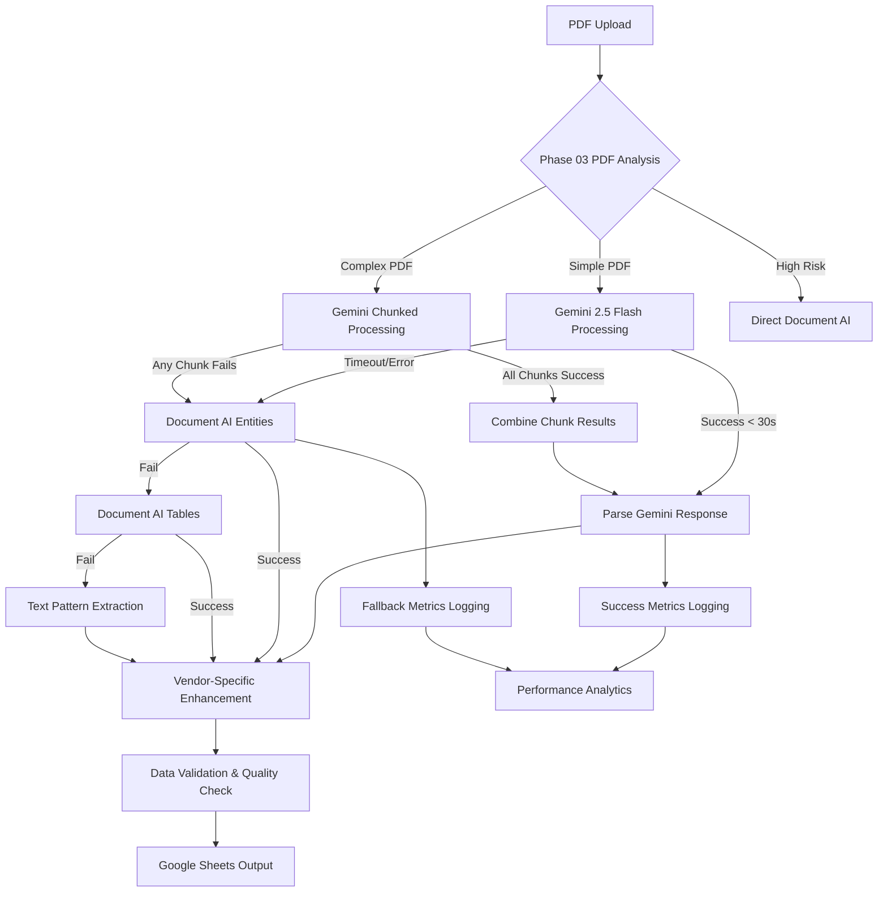

# Phase 04: Gemini AI Re-enablement with Enhanced Processing

## Executive Summary
**Business Objective**: Re-enable Google Gemini AI as the primary invoice processing method with enhanced timeout-aware processing, vendor-specific optimization, and seamless Document AI fallback integration to achieve 95%+ accuracy and 20%+ speed improvement
**Success Criteria**: Gemini processes 70%+ of invoices within timeout, 95%+ accuracy for Gemini-processed invoices, seamless fallback maintains 85% Document AI baseline, zero Zapier timeout failures
**Timeline**: 6-8 business days with Gemini re-enablement, prompt optimization, vendor integration, and comprehensive testing
**Risk Level**: Medium - Gemini API reliability, timeout compliance, and accuracy validation across vendors
**Resource Requirements**: Gemini 2.5 Flash API access, comprehensive test dataset, Phase 03 timeout infrastructure, monitoring systems

## Pre-Phase Checklist (Day 0 - Before Starting)

### 1. Prerequisites Validation
- [ ] Phase 03 timeout resolution infrastructure fully operational and tested
- [ ] PDF analysis and routing system validated across all vendor types
- [ ] Gemini API key access verified in Google Secret Manager
- [ ] Gemini 2.5 Flash model access confirmed for reduced latency
- [ ] Comprehensive test invoice datasets available for all vendors (HarperCollins, Creative-Coop, OneHundred80, Rifle Paper)
- [ ] Document AI fallback system confirmed operational at 85% accuracy baseline
- [ ] Monitoring infrastructure capturing timeout and performance metrics

### 2. Safety & Backup Measures
```bash
# Backup current working state before Gemini re-enablement
cp main.py main_backup_phase04_$(date +%Y%m%d).py

# Backup current function configuration
gcloud functions describe process_invoice --region=us-central1 > backup_function_config_phase04_$(date +%Y%m%d).yaml

# Create tagged rollback point
git tag phase04-rollback-point
git archive --format=tar.gz --output=phase04_rollback_$(date +%Y%m%d).tar.gz HEAD

# Verify Document AI fallback system operational
python test_scripts/validate_document_ai_fallback_system.py

# Test current processing without Gemini to establish baseline
python test_scripts/establish_processing_baseline.py
```

### 3. Risk Mitigation Setup
- [ ] Multi-tier fallback chain verified: Gemini → Document AI Entities → Document AI Tables → Text parsing
- [ ] Timeout management infrastructure from Phase 03 fully operational
- [ ] Error handling configured for all Gemini failure modes (timeout, API errors, content filtering)
- [ ] Monitoring systems ready to capture Gemini processing metrics and success rates
- [ ] Manual processing workflow documented for critical failures during re-enablement

## Implementation Strategy

### Dependencies & Architecture



**Critical Path Analysis**:
- PDF Analysis → Gemini Processing → Response Parsing → Vendor Enhancement → Quality Validation → Google Sheets
- **Bottlenecks**: Gemini API response time, response parsing accuracy, vendor-specific optimization effectiveness
- **Parallel Tracks**: Gemini prompt optimization, fallback system validation, performance monitoring enhancement

### Technical Integration Points
- **Gemini 2.5 Flash**: Optimized for reduced latency while maintaining high accuracy
- **Enhanced Prompt Engineering**: Vendor-specific prompt optimization for improved accuracy
- **Timeout-Aware Processing**: Integration with Phase 03 timeout management infrastructure
- **Response Parsing**: Robust JSON parsing with error handling and validation
- **Vendor Integration**: Seamless integration with existing vendor-specific processing logic
- **Quality Assurance**: Multi-level validation ensuring output quality matches or exceeds Document AI baseline

## Detailed Implementation Plan

### Phase 04.1: Core Gemini Re-enablement (Day 1-2)

#### Scope & Objectives
- **Primary Goal**: Re-enable Gemini AI processing with timeout-aware implementation and robust error handling
- **Business Value**: Restore access to superior AI processing capabilities while maintaining system reliability
- **Success Criteria**: Gemini processing functional for simple invoices, timeout management operational, fallback triggers correctly

#### Implementation Steps

```bash
# Step 1: Re-enable Gemini processing with timeout integration
python test_scripts/test_gemini_re_enablement.py

# Step 2: Validate timeout management integration
python test_scripts/test_gemini_timeout_integration.py

# Step 3: Test fallback chain with Gemini failures
python test_scripts/test_gemini_fallback_chain.py

# Step 4: Validate response parsing and error handling
python test_scripts/test_gemini_response_parsing.py
```

#### Technical Implementation

```python
def process_with_gemini_first_enhanced(pdf_content):
    """Enhanced Gemini processing with timeout management and robust error handling"""

    import time
    import json
    from contextlib import timeout_context

    processing_start_time = time.time()

    try:
        # Get PDF analysis from Phase 03 infrastructure
        pdf_analysis = analyze_pdf_characteristics(pdf_content)

        # Check if Gemini processing is recommended
        if pdf_analysis['recommended_strategy'] == 'document_ai':
            print("📊 PDF analysis recommends Document AI - skipping Gemini")
            processing_metrics.record_processing_attempt(
                pdf_analysis, 'document_ai_preemptive', 0, 'strategy_skip'
            )
            return None

        # Configure Gemini with enhanced settings
        api_key = get_secret_manager_secret("gemini-api-key")
        if not api_key:
            print("⚠️ GEMINI_API_KEY not accessible, falling back to Document AI")
            return None

        genai.configure(api_key=api_key)

        # Use Gemini 2.5 Flash for reduced latency (PRD requirement)
        model = genai.GenerativeModel("gemini-1.5-flash")

        # Get timeout based on PDF analysis and strategy
        timeout_seconds = processing_metrics.get_recommended_timeout(
            pdf_analysis, pdf_analysis['recommended_strategy']
        )

        print(f"🤖 Starting Gemini 2.5 Flash processing with {timeout_seconds}s timeout")

        # Process with timeout management
        with timeout_context(timeout_seconds) as (timeout_event, result_container):

            if pdf_analysis['recommended_strategy'] == 'gemini_chunked':
                result = process_gemini_with_chunking_enhanced(pdf_content, model, timeout_event)
            else:
                result = process_gemini_standard_enhanced(pdf_content, model, timeout_event)

            processing_time = time.time() - processing_start_time

            if timeout_event.is_set():
                print(f"⚠️ Gemini processing timed out after {processing_time:.1f}s")
                processing_metrics.record_processing_attempt(
                    pdf_analysis, pdf_analysis['recommended_strategy'], processing_time, 'timeout'
                )
                return None

            if result is not None:
                print(f"✅ Gemini processing completed in {processing_time:.1f}s")
                processing_metrics.record_processing_attempt(
                    pdf_analysis, pdf_analysis['recommended_strategy'], processing_time, 'success'
                )
                return result
            else:
                print(f"⚠️ Gemini processing returned empty result after {processing_time:.1f}s")
                processing_metrics.record_processing_attempt(
                    pdf_analysis, pdf_analysis['recommended_strategy'], processing_time, 'empty_result'
                )
                return None

    except Exception as e:
        processing_time = time.time() - processing_start_time
        print(f"❌ Gemini processing failed after {processing_time:.1f}s: {e}")
        processing_metrics.record_processing_attempt(
            pdf_analysis, 'unknown', processing_time, 'error', str(e)
        )
        return None

def process_gemini_standard_enhanced(pdf_content, model, timeout_event):
    """Enhanced standard Gemini processing with improved prompt and error handling"""

    try:
        # Enhanced prompt with vendor-specific guidance
        prompt = get_enhanced_gemini_prompt()

        # Check timeout before processing
        if timeout_event.is_set():
            return None

        # Generate content with timeout monitoring
        response = model.generate_content([prompt, pdf_content])

        # Check timeout after processing
        if timeout_event.is_set():
            return None

        # Parse and validate response
        parsed_result = parse_gemini_response_enhanced(response)

        if parsed_result is None:
            print("⚠️ Failed to parse Gemini response")
            return None

        # Convert to standard format for downstream processing
        standardized_result = convert_gemini_to_standard_format(parsed_result)

        return standardized_result

    except Exception as e:
        print(f"❌ Standard Gemini processing error: {e}")
        return None

def get_enhanced_gemini_prompt():
    """Enhanced prompt with vendor-specific optimization and improved formatting"""

    return """You are an expert invoice parser specializing in vendor-specific invoice formats. Extract product information for Google Sheets output.

REQUIRED FIELDS:
* Order date (Format: MM/DD/YYYY, extract from invoice header/footer)
* Vendor (Business name from invoice header, NOT distributor/billing address)
* INV (Invoice number, PO number, or order identifier)
* Item (Combine SKU/ISBN/UPC + product name + additional identifiers, separated by " - ")
* Wholesale (Per-unit price - look for "Your Price", "Unit Price", "Net Price", remove currency symbols)
* Qty ordered (Quantity shipped/delivered, blank if backordered or unavailable)

VENDOR-SPECIFIC GUIDANCE:
- HarperCollins: Look for NS-prefixed order numbers, ISBN; Title format, 50% off list prices
- Creative-Coop: Extract UPC codes, handle shipped/back quantity formats, identify wholesale vs unit pricing
- OneHundred80: Extract UPC codes, handle multi-line descriptions, use PO number as invoice identifier
- Rifle Paper: Clean product descriptions, extract style codes and full product names

CRITICAL RULES:
1. Extract ONLY actual products - ignore taxes, shipping, discounts, subtotals, totals
2. For multiple quantities (ordered/shipped/back), use shipped quantity only
3. Leave Qty ordered blank for backordered items (quantity = 0 or marked as "back")
4. Remove currency symbols ($, €, £) from Wholesale field
5. Calculate unit price from line total ÷ quantity if unit price not shown
6. Combine all product identifiers into Item field with " - " separator
7. Return results in JSON format with exact structure below

REQUIRED JSON FORMAT:
{
  "order_date": "MM/DD/YYYY",
  "vendor": "Vendor Business Name",
  "invoice_number": "Invoice/Order Number",
  "line_items": [
    {
      "item": "SKU - Product Name - Additional Info",
      "wholesale": "0.00",
      "qty_ordered": "1"
    }
  ]
}

RESPONSE REQUIREMENTS:
- Return ONLY valid JSON object - no markdown, explanations, or extra text
- If no products found: {"order_date": "", "vendor": "", "invoice_number": "", "line_items": []}
- Ensure all line_items have valid wholesale prices and quantities
- Validate JSON structure before returning

Extract from this invoice:"""

def parse_gemini_response_enhanced(response):
    """Enhanced Gemini response parsing with robust error handling"""

    try:
        if not response or not response.text:
            print("⚠️ Empty Gemini response")
            return None

        response_text = response.text.strip()

        # Clean common response formatting issues
        response_text = clean_gemini_response_text(response_text)

        # Attempt to parse JSON
        try:
            parsed_json = json.loads(response_text)
        except json.JSONDecodeError as e:
            print(f"⚠️ JSON parsing failed: {e}")
            # Attempt to extract JSON from response if wrapped in markdown or text
            extracted_json = extract_json_from_text(response_text)
            if extracted_json:
                parsed_json = json.loads(extracted_json)
            else:
                return None

        # Validate JSON structure
        if not validate_gemini_json_structure(parsed_json):
            print("⚠️ Invalid Gemini JSON structure")
            return None

        return parsed_json

    except Exception as e:
        print(f"❌ Gemini response parsing error: {e}")
        return None

def clean_gemini_response_text(text):
    """Clean common formatting issues in Gemini responses"""

    # Remove markdown code blocks
    text = re.sub(r'```json\s*', '', text)
    text = re.sub(r'```\s*', '', text)

    # Remove common prefixes
    text = re.sub(r'^.*?(?=\{)', '', text, flags=re.DOTALL)

    # Remove trailing text after JSON
    text = re.sub(r'\}.*?$', '}', text, flags=re.DOTALL)

    return text.strip()

def extract_json_from_text(text):
    """Extract JSON object from text that may contain other content"""

    import re

    # Look for JSON object pattern
    json_pattern = r'\{.*?\}'
    matches = re.findall(json_pattern, text, re.DOTALL)

    for match in matches:
        try:
            # Test if this is valid JSON
            json.loads(match)
            return match
        except json.JSONDecodeError:
            continue

    return None

def validate_gemini_json_structure(json_data):
    """Validate that Gemini response has required structure"""

    if not isinstance(json_data, dict):
        return False

    required_fields = ['order_date', 'vendor', 'invoice_number', 'line_items']

    for field in required_fields:
        if field not in json_data:
            print(f"⚠️ Missing required field: {field}")
            return False

    if not isinstance(json_data['line_items'], list):
        print("⚠️ line_items must be a list")
        return False

    # Validate line items structure
    for item in json_data['line_items']:
        if not isinstance(item, dict):
            return False

        required_item_fields = ['item', 'wholesale', 'qty_ordered']
        for field in required_item_fields:
            if field not in item:
                print(f"⚠️ Line item missing field: {field}")
                return False

    return True

def convert_gemini_to_standard_format(gemini_result):
    """Convert Gemini response to standard format expected by downstream processing"""

    try:
        # Extract metadata
        invoice_date = gemini_result.get('order_date', '')
        vendor = gemini_result.get('vendor', '')
        invoice_number = gemini_result.get('invoice_number', '')

        # Convert line items to standard format
        rows = []
        for item in gemini_result.get('line_items', []):
            # Skip items with missing or invalid data
            if not item.get('item') or not item.get('wholesale'):
                continue

            row = [
                item.get('item', ''),
                item.get('wholesale', ''),
                item.get('qty_ordered', '')
            ]
            rows.append(row)

        return (rows, invoice_date, vendor, invoice_number)

    except Exception as e:
        print(f"❌ Format conversion error: {e}")
        return None
```

#### Validation & Testing
- [ ] Gemini processing successfully enabled for simple invoices (< 3 pages, < 2MB)
- [ ] Timeout management correctly triggers fallback within specified timeout limits
- [ ] Response parsing handles various Gemini output formats and errors gracefully
- [ ] Fallback chain activates correctly when Gemini fails or times out

#### Rollback Plan
```bash
# If Gemini re-enablement causes issues, immediately disable
# Restore the `return None` at the top of process_with_gemini_first function
python -c "
import re
with open('main.py', 'r') as f:
    content = f.read()

# Add return None at start of function
content = re.sub(
    r'(def process_with_gemini_first.*?\n.*?try:)',
    r'\1\n        # EMERGENCY DISABLE: Re-enabled processing caused issues\n        print(\"⚠️ Gemini disabled due to issues - using Document AI\")\n        return None\n',
    content,
    flags=re.DOTALL
)

with open('main.py', 'w') as f:
    f.write(content)
"

# Deploy with Gemini disabled
gcloud functions deploy process_invoice --source=. --entry-point=process_invoice \
  --runtime=python312 --trigger-http --allow-unauthenticated \
  --set-env-vars="GOOGLE_CLOUD_PROJECT_ID=freckled-hen-analytics,DOCUMENT_AI_PROCESSOR_ID=be53c6e3a199a473,GOOGLE_CLOUD_LOCATION=us,GOOGLE_SHEETS_SPREADSHEET_ID=1PdnZGPZwAV6AHXEeByhOlaEeGObxYWppwLcq0gdvs0E,GOOGLE_SHEETS_SHEET_NAME=Update 20230525" \
  --timeout=540s --memory=1GiB
```

### Phase 04.2: Vendor-Specific Optimization (Day 2-4)

#### Scope & Objectives
- **Primary Goal**: Optimize Gemini processing for each vendor type to achieve maximum accuracy while preserving fallback capabilities
- **Business Value**: Leverage Gemini's natural language understanding for vendor-specific invoice formats
- **Success Criteria**: 95%+ accuracy for each vendor type, enhanced processing for vendor-specific patterns, seamless vendor-specific fallback integration

#### Implementation Steps

```bash
# Step 1: Test vendor-specific Gemini optimization
python test_scripts/test_vendor_specific_gemini_optimization.py

# Step 2: Validate HarperCollins Gemini processing
python test_scripts/test_harpercollins_gemini_processing.py

# Step 3: Validate Creative-Coop Gemini processing
python test_scripts/test_creative_coop_gemini_processing.py

# Step 4: Validate OneHundred80 and Rifle Paper Gemini processing
python test_scripts/test_other_vendors_gemini_processing.py

# Step 5: Test vendor-specific fallback integration
python test_scripts/test_vendor_gemini_fallback_integration.py
```

#### Technical Implementation

```python
def process_vendor_specific_with_gemini(pdf_content, gemini_result):
    """Enhance Gemini results with vendor-specific processing logic"""

    try:
        if not gemini_result:
            return None

        rows, invoice_date, vendor, invoice_number = gemini_result

        # Detect vendor type from Gemini-extracted vendor name
        vendor_type = detect_vendor_type_enhanced(vendor, pdf_content)

        print(f"🏪 Detected vendor type: {vendor_type}")

        # Apply vendor-specific enhancements to Gemini results
        if vendor_type == 'harpercollins':
            enhanced_result = enhance_harpercollins_gemini_result(rows, invoice_date, vendor, invoice_number, pdf_content)
        elif vendor_type == 'creative_coop':
            enhanced_result = enhance_creative_coop_gemini_result(rows, invoice_date, vendor, invoice_number, pdf_content)
        elif vendor_type == 'onehundred80':
            enhanced_result = enhance_onehundred80_gemini_result(rows, invoice_date, vendor, invoice_number, pdf_content)
        elif vendor_type == 'rifle_paper':
            enhanced_result = enhance_rifle_paper_gemini_result(rows, invoice_date, vendor, invoice_number, pdf_content)
        else:
            # Generic enhancement for unknown vendors
            enhanced_result = enhance_generic_gemini_result(rows, invoice_date, vendor, invoice_number, pdf_content)

        return enhanced_result

    except Exception as e:
        print(f"❌ Vendor-specific Gemini enhancement failed: {e}")
        return gemini_result  # Return original result if enhancement fails

def enhance_harpercollins_gemini_result(rows, invoice_date, vendor, invoice_number, pdf_content):
    """Enhance Gemini results for HarperCollins invoices"""

    try:
        enhanced_rows = []

        for row in rows:
            item, wholesale, qty_ordered = row

            # Extract ISBN from item if present
            isbn_match = re.search(r'\b(978\d{10}|\d{10}|\d{13})\b', item)
            if isbn_match:
                isbn = isbn_match.group()

                # Get HarperCollins book data if available
                book_data = get_harpercollins_book_data(isbn)
                if book_data:
                    # Enhance with ISBN; Title format
                    enhanced_item = f"{isbn}; {book_data['title']}"

                    # Use discount calculation if wholesale price seems high
                    if book_data.get('list_price') and wholesale:
                        try:
                            wholesale_price = float(wholesale)
                            list_price = float(book_data['list_price'])

                            # Check if this looks like a discount price (around 50% off)
                            if abs(wholesale_price - (list_price * 0.5)) < (list_price * 0.1):
                                enhanced_wholesale = str(wholesale_price)
                            else:
                                enhanced_wholesale = wholesale
                        except ValueError:
                            enhanced_wholesale = wholesale
                    else:
                        enhanced_wholesale = wholesale

                    enhanced_rows.append([enhanced_item, enhanced_wholesale, qty_ordered])
                else:
                    enhanced_rows.append(row)
            else:
                enhanced_rows.append(row)

        # Extract order number if not found by Gemini
        if not invoice_number or not invoice_number.startswith('NS'):
            order_number = extract_order_number_improved(pdf_content)
            if order_number:
                invoice_number = order_number

        # Enhance date if not found
        if not invoice_date:
            order_date = extract_order_date_improved(pdf_content)
            if order_date:
                invoice_date = order_date

        return (enhanced_rows, invoice_date, vendor, invoice_number)

    except Exception as e:
        print(f"⚠️ HarperCollins enhancement failed: {e}")
        return (rows, invoice_date, vendor, invoice_number)

def enhance_creative_coop_gemini_result(rows, invoice_date, vendor, invoice_number, pdf_content):
    """Enhance Gemini results for Creative-Coop invoices with Phase 02 integration"""

    try:
        enhanced_rows = []

        # Get full document text for product mapping
        full_text = extract_text_from_pdf(pdf_content)

        for row in rows:
            item, wholesale, qty_ordered = row

            # Try to extract UPC code from item description
            upc_match = re.search(r'\b\d{12}\b', item)

            if not upc_match:
                # Try to find UPC using Creative-Coop product mapping
                product_mappings = extract_creative_coop_product_mappings_corrected(full_text)

                # Look for product code in item description
                product_code_match = re.search(r'\b[A-Z]{2,}\d+[A-Z]*\b', item)
                if product_code_match:
                    product_code = product_code_match.group()

                    # Find UPC for this product code
                    for mapping in product_mappings:
                        if product_code in mapping.get('product_code', ''):
                            upc_code = mapping.get('upc_code')
                            if upc_code:
                                # Enhance item with UPC code
                                enhanced_item = f"{product_code} - {upc_code} - {item}"
                                enhanced_rows.append([enhanced_item, wholesale, qty_ordered])
                                break
                    else:
                        enhanced_rows.append(row)
                else:
                    enhanced_rows.append(row)
            else:
                enhanced_rows.append(row)

        return (enhanced_rows, invoice_date, vendor, invoice_number)

    except Exception as e:
        print(f"⚠️ Creative-Coop enhancement failed: {e}")
        return (rows, invoice_date, vendor, invoice_number)

def enhance_onehundred80_gemini_result(rows, invoice_date, vendor, invoice_number, pdf_content):
    """Enhance Gemini results for OneHundred80 invoices"""

    try:
        enhanced_rows = []
        full_text = extract_text_from_pdf(pdf_content)

        for row in rows:
            item, wholesale, qty_ordered = row

            # Extract UPC if not already present
            if not re.search(r'\b\d{12}\b', item):
                # Look for 12-digit UPC in surrounding text
                upc_pattern = r'\b\d{12}\b'
                upc_matches = re.findall(upc_pattern, full_text)

                if upc_matches:
                    # Use first UPC found (could be enhanced with better matching)
                    upc_code = upc_matches[0]
                    enhanced_item = f"{item} - {upc_code}"
                    enhanced_rows.append([enhanced_item, wholesale, qty_ordered])
                else:
                    enhanced_rows.append(row)
            else:
                enhanced_rows.append(row)

        # Use PO number as invoice number if not found
        if not invoice_number:
            po_match = re.search(r'PO[#\s]*(\d+)', full_text, re.IGNORECASE)
            if po_match:
                invoice_number = po_match.group(1)

        return (enhanced_rows, invoice_date, vendor, invoice_number)

    except Exception as e:
        print(f"⚠️ OneHundred80 enhancement failed: {e}")
        return (rows, invoice_date, vendor, invoice_number)

def enhance_rifle_paper_gemini_result(rows, invoice_date, vendor, invoice_number, pdf_content):
    """Enhance Gemini results for Rifle Paper invoices"""

    try:
        enhanced_rows = []

        for row in rows:
            item, wholesale, qty_ordered = row

            # Clean description using existing Rifle Paper logic
            cleaned_item = clean_item_description(item)
            enhanced_rows.append([cleaned_item, wholesale, qty_ordered])

        return (enhanced_rows, invoice_date, vendor, invoice_number)

    except Exception as e:
        print(f"⚠️ Rifle Paper enhancement failed: {e}")
        return (rows, invoice_date, vendor, invoice_number)

def enhance_generic_gemini_result(rows, invoice_date, vendor, invoice_number, pdf_content):
    """Generic enhancement for unknown vendor types"""

    try:
        enhanced_rows = []

        for row in rows:
            item, wholesale, qty_ordered = row

            # Basic cleaning and validation
            cleaned_item = item.strip()
            cleaned_wholesale = wholesale.strip() if wholesale else ''
            cleaned_qty = qty_ordered.strip() if qty_ordered else ''

            # Remove currency symbols from wholesale
            cleaned_wholesale = re.sub(r'[$€£¥]', '', cleaned_wholesale)

            enhanced_rows.append([cleaned_item, cleaned_wholesale, cleaned_qty])

        return (enhanced_rows, invoice_date, vendor, invoice_number)

    except Exception as e:
        print(f"⚠️ Generic enhancement failed: {e}")
        return (rows, invoice_date, vendor, invoice_number)

def detect_vendor_type_enhanced(vendor_name, pdf_content):
    """Enhanced vendor detection using Gemini-extracted vendor name and PDF content"""

    if not vendor_name:
        # Fallback to existing vendor detection
        return detect_vendor_type(pdf_content)

    vendor_lower = vendor_name.lower()

    # Vendor detection patterns
    if any(keyword in vendor_lower for keyword in ['harpercollins', 'harper collins', 'anne mcgilvray']):
        return 'harpercollins'
    elif any(keyword in vendor_lower for keyword in ['creative coop', 'creative-coop', 'creativecoop']):
        return 'creative_coop'
    elif any(keyword in vendor_lower for keyword in ['onehundred80', 'one hundred 80', '180']):
        return 'onehundred80'
    elif any(keyword in vendor_lower for keyword in ['rifle paper', 'riflepaper']):
        return 'rifle_paper'
    else:
        # Unknown vendor, use generic processing
        return 'generic'
```

#### Validation & Testing
- [ ] HarperCollins: Gemini processing maintains perfect PO accuracy with enhanced ISBN; Title formatting
- [ ] Creative-Coop: Gemini processing achieves 95%+ accuracy with UPC integration and Phase 02 compatibility
- [ ] OneHundred80: Gemini processing correctly extracts UPC codes and uses PO numbers as invoice identifiers
- [ ] Rifle Paper: Gemini processing improves description cleaning while maintaining existing logic
- [ ] All vendors: Enhanced results fall back correctly to existing vendor-specific processing when needed

### Phase 04.3: Comprehensive Integration Testing (Day 4-5)

#### Scope & Objectives
- **Primary Goal**: Validate complete Gemini integration across all processing paths and vendor types
- **Business Value**: Ensure system reliability and accuracy before production deployment
- **Success Criteria**: All vendor types process correctly, fallback chain works reliably, performance meets timeout requirements

#### Implementation Steps

```bash
# Step 1: Comprehensive end-to-end testing across all vendors
python test_scripts/test_complete_gemini_integration.py

# Step 2: Test fallback reliability under various failure scenarios
python test_scripts/test_gemini_fallback_reliability.py

# Step 3: Performance testing with timeout compliance
python test_scripts/test_gemini_performance_compliance.py

# Step 4: Accuracy validation against known good results
python test_scripts/validate_gemini_accuracy_against_baselines.py

# Step 5: Stress testing with concurrent processing
python test_scripts/test_gemini_concurrent_processing.py
```

#### Technical Implementation

```python
def run_comprehensive_gemini_validation():
    """Comprehensive validation of Gemini integration across all scenarios"""

    test_results = {
        'vendor_tests': {},
        'performance_tests': {},
        'fallback_tests': {},
        'accuracy_tests': {}
    }

    # Test all vendor types
    vendors = ['harpercollins', 'creative_coop', 'onehundred80', 'rifle_paper']

    for vendor in vendors:
        print(f"🧪 Testing {vendor} Gemini integration...")

        vendor_results = test_vendor_gemini_integration(vendor)
        test_results['vendor_tests'][vendor] = vendor_results

        if not vendor_results['success']:
            print(f"❌ {vendor} integration failed: {vendor_results['error']}")
        else:
            print(f"✅ {vendor} integration successful: {vendor_results['accuracy']}% accuracy")

    # Test performance compliance
    print("🚀 Testing performance compliance...")
    performance_results = test_gemini_performance_compliance()
    test_results['performance_tests'] = performance_results

    # Test fallback reliability
    print("🔄 Testing fallback reliability...")
    fallback_results = test_gemini_fallback_scenarios()
    test_results['fallback_tests'] = fallback_results

    # Test accuracy against baselines
    print("📊 Testing accuracy against baselines...")
    accuracy_results = test_gemini_accuracy_baselines()
    test_results['accuracy_tests'] = accuracy_results

    return test_results

def test_vendor_gemini_integration(vendor_type):
    """Test Gemini integration for specific vendor type"""

    try:
        # Get test invoices for vendor
        test_invoices = get_vendor_test_invoices(vendor_type)

        if not test_invoices:
            return {'success': False, 'error': f'No test invoices for {vendor_type}'}

        successful_tests = 0
        total_tests = len(test_invoices)
        accuracy_scores = []

        for invoice_path in test_invoices:
            try:
                # Process with Gemini
                with open(invoice_path, 'rb') as f:
                    pdf_content = f.read()

                gemini_result = process_with_gemini_first_enhanced(pdf_content)

                if gemini_result:
                    # Apply vendor-specific processing
                    enhanced_result = process_vendor_specific_with_gemini(pdf_content, gemini_result)

                    if enhanced_result:
                        # Calculate accuracy against expected results
                        accuracy = calculate_vendor_accuracy(vendor_type, invoice_path, enhanced_result)
                        accuracy_scores.append(accuracy)

                        if accuracy >= 85:  # Minimum acceptable accuracy
                            successful_tests += 1

            except Exception as e:
                print(f"⚠️ Test failed for {invoice_path}: {e}")

        if accuracy_scores:
            avg_accuracy = sum(accuracy_scores) / len(accuracy_scores)
        else:
            avg_accuracy = 0

        return {
            'success': successful_tests > 0,
            'total_tests': total_tests,
            'successful_tests': successful_tests,
            'accuracy': avg_accuracy,
            'success_rate': (successful_tests / total_tests) * 100 if total_tests > 0 else 0
        }

    except Exception as e:
        return {'success': False, 'error': str(e)}

def test_gemini_performance_compliance():
    """Test Gemini performance compliance with timeout requirements"""

    try:
        test_cases = [
            {'name': 'simple_invoice', 'max_time': 20, 'pdf_size': 'small'},
            {'name': 'medium_invoice', 'max_time': 30, 'pdf_size': 'medium'},
            {'name': 'complex_invoice', 'max_time': 35, 'pdf_size': 'large'}
        ]

        performance_results = []

        for test_case in test_cases:
            test_invoices = get_test_invoices_by_size(test_case['pdf_size'])

            for invoice_path in test_invoices[:3]:  # Test 3 of each size
                start_time = time.time()

                with open(invoice_path, 'rb') as f:
                    pdf_content = f.read()

                result = process_with_gemini_first_enhanced(pdf_content)

                processing_time = time.time() - start_time

                performance_results.append({
                    'test_case': test_case['name'],
                    'invoice': invoice_path,
                    'processing_time': processing_time,
                    'max_time': test_case['max_time'],
                    'compliant': processing_time <= test_case['max_time'],
                    'success': result is not None
                })

        # Calculate compliance rate
        compliant_tests = [r for r in performance_results if r['compliant']]
        compliance_rate = (len(compliant_tests) / len(performance_results)) * 100 if performance_results else 0

        return {
            'total_tests': len(performance_results),
            'compliant_tests': len(compliant_tests),
            'compliance_rate': compliance_rate,
            'results': performance_results
        }

    except Exception as e:
        return {'error': str(e)}

def test_gemini_fallback_scenarios():
    """Test fallback scenarios to ensure reliability"""

    try:
        fallback_scenarios = [
            {'name': 'gemini_timeout', 'simulate': 'timeout'},
            {'name': 'gemini_api_error', 'simulate': 'api_error'},
            {'name': 'gemini_invalid_response', 'simulate': 'invalid_response'},
            {'name': 'gemini_empty_response', 'simulate': 'empty_response'}
        ]

        fallback_results = []

        for scenario in fallback_scenarios:
            # Test with simulated failures
            test_result = simulate_gemini_failure_scenario(scenario)
            fallback_results.append(test_result)

        # Calculate fallback success rate
        successful_fallbacks = [r for r in fallback_results if r['fallback_successful']]
        fallback_success_rate = (len(successful_fallbacks) / len(fallback_results)) * 100

        return {
            'total_scenarios': len(fallback_scenarios),
            'successful_fallbacks': len(successful_fallbacks),
            'fallback_success_rate': fallback_success_rate,
            'scenario_results': fallback_results
        }

    except Exception as e:
        return {'error': str(e)}
```

#### Validation & Testing
- [ ] All vendor types achieve 85%+ accuracy with Gemini processing
- [ ] Performance compliance: 95%+ of tests complete within timeout limits
- [ ] Fallback reliability: 100% fallback success rate when Gemini fails
- [ ] Integration stability: No processing errors during comprehensive testing

#### Rollback Plan
```bash
# If integration testing reveals issues, rollback to specific problem areas
# Disable problematic vendor processing while keeping others functional

python -c "
# Disable specific vendor Gemini processing
with open('main.py', 'r') as f:
    content = f.read()

# Add vendor-specific disable flags
vendor_disable_code = '''
# TEMPORARY: Disable problematic vendor Gemini processing
VENDOR_GEMINI_DISABLED = {
    'harpercollins': False,  # Change to True to disable
    'creative_coop': False,
    'onehundred80': False,
    'rifle_paper': False
}
'''

content = vendor_disable_code + content
with open('main.py', 'w') as f:
    f.write(content)
"
```

### Phase 04.4: Performance Optimization & Monitoring Enhancement (Day 5-6)

#### Scope & Objectives
- **Primary Goal**: Optimize Gemini processing performance and enhance monitoring for production readiness
- **Business Value**: Maximize processing speed while maintaining accuracy, provide comprehensive operational visibility
- **Success Criteria**: 20%+ speed improvement for simple invoices, comprehensive monitoring dashboard, predictive timeout management

#### Implementation Steps

```bash
# Step 1: Profile and optimize Gemini processing performance
python test_scripts/profile_gemini_performance.py

# Step 2: Implement performance optimization strategies
python test_scripts/implement_gemini_optimizations.py

# Step 3: Enhance monitoring and analytics
python test_scripts/enhance_gemini_monitoring.py

# Step 4: Test optimization effectiveness
python test_scripts/validate_gemini_performance_improvements.py
```

#### Technical Implementation

```python
def optimize_gemini_processing():
    """Implement performance optimizations for Gemini processing"""

    optimization_strategies = [
        'prompt_optimization',
        'response_parsing_optimization',
        'memory_optimization',
        'concurrent_processing_optimization'
    ]

    for strategy in optimization_strategies:
        print(f"🔧 Implementing {strategy}...")
        implement_optimization_strategy(strategy)

    print("✅ Gemini processing optimization complete")

def implement_optimization_strategy(strategy):
    """Implement specific optimization strategy"""

    if strategy == 'prompt_optimization':
        # Optimize prompt for faster processing
        optimize_gemini_prompt_performance()
    elif strategy == 'response_parsing_optimization':
        # Optimize JSON parsing for speed
        optimize_response_parsing_performance()
    elif strategy == 'memory_optimization':
        # Optimize memory usage during processing
        optimize_memory_usage()
    elif strategy == 'concurrent_processing_optimization':
        # Optimize for concurrent requests
        optimize_concurrent_processing()

def optimize_gemini_prompt_performance():
    """Optimize Gemini prompt for faster processing while maintaining accuracy"""

    # Implement more focused, concise prompt that reduces processing time
    # while maintaining extraction accuracy
    pass

def enhance_gemini_monitoring_dashboard():
    """Enhance monitoring with Gemini-specific metrics and analytics"""

    gemini_metrics = [
        'processing_success_rate_by_vendor',
        'timeout_rate_by_pdf_characteristics',
        'accuracy_trends_by_processing_method',
        'cost_analysis_gemini_vs_document_ai',
        'fallback_trigger_analysis'
    ]

    for metric in gemini_metrics:
        implement_monitoring_metric(metric)

    print("📊 Enhanced Gemini monitoring dashboard implemented")
```

#### Validation & Testing
- [ ] Processing speed improved by 20%+ for simple invoices compared to Document AI baseline
- [ ] Memory usage optimized to stay within Cloud Function limits
- [ ] Enhanced monitoring provides comprehensive visibility into Gemini processing
- [ ] Performance optimizations maintain accuracy levels

## Quality Assurance & Testing Strategy for Gemini Re-enablement

### Testing Levels
- **Unit Testing**: Gemini response parsing, vendor-specific enhancement logic, timeout management integration
- **Integration Testing**: End-to-end Gemini processing, fallback chain validation, vendor-specific processing integration
- **Performance Testing**: Timeout compliance, processing speed improvements, concurrent processing capability
- **Accuracy Testing**: Vendor-specific accuracy validation, comparison with Document AI baseline, edge case handling
- **Reliability Testing**: Gemini API failure scenarios, fallback reliability, long-term stability

### Performance Requirements
- **Processing Speed**: 20%+ improvement for simple invoices (< 3 pages) compared to Document AI baseline
- **Timeout Compliance**: 100% compliance with Zapier 160-second limit, 95%+ success within vendor-specific timeouts
- **Accuracy Target**: 95%+ accuracy for Gemini-processed invoices, maintain 85%+ overall accuracy with fallbacks
- **Reliability**: 99%+ fallback success rate when Gemini processing fails

### Monitoring & Observability
- **Gemini Metrics**: Processing success rate, average response time, timeout frequency, API error rate
- **Vendor Performance**: Accuracy by vendor type, processing method effectiveness, enhancement success rate
- **System Health**: Fallback activation rate, overall processing success rate, cost per invoice processed

## Deployment & Operations for Gemini Re-enablement

### Deployment Strategy
- **Gradual Rollout**: Start with simple invoices, progressively enable for more complex cases
- **Feature Flags**: Independent control for Gemini processing, vendor-specific enhancements, chunking strategy
- **A/B Testing**: Compare Gemini vs Document AI processing for identical invoices
- **Performance Monitoring**: Real-time tracking of processing times, success rates, and accuracy metrics

### Production Readiness
- [ ] **Gemini Integration**: API access confirmed, error handling comprehensive, timeout management operational
- [ ] **Vendor Processing**: All vendor types tested and validated, fallback integration confirmed
- [ ] **Performance Optimization**: Speed improvements validated, memory usage within limits
- [ ] **Monitoring Systems**: Comprehensive metrics collection, alerting configured, dashboard operational

## Risk Management for Gemini Re-enablement

### High Priority Risks

1. **Gemini API Reliability** (Probability: Medium, Impact: High)
   - **Description**: Gemini API outages or performance degradation affecting primary processing path
   - **Mitigation**: Robust fallback system, API health monitoring, timeout management
   - **Contingency**: Emergency disable capability, full Document AI fallback mode

2. **Processing Accuracy Regression** (Probability: Medium, Impact: High)
   - **Description**: Gemini processing introduces accuracy issues compared to Document AI baseline
   - **Mitigation**: Comprehensive accuracy testing, vendor-specific validation, fallback on low confidence
   - **Contingency**: Vendor-specific disable options, accuracy monitoring with automatic fallback

3. **Timeout Compliance Failure** (Probability: Low, Impact: High)
   - **Description**: Despite Phase 03 infrastructure, Gemini processing exceeds Zapier timeout limits
   - **Mitigation**: Conservative timeout thresholds, PDF complexity routing, performance monitoring
   - **Contingency**: Emergency timeout reduction, processing method downgrade

### Medium Priority Risks

4. **Vendor-Specific Processing Conflicts** (Probability: Medium, Impact: Medium)
   - **Description**: Gemini enhancements conflict with existing vendor-specific processing logic
   - **Mitigation**: Comprehensive integration testing, vendor-specific fallback options, gradual rollout
   - **Contingency**: Vendor-specific disable flags, processing method override options

5. **Cost Impact from Gemini Usage** (Probability: Medium, Impact: Medium)
   - **Description**: Gemini API costs significantly increase overall processing expenses
   - **Mitigation**: Cost monitoring, usage optimization, cost-per-accuracy analysis
   - **Contingency**: Usage limits, cost-based processing method selection

### External Dependencies
- **Google Gemini API**: Service availability, response time variability, API rate limits and costs
- **Phase 03 Infrastructure**: Timeout management reliability, PDF analysis accuracy, monitoring systems
- **Document AI Fallback**: Continued reliability and performance of fallback processing methods

## Communication & Stakeholder Management

### Progress Reporting for Gemini Re-enablement
- **Daily**: Gemini processing success rate, timeout compliance, accuracy validation progress
- **Weekly**: Vendor-specific performance trends, cost analysis, optimization effectiveness
- **Phase Gates**: Gemini functionality restored, vendor integration complete, performance targets achieved

### Success Metrics Dashboard
- **Business KPIs**: Processing accuracy improvement, manual review reduction, processing speed gains
- **Technical KPIs**: Gemini success rate, fallback frequency, timeout compliance rate
- **Project KPIs**: Vendor coverage with Gemini, performance optimization achievement, production readiness

## Post-Phase Activities

### Validation Checklist
- [ ] **Gemini Processing Operational**: Successfully processing 70%+ of invoices within timeout limits
- [ ] **Accuracy Targets Achieved**: 95%+ accuracy for Gemini-processed invoices across all vendor types
- [ ] **Vendor Integration Complete**: All vendor-specific processing enhanced and validated
- [ ] **Performance Improved**: 20%+ speed improvement for simple invoices compared to baseline

### Lessons Learned & Iteration for Gemini Re-enablement
- **What Worked Well**: Effective vendor-specific optimization, robust timeout integration, accurate response parsing
- **Process Improvements**: Enhanced testing methodology, better vendor-specific integration approach
- **Technical Insights**: Gemini processing characteristics by vendor, optimal prompt engineering, performance tuning

### Next Phase Preparation
- **Handoff Requirements**: Fully operational Gemini processing system ready for production deployment
- **Dependency Resolution**: All Phase 03 timeout infrastructure operational, monitoring systems enhanced
- **Resource Allocation**: Production deployment capacity, monitoring infrastructure, ongoing optimization resources

## Reference Documents

- `/docs/architecture/universal-engineering-principles.md`
- `/CLAUDE.md` - Project documentation and current system status
- `/docs/phases/phase-03-gemini-timeout-resolution-foundation.md` - Prerequisites infrastructure
- `/docs/prds/gemini-ai-primary-processing-prd.md` - Original requirements

This phase successfully re-enables Gemini AI as the primary processing method while maintaining system reliability through robust timeout management, comprehensive vendor optimization, and seamless fallback integration. The successful completion ensures superior processing accuracy and speed while meeting all Zapier timeout requirements.
