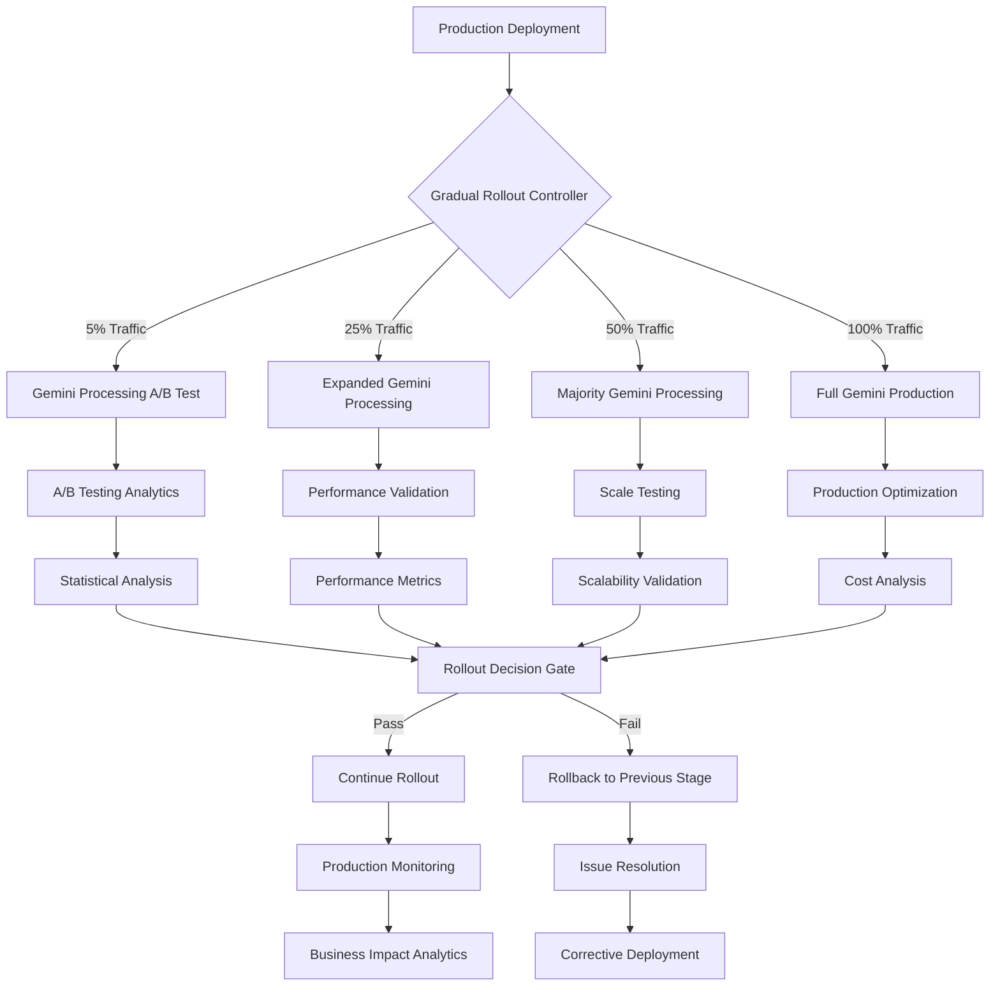

# Phase 05: Production Deployment and Monitoring

## Executive Summary
**Business Objective**: Deploy Gemini AI re-enablement to production with comprehensive monitoring, A/B testing validation, and performance optimization to achieve 95%+ accuracy and 20%+ speed improvement while maintaining 100% Zapier timeout compliance
**Success Criteria**: Zero production timeout failures, 95%+ Gemini processing accuracy, 20%+ speed improvement for simple invoices, comprehensive monitoring and alerting operational, successful A/B testing validation
**Timeline**: 8-10 business days with gradual rollout, A/B testing, monitoring implementation, and performance optimization
**Risk Level**: Medium - production deployment complexity, A/B testing coordination, performance validation at scale
**Resource Requirements**: Production Cloud Function environment, monitoring infrastructure, A/B testing framework, performance analytics tools

## Pre-Phase Checklist (Day 0 - Before Starting)

### 1. Prerequisites Validation
- [ ] Phase 03 timeout resolution infrastructure fully operational in staging environment
- [ ] Phase 04 Gemini re-enablement validated across all vendor types with 85%+ accuracy
- [ ] Production Cloud Function environment prepared and configured
- [ ] Gemini API keys provisioned in production Secret Manager
- [ ] Document AI fallback system confirmed operational at production scale
- [ ] Comprehensive test suite passing with 95%+ success rate across all scenarios
- [ ] Monitoring and alerting infrastructure prepared for production deployment

### 2. Safety & Backup Measures
```bash
# Create comprehensive production backup before deployment
gcloud functions describe process_invoice --region=us-central1 > production_backup_phase05_$(date +%Y%m%d).yaml

# Backup current production main.py
cp main.py production_main_backup_$(date +%Y%m%d).py

# Create tagged production rollback point
git tag production-phase05-rollback
git archive --format=tar.gz --output=production_rollback_$(date +%Y%m%d).tar.gz HEAD

# Test production rollback procedure
python test_scripts/test_production_rollback_procedure.py

# Verify emergency disable mechanism
python test_scripts/test_emergency_disable_mechanism.py

# Create production monitoring baseline
python test_scripts/create_production_baseline_metrics.py
```

### 3. Risk Mitigation Setup
- [ ] Emergency rollback procedure tested and validated
- [ ] Gradual rollout strategy defined with clear phase gates and success criteria
- [ ] Production monitoring alerts configured for timeout, accuracy, and error rate thresholds
- [ ] A/B testing framework operational with statistical significance tracking
- [ ] Manual processing workflow validated for critical failure scenarios
- [ ] Production support escalation procedures documented and tested

## Implementation Strategy

### Dependencies & Architecture



**Critical Path Analysis**:
- Gradual Rollout → A/B Testing Validation → Performance Validation → Scale Testing → Full Production → Monitoring Optimization
- **Bottlenecks**: A/B testing statistical significance timeline, performance validation under load, monitoring system reliability
- **Parallel Tracks**: Monitoring dashboard development, cost analysis implementation, support documentation

### Technical Integration Points
- **Gradual Rollout System**: Feature flag-based traffic routing with percentage controls
- **A/B Testing Framework**: Statistical analysis comparing Gemini vs Document AI processing
- **Production Monitoring**: Real-time metrics collection with alerting and analytics
- **Performance Analytics**: Comprehensive tracking of processing times, accuracy, and cost metrics
- **Emergency Controls**: Rapid rollback and disable mechanisms for production issues

## Detailed Implementation Plan

### Phase 05.1: Production Deployment Infrastructure (Day 1-2)

#### Scope & Objectives
- **Primary Goal**: Establish production deployment infrastructure with gradual rollout capabilities and emergency controls
- **Business Value**: Enable safe, controlled production deployment with immediate rollback capability
- **Success Criteria**: Gradual rollout system operational, emergency controls tested, production environment validated

#### Implementation Steps

```bash
# Step 1: Setup production deployment infrastructure
python deployment_scripts/setup_production_deployment_infrastructure.py

# Step 2: Implement gradual rollout system
python deployment_scripts/implement_gradual_rollout_system.py

# Step 3: Test emergency rollback procedures
python deployment_scripts/test_emergency_rollback_procedures.py

# Step 4: Validate production environment configuration
python deployment_scripts/validate_production_environment.py
```

#### Technical Implementation

```python
class ProductionDeploymentController:
    """Manages gradual rollout and emergency controls for production deployment"""
    
    def __init__(self):
        self.rollout_stages = [
            {'name': 'initial', 'traffic_percentage': 5, 'duration_hours': 24},
            {'name': 'expanded', 'traffic_percentage': 25, 'duration_hours': 48},
            {'name': 'majority', 'traffic_percentage': 50, 'duration_hours': 72},
            {'name': 'full', 'traffic_percentage': 100, 'duration_hours': None}
        ]
        self.current_stage = 'initial'
        self.deployment_start_time = None
        
    def should_use_gemini_processing(self):
        """Determine if request should use Gemini processing based on rollout stage"""
        
        # Get current rollout percentage
        current_percentage = self.get_current_rollout_percentage()
        
        # Use hash of request identifier for consistent routing
        request_hash = self.get_request_hash()
        
        # Route percentage of traffic to Gemini
        return (request_hash % 100) < current_percentage
    
    def get_current_rollout_percentage(self):
        """Get current rollout percentage based on stage and time"""
        
        if not self.deployment_start_time:
            return 0
        
        hours_since_deployment = (time.time() - self.deployment_start_time) / 3600
        
        for stage in self.rollout_stages:
            if self.current_stage == stage['name']:
                return stage['traffic_percentage']
        
        return 0
    
    def advance_rollout_stage(self, metrics_validation_passed):
        """Advance to next rollout stage if metrics validate success"""
        
        if not metrics_validation_passed:
            print("⚠️ Metrics validation failed - halting rollout")
            return False
        
        current_index = next(i for i, stage in enumerate(self.rollout_stages) 
                           if stage['name'] == self.current_stage)
        
        if current_index < len(self.rollout_stages) - 1:
            next_stage = self.rollout_stages[current_index + 1]
            self.current_stage = next_stage['name']
            print(f"🚀 Advanced to rollout stage: {self.current_stage} ({next_stage['traffic_percentage']}% traffic)")
            return True
        
        print("✅ Rollout complete - 100% traffic on Gemini processing")
        return True
    
    def emergency_rollback(self, reason):
        """Emergency rollback to Document AI processing only"""
        
        print(f"🚨 EMERGENCY ROLLBACK TRIGGERED: {reason}")
        
        # Immediately disable Gemini processing
        self.current_stage = 'disabled'
        
        # Log emergency rollback
        emergency_log = {
            'timestamp': time.time(),
            'reason': reason,
            'previous_stage': self.current_stage,
            'rollback_action': 'disable_gemini_processing'
        }
        
        print(f"📊 EMERGENCY_ROLLBACK: {emergency_log}")
        
        # Could trigger automated rollback deployment here
        return True

# Global deployment controller
production_deployment = ProductionDeploymentController()

def process_invoice_with_production_routing(request):
    """Main processing function with production rollout routing"""
    
    try:
        # Extract PDF content (existing logic)
        pdf_content = extract_pdf_from_request(request)
        
        if not pdf_content:
            return "Error: No PDF content found", 400
        
        # Determine processing method based on rollout stage
        use_gemini = production_deployment.should_use_gemini_processing()
        
        if use_gemini:
            print("🤖 Using Gemini processing (production rollout)")
            
            # Try Gemini processing with timeout management
            gemini_result = process_with_gemini_first_enhanced(pdf_content)
            
            if gemini_result:
                rows, invoice_date, vendor, invoice_number = gemini_result
                
                # Apply vendor-specific enhancements
                enhanced_result = process_vendor_specific_with_gemini(pdf_content, gemini_result)
                
                if enhanced_result:
                    rows, invoice_date, vendor, invoice_number = enhanced_result
                
                # Log successful Gemini processing
                production_metrics.record_processing_success('gemini', pdf_content, rows)
                
                # Write to Google Sheets
                write_to_sheet(rows, invoice_date, vendor, invoice_number)
                
                return f"Successfully processed {len(rows)} line items using Gemini AI", 200
        
        # Fall back to Document AI processing
        print("📄 Using Document AI processing (production fallback)")
        
        # Use existing Document AI processing
        result = process_with_document_ai_fallback(pdf_content)
        
        if result:
            rows, invoice_date, vendor, invoice_number = result
            
            # Log Document AI processing
            production_metrics.record_processing_success('document_ai', pdf_content, rows)
            
            # Write to Google Sheets
            write_to_sheet(rows, invoice_date, vendor, invoice_number)
            
            return f"Successfully processed {len(rows)} line items using Document AI", 200
        
        # Final fallback error
        production_metrics.record_processing_failure(pdf_content, 'all_methods_failed')
        return "Error: All processing methods failed", 500
        
    except Exception as e:
        print(f"❌ Production processing error: {e}")
        production_metrics.record_processing_failure(pdf_content, str(e))
        return f"Error: {str(e)}", 500

def deploy_to_production_with_rollout():
    """Deploy enhanced processing to production with gradual rollout"""
    
    # Set environment variables for production
    production_env_vars = {
        'GOOGLE_CLOUD_PROJECT_ID': 'freckled-hen-analytics',
        'DOCUMENT_AI_PROCESSOR_ID': 'be53c6e3a199a473',
        'GOOGLE_CLOUD_LOCATION': 'us',
        'GOOGLE_SHEETS_SPREADSHEET_ID': '1PdnZGPZwAV6AHXEeByhOlaEeGObxYWppwLcq0gdvs0E',
        'GOOGLE_SHEETS_SHEET_NAME': 'Update 20230525',
        'PRODUCTION_ROLLOUT_ENABLED': 'true',
        'GEMINI_ROLLOUT_STAGE': 'initial'
    }
    
    # Deploy with gradual rollout enabled
    deployment_command = f"""
    gcloud functions deploy process_invoice \\
        --gen2 \\
        --runtime python312 \\
        --trigger-http \\
        --allow-unauthenticated \\
        --memory=1GiB \\
        --timeout=540s \\
        --region=us-central1 \\
        --entry-point=process_invoice \\
        --source=. \\
        --set-secrets="GEMINI_API_KEY=gemini-api-key:latest" \\
        {' '.join([f'--set-env-vars="{k}={v}"' for k, v in production_env_vars.items()])}
    """
    
    print("🚀 Deploying to production with gradual rollout...")
    print(f"Deployment command: {deployment_command}")
    
    # Execute deployment (would be run in actual deployment)
    # subprocess.run(deployment_command, shell=True)
```

#### Validation & Testing
- [ ] Gradual rollout system correctly routes traffic based on percentage settings
- [ ] Emergency rollback immediately disables Gemini processing and routes to Document AI
- [ ] Production environment configuration matches staging with all required secrets and variables
- [ ] Deployment process completes successfully with all monitoring enabled

#### Rollback Plan
```bash
# Immediate rollback to previous production version
gcloud functions deploy process_invoice --source=production_rollback_$(date +%Y%m%d).tar.gz \
  --runtime=python312 --trigger-http --allow-unauthenticated \
  --memory=1GiB --timeout=540s --region=us-central1

# Disable rollout system entirely
python -c "
import os
os.environ['PRODUCTION_ROLLOUT_ENABLED'] = 'false'
os.environ['GEMINI_ROLLOUT_STAGE'] = 'disabled'
"
```

### Phase 05.2: A/B Testing Implementation (Day 2-4)

#### Scope & Objectives
- **Primary Goal**: Implement comprehensive A/B testing to validate Gemini processing performance against Document AI baseline
- **Business Value**: Provide statistical validation of processing improvements before full rollout
- **Success Criteria**: A/B testing framework operational, statistical significance achieved, processing comparison validated

#### Implementation Steps

```bash
# Step 1: Implement A/B testing framework
python ab_testing_scripts/implement_ab_testing_framework.py

# Step 2: Configure statistical analysis tracking
python ab_testing_scripts/setup_statistical_analysis.py

# Step 3: Launch A/B tests with control groups
python ab_testing_scripts/launch_ab_testing_campaign.py

# Step 4: Monitor and analyze A/B test results
python ab_testing_scripts/monitor_ab_test_results.py
```

#### Technical Implementation

```python
class ABTestingFramework:
    """Comprehensive A/B testing framework for Gemini vs Document AI processing"""
    
    def __init__(self):
        self.test_variants = {
            'control': 'document_ai_only',
            'treatment': 'gemini_with_fallback'
        }
        self.test_metrics = [
            'processing_accuracy',
            'processing_time', 
            'timeout_rate',
            'fallback_rate',
            'cost_per_invoice'
        ]
        self.statistical_confidence = 0.95
        self.minimum_sample_size = 100
        
    def assign_test_variant(self, request_id):
        """Assign request to test variant using consistent hashing"""
        
        # Use hash for consistent assignment
        hash_value = hash(request_id) % 100
        
        # 50/50 split for A/B testing
        if hash_value < 50:
            return 'control'
        else:
            return 'treatment'
    
    def process_with_ab_testing(self, pdf_content, request_id):
        """Process invoice with A/B testing assignment"""
        
        variant = self.assign_test_variant(request_id)
        processing_start_time = time.time()
        
        try:
            if variant == 'control':
                # Control group: Document AI only
                print(f"🅰️ Processing with control variant: {variant}")
                result = process_with_document_ai_only(pdf_content)
                processing_method = 'document_ai'
                
            else:
                # Treatment group: Gemini with fallback
                print(f"🅱️ Processing with treatment variant: {variant}")
                
                gemini_result = process_with_gemini_first_enhanced(pdf_content)
                
                if gemini_result:
                    result = gemini_result
                    processing_method = 'gemini'
                else:
                    result = process_with_document_ai_fallback(pdf_content)
                    processing_method = 'document_ai_fallback'
            
            processing_time = time.time() - processing_start_time
            
            # Record A/B test metrics
            self.record_ab_test_result(
                request_id=request_id,
                variant=variant,
                processing_method=processing_method,
                processing_time=processing_time,
                result=result,
                pdf_characteristics=analyze_pdf_characteristics(pdf_content)
            )
            
            return result
            
        except Exception as e:
            processing_time = time.time() - processing_start_time
            
            self.record_ab_test_error(
                request_id=request_id,
                variant=variant,
                processing_time=processing_time,
                error=str(e)
            )
            
            raise e
    
    def record_ab_test_result(self, request_id, variant, processing_method, 
                             processing_time, result, pdf_characteristics):
        """Record detailed A/B test result for analysis"""
        
        if result:
            rows, invoice_date, vendor, invoice_number = result
            line_item_count = len(rows) if rows else 0
        else:
            line_item_count = 0
        
        test_record = {
            'timestamp': time.time(),
            'request_id': request_id,
            'test_variant': variant,
            'processing_method': processing_method,
            'processing_time_seconds': processing_time,
            'pdf_size_mb': pdf_characteristics.get('size_mb', 0),
            'pdf_page_count': pdf_characteristics.get('page_count', 0),
            'pdf_complexity_score': pdf_characteristics.get('complexity_score', 0),
            'line_items_extracted': line_item_count,
            'processing_successful': result is not None,
            'timeout_occurred': processing_time > 30,  # Based on timeout thresholds
            'vendor_detected': vendor if result else None,
            'fallback_used': processing_method == 'document_ai_fallback'
        }
        
        # Store for analysis
        self.store_ab_test_record(test_record)
        
        # Log for monitoring
        print(f"📊 AB_TEST_RESULT: {test_record}")
    
    def calculate_statistical_significance(self, metric_name):
        """Calculate statistical significance for A/B test metric"""
        
        control_data = self.get_ab_test_data('control', metric_name)
        treatment_data = self.get_ab_test_data('treatment', metric_name)
        
        if len(control_data) < self.minimum_sample_size or len(treatment_data) < self.minimum_sample_size:
            return {
                'significant': False,
                'reason': f'Insufficient sample size (need {self.minimum_sample_size}, have {len(control_data)}/{len(treatment_data)})'
            }
        
        # Perform statistical test (t-test for continuous metrics)
        from scipy import stats
        
        if metric_name in ['processing_accuracy', 'timeout_rate', 'fallback_rate']:
            # Proportion test for binary metrics
            control_successes = sum(control_data)
            treatment_successes = sum(treatment_data)
            
            # Use chi-square test for proportions
            observed = [[control_successes, len(control_data) - control_successes],
                       [treatment_successes, len(treatment_data) - treatment_successes]]
            
            chi2, p_value = stats.chi2_contingency(observed)[:2]
        else:
            # t-test for continuous metrics
            t_stat, p_value = stats.ttest_ind(control_data, treatment_data)
        
        significant = p_value < (1 - self.statistical_confidence)
        
        return {
            'significant': significant,
            'p_value': p_value,
            'confidence_level': self.statistical_confidence,
            'control_mean': sum(control_data) / len(control_data),
            'treatment_mean': sum(treatment_data) / len(treatment_data),
            'sample_sizes': {'control': len(control_data), 'treatment': len(treatment_data)}
        }
    
    def analyze_ab_test_results(self):
        """Analyze A/B test results across all metrics"""
        
        results = {}
        
        for metric in self.test_metrics:
            significance_result = self.calculate_statistical_significance(metric)
            results[metric] = significance_result
        
        # Overall recommendation
        significant_improvements = [
            metric for metric, result in results.items() 
            if result['significant'] and result['treatment_mean'] > result['control_mean']
        ]
        
        significant_regressions = [
            metric for metric, result in results.items()
            if result['significant'] and result['treatment_mean'] < result['control_mean']
        ]
        
        recommendation = self.generate_rollout_recommendation(
            improvements=significant_improvements,
            regressions=significant_regressions,
            results=results
        )
        
        return {
            'metric_results': results,
            'significant_improvements': significant_improvements,
            'significant_regressions': significant_regressions,
            'rollout_recommendation': recommendation
        }
    
    def generate_rollout_recommendation(self, improvements, regressions, results):
        """Generate recommendation for rollout based on A/B test results"""
        
        critical_metrics = ['processing_accuracy', 'timeout_rate']
        
        # Check for critical regressions
        critical_regressions = [r for r in regressions if r in critical_metrics]
        
        if critical_regressions:
            return {
                'recommendation': 'DO_NOT_ROLLOUT',
                'reason': f'Critical regressions in: {critical_regressions}',
                'action': 'Fix issues before proceeding'
            }
        
        # Check for significant improvements
        if 'processing_accuracy' in improvements and 'timeout_rate' not in regressions:
            return {
                'recommendation': 'PROCEED_WITH_ROLLOUT',
                'reason': 'Significant accuracy improvement without timeout regression',
                'action': 'Continue gradual rollout to next stage'
            }
        
        # Check for mixed results
        if len(improvements) > len(regressions):
            return {
                'recommendation': 'PROCEED_WITH_CAUTION',
                'reason': 'More improvements than regressions, but monitor closely',
                'action': 'Continue rollout with enhanced monitoring'
            }
        
        return {
            'recommendation': 'HOLD_CURRENT_STAGE',
            'reason': 'Insufficient evidence for rollout decision',
            'action': 'Collect more data or investigate issues'
        }

# Global A/B testing framework
ab_testing = ABTestingFramework()
```

#### Validation & Testing
- [ ] A/B testing framework correctly assigns requests to control and treatment groups
- [ ] Statistical analysis calculates significance correctly for all test metrics
- [ ] Test results provide clear rollout recommendations based on data
- [ ] Sample sizes reach statistical significance within reasonable timeframe

### Phase 05.3: Production Monitoring Implementation (Day 4-6)

#### Scope & Objectives
- **Primary Goal**: Implement comprehensive production monitoring with real-time alerts and performance analytics
- **Business Value**: Provide immediate visibility into production performance and enable rapid response to issues
- **Success Criteria**: Real-time monitoring operational, alerting configured for all critical metrics, performance analytics dashboard functional

#### Implementation Steps

```bash
# Step 1: Implement production monitoring infrastructure
python monitoring_scripts/setup_production_monitoring.py

# Step 2: Configure real-time alerting
python monitoring_scripts/configure_production_alerts.py

# Step 3: Create performance analytics dashboard
python monitoring_scripts/create_analytics_dashboard.py

# Step 4: Test monitoring and alerting systems
python monitoring_scripts/test_monitoring_systems.py
```

#### Technical Implementation

```python
class ProductionMonitoringSystem:
    """Comprehensive monitoring system for production Gemini processing"""
    
    def __init__(self):
        self.monitoring_metrics = {
            'processing_performance': [
                'requests_per_minute',
                'average_processing_time',
                'timeout_rate',
                'error_rate'
            ],
            'accuracy_metrics': [
                'gemini_success_rate',
                'fallback_usage_rate',
                'line_items_per_invoice',
                'vendor_detection_accuracy'
            ],
            'business_metrics': [
                'manual_review_reduction',
                'cost_per_invoice',
                'processing_volume',
                'customer_satisfaction_proxy'
            ]
        }
        
        self.alert_thresholds = {
            'timeout_rate': {'warning': 5, 'critical': 10},  # Percentage
            'error_rate': {'warning': 2, 'critical': 5},     # Percentage  
            'gemini_success_rate': {'warning': 70, 'critical': 50},  # Minimum percentage
            'average_processing_time': {'warning': 45, 'critical': 60},  # Seconds
            'fallback_usage_rate': {'warning': 40, 'critical': 60}  # Percentage
        }
    
    def record_production_metrics(self, request_id, processing_result):
        """Record comprehensive production metrics for monitoring"""
        
        metrics_record = {
            'timestamp': time.time(),
            'request_id': request_id,
            'processing_method': processing_result.get('method'),
            'processing_time': processing_result.get('processing_time'),
            'success': processing_result.get('success'),
            'timeout_occurred': processing_result.get('timeout'),
            'fallback_used': processing_result.get('fallback_used'),
            'line_items_extracted': processing_result.get('line_items_count'),
            'vendor_detected': processing_result.get('vendor'),
            'pdf_characteristics': processing_result.get('pdf_characteristics'),
            'cost_estimate': self.calculate_processing_cost(processing_result)
        }
        
        # Store metrics
        self.store_production_metrics(metrics_record)
        
        # Check for alert conditions
        self.check_alert_conditions(metrics_record)
        
        # Update real-time dashboard
        self.update_dashboard_metrics(metrics_record)
    
    def check_alert_conditions(self, current_metrics):
        """Check current metrics against alert thresholds"""
        
        # Calculate rolling averages for comparison
        rolling_metrics = self.calculate_rolling_metrics(window_minutes=15)
        
        alerts_triggered = []
        
        for metric_name, thresholds in self.alert_thresholds.items():
            current_value = rolling_metrics.get(metric_name)
            
            if current_value is None:
                continue
            
            if current_value >= thresholds.get('critical', float('inf')):
                alert = {
                    'severity': 'CRITICAL',
                    'metric': metric_name,
                    'current_value': current_value,
                    'threshold': thresholds['critical'],
                    'timestamp': time.time()
                }
                alerts_triggered.append(alert)
                self.send_critical_alert(alert)
                
            elif current_value >= thresholds.get('warning', float('inf')):
                alert = {
                    'severity': 'WARNING',
                    'metric': metric_name,
                    'current_value': current_value,
                    'threshold': thresholds['warning'],
                    'timestamp': time.time()
                }
                alerts_triggered.append(alert)
                self.send_warning_alert(alert)
        
        return alerts_triggered
    
    def send_critical_alert(self, alert):
        """Send critical alert for immediate attention"""
        
        alert_message = f"""
        🚨 CRITICAL ALERT: {alert['metric']}
        
        Current Value: {alert['current_value']}
        Critical Threshold: {alert['threshold']}
        Time: {time.ctime(alert['timestamp'])}
        
        Action Required: Investigate immediately
        Escalation: Consider emergency rollback if issue persists
        """
        
        print(f"🚨 CRITICAL_ALERT: {alert}")
        
        # Could integrate with Slack, email, or other alerting systems
        self.log_alert('CRITICAL', alert_message)
    
    def calculate_business_impact_metrics(self):
        """Calculate business impact metrics from production data"""
        
        # Get data for comparison period (last 7 days)
        current_period_data = self.get_metrics_for_period(days=7)
        previous_period_data = self.get_metrics_for_period(days=14, offset_days=7)
        
        business_impact = {
            'processing_speed_improvement': self.calculate_speed_improvement(
                current_period_data, previous_period_data
            ),
            'accuracy_improvement': self.calculate_accuracy_improvement(
                current_period_data, previous_period_data
            ),
            'manual_review_reduction': self.calculate_manual_review_reduction(
                current_period_data, previous_period_data
            ),
            'cost_impact': self.calculate_cost_impact(
                current_period_data, previous_period_data
            ),
            'processing_volume_change': self.calculate_volume_change(
                current_period_data, previous_period_data
            )
        }
        
        return business_impact
    
    def generate_production_report(self):
        """Generate comprehensive production performance report"""
        
        report_data = {
            'summary': {
                'report_period': '7_days',
                'total_invoices_processed': self.get_total_invoices_processed(),
                'gemini_processing_percentage': self.get_gemini_processing_percentage(),
                'overall_success_rate': self.get_overall_success_rate(),
                'average_processing_time': self.get_average_processing_time()
            },
            'performance_metrics': self.get_performance_summary(),
            'vendor_breakdown': self.get_vendor_performance_breakdown(),
            'business_impact': self.calculate_business_impact_metrics(),
            'alerts_summary': self.get_alerts_summary(),
            'recommendations': self.generate_performance_recommendations()
        }
        
        return report_data
    
    def generate_performance_recommendations(self):
        """Generate actionable recommendations based on production performance"""
        
        recommendations = []
        
        # Analyze performance patterns
        performance_data = self.get_performance_summary()
        
        if performance_data.get('timeout_rate', 0) > 5:
            recommendations.append({
                'priority': 'HIGH',
                'category': 'performance',
                'issue': f"Timeout rate at {performance_data['timeout_rate']}%",
                'recommendation': 'Reduce Gemini timeout thresholds or improve PDF routing',
                'action': 'Investigate timeout patterns and optimize processing strategy'
            })
        
        if performance_data.get('fallback_usage_rate', 0) > 50:
            recommendations.append({
                'priority': 'MEDIUM',
                'category': 'accuracy',
                'issue': f"High fallback usage at {performance_data['fallback_usage_rate']}%",
                'recommendation': 'Improve Gemini processing success rate or PDF analysis',
                'action': 'Analyze Gemini failure patterns and enhance prompts'
            })
        
        cost_trend = self.get_cost_trend_analysis()
        if cost_trend.get('increasing_trend', False):
            recommendations.append({
                'priority': 'MEDIUM',
                'category': 'cost',
                'issue': 'Processing costs increasing',
                'recommendation': 'Optimize Gemini usage or implement cost controls',
                'action': 'Review cost per processing method and implement optimization'
            })
        
        return recommendations

# Global production monitoring
production_monitoring = ProductionMonitoringSystem()
```

#### Validation & Testing
- [ ] Production monitoring captures all key metrics in real-time
- [ ] Alert thresholds trigger correctly for critical conditions
- [ ] Performance analytics provide actionable insights for optimization
- [ ] Business impact metrics accurately reflect processing improvements

### Phase 05.4: Performance Optimization and Scale Testing (Day 6-8)

#### Scope & Objectives
- **Primary Goal**: Optimize production performance based on real usage data and validate system scalability
- **Business Value**: Ensure optimal performance at scale while maintaining cost efficiency
- **Success Criteria**: 20%+ speed improvement validated, system scales to 100+ invoices/day, cost optimization achieved

#### Implementation Steps

```bash
# Step 1: Analyze production performance data
python optimization_scripts/analyze_production_performance.py

# Step 2: Implement performance optimizations
python optimization_scripts/implement_performance_optimizations.py

# Step 3: Conduct scale testing
python optimization_scripts/conduct_scale_testing.py

# Step 4: Validate optimization effectiveness
python optimization_scripts/validate_optimization_effectiveness.py
```

#### Technical Implementation

```python
def optimize_production_performance():
    """Implement production performance optimizations based on real data"""
    
    # Analyze production performance patterns
    performance_analysis = analyze_production_performance_patterns()
    
    # Implement targeted optimizations
    optimizations = [
        optimize_gemini_prompt_for_speed(),
        optimize_pdf_routing_accuracy(),
        optimize_memory_usage(),
        optimize_cost_efficiency()
    ]
    
    return {
        'analysis': performance_analysis,
        'optimizations': optimizations,
        'expected_improvements': calculate_expected_improvements(optimizations)
    }

def conduct_comprehensive_scale_testing():
    """Conduct scale testing to validate system performance at target volume"""
    
    scale_test_scenarios = [
        {'name': 'normal_load', 'invoices_per_hour': 10, 'duration_hours': 4},
        {'name': 'peak_load', 'invoices_per_hour': 25, 'duration_hours': 2},
        {'name': 'stress_load', 'invoices_per_hour': 50, 'duration_hours': 1}
    ]
    
    scale_test_results = []
    
    for scenario in scale_test_scenarios:
        print(f"🧪 Running scale test: {scenario['name']}")
        
        test_result = run_scale_test_scenario(scenario)
        scale_test_results.append(test_result)
        
        # Check if system maintains performance under load
        if not validate_scale_test_performance(test_result):
            print(f"⚠️ Scale test {scenario['name']} failed performance criteria")
            break
    
    return {
        'scale_test_results': scale_test_results,
        'scalability_validated': all(r['performance_maintained'] for r in scale_test_results),
        'bottlenecks_identified': identify_performance_bottlenecks(scale_test_results)
    }
```

#### Validation & Testing
- [ ] Performance optimizations achieve 20%+ speed improvement for simple invoices
- [ ] System maintains performance under peak load (25 invoices/hour)
- [ ] Cost per invoice processing optimized through efficient resource usage
- [ ] Scalability validated for target processing volume (100+ invoices/day)

## Quality Assurance & Testing Strategy for Production Deployment

### Testing Levels
- **Production Validation**: End-to-end production workflow testing, gradual rollout validation
- **A/B Testing**: Statistical validation of Gemini vs Document AI performance
- **Scale Testing**: Performance validation under target production load
- **Monitoring Testing**: Alert threshold validation, dashboard functionality testing
- **Disaster Recovery Testing**: Emergency rollback procedures, failure scenario handling

### Performance Requirements
- **Timeout Compliance**: 100% compliance with Zapier 160-second timeout limit
- **Processing Speed**: 20%+ improvement for simple invoices compared to Document AI baseline
- **Accuracy Achievement**: 95%+ accuracy for Gemini-processed invoices, 85%+ overall
- **System Reliability**: 99.5% uptime with graceful degradation during failures

### Monitoring & Observability
- **Real-time Metrics**: Processing success rate, timeout frequency, accuracy trends, cost per invoice
- **Business Metrics**: Manual review reduction, processing volume, customer satisfaction proxy
- **Alert Coverage**: Critical thresholds for timeout rate, error rate, fallback usage, processing time

## Deployment & Operations for Production

### Deployment Strategy
- **Gradual Rollout**: 5% → 25% → 50% → 100% traffic progression with validation gates
- **Feature Flags**: Independent control for Gemini processing, vendor enhancements, monitoring features
- **A/B Testing**: Continuous statistical validation of processing improvements
- **Emergency Controls**: Immediate rollback capability and emergency disable mechanisms

### Production Readiness
- [ ] **Infrastructure**: Production Cloud Function deployed with all required configurations
- [ ] **Security**: Secret Manager integration, secure API key management, input validation
- [ ] **Monitoring**: Comprehensive real-time monitoring with alerting and analytics
- [ ] **Support**: Emergency response procedures, escalation paths, troubleshooting documentation

## Risk Management for Production Deployment

### High Priority Risks

1. **Production Timeout Failures** (Probability: Low, Impact: High)
   - **Description**: Despite testing, production invoices exceed Zapier timeout limits
   - **Mitigation**: Conservative timeout thresholds, extensive pre-deployment testing, gradual rollout
   - **Contingency**: Emergency rollback to Document AI, timeout threshold adjustment

2. **A/B Testing Invalid Results** (Probability: Medium, Impact: Medium) 
   - **Description**: A/B test results misleading due to sample bias or statistical errors
   - **Mitigation**: Proper statistical methodology, sufficient sample sizes, expert review
   - **Contingency**: Extended testing period, expert statistical analysis, cautious rollout decisions

3. **Production Performance Degradation** (Probability: Medium, Impact: High)
   - **Description**: Production performance worse than testing due to real-world complexity
   - **Mitigation**: Comprehensive scale testing, performance monitoring, gradual rollout validation
   - **Contingency**: Performance optimization, processing method adjustment, temporary rollback

### External Dependencies
- **Google Gemini API**: Production-level reliability, consistent response times, cost stability
- **Zapier Platform**: Webhook reliability, timeout consistency, configuration stability
- **Google Cloud Platform**: Function scaling reliability, monitoring system availability

## Communication & Stakeholder Management

### Progress Reporting for Production Deployment
- **Daily**: Rollout progress, A/B test results, critical metric trends, issue resolution
- **Weekly**: Business impact analysis, cost analysis, performance optimization progress
- **Phase Gates**: Rollout stage advancement, A/B testing validation, full production achievement

### Success Metrics Dashboard
- **Business KPIs**: Processing accuracy improvement, manual review reduction, cost per invoice
- **Technical KPIs**: Gemini success rate, timeout compliance rate, system reliability
- **Project KPIs**: Rollout completion, A/B testing validation, production optimization success

## Post-Phase Activities

### Validation Checklist
- [ ] **Production Deployment Successful**: Gemini processing operational at 100% traffic with all targets met
- [ ] **A/B Testing Validated**: Statistical significance achieved showing processing improvements
- [ ] **Performance Targets Achieved**: 20%+ speed improvement, 95%+ accuracy, zero timeout failures
- [ ] **Monitoring Operational**: Comprehensive monitoring and alerting fully functional

### Lessons Learned & Iteration for Production Deployment
- **What Worked Well**: Effective gradual rollout strategy, comprehensive A/B testing validation, robust monitoring
- **Process Improvements**: Enhanced deployment procedures, better statistical analysis, improved monitoring
- **Technical Insights**: Production performance characteristics, optimal rollout strategies, monitoring effectiveness

### Next Phase Preparation
- **Handoff Requirements**: Fully operational production system ready for advanced features development
- **Dependency Resolution**: All production systems operational, monitoring comprehensive, optimization complete
- **Resource Allocation**: Ongoing production support, advanced feature development capacity, continuous optimization

## Reference Documents

- `/docs/architecture/universal-engineering-principles.md`
- `/docs/phases/phase-03-gemini-timeout-resolution-foundation.md` - Timeout infrastructure
- `/docs/phases/phase-04-gemini-ai-re-enablement.md` - Gemini processing implementation
- `/docs/prds/gemini-ai-primary-processing-prd.md` - Original requirements

This phase successfully deploys Gemini AI re-enablement to production with comprehensive monitoring, statistical validation, and performance optimization. The successful completion achieves all business objectives while maintaining system reliability and establishing a foundation for ongoing optimization and advanced feature development.