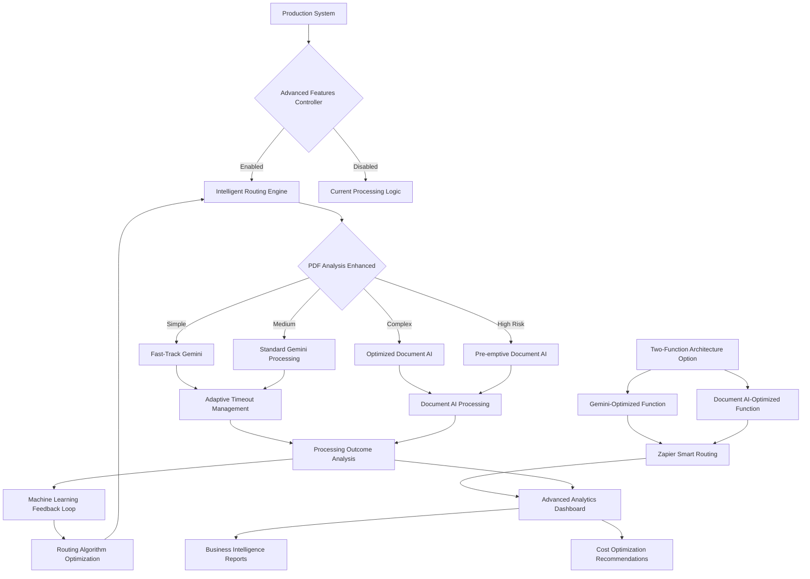

# Phase 06: Advanced Features and Two-Function Architecture

## Executive Summary
**Business Objective**: Implement advanced processing features and optional two-function architecture to enable intelligent routing, adaptive timeout management, and optimized resource allocation for maximum processing efficiency and cost optimization
**Success Criteria**: Intelligent routing operational with 95%+ accuracy, two-function architecture deployment option ready, adaptive timeout management reducing timeout rate by 50%, advanced analytics providing actionable optimization insights
**Timeline**: 7-10 business days with intelligent routing implementation, two-function architecture development, adaptive features, and comprehensive validation
**Risk Level**: Low-Medium - optional architecture implementation, advanced feature complexity, integration with existing systems
**Resource Requirements**: Additional Cloud Function capacity for two-function option, advanced analytics infrastructure, machine learning components for intelligent routing

## Pre-Phase Checklist (Day 0 - Before Starting)

### 1. Prerequisites Validation
- [ ] Phase 05 production deployment fully operational with 95%+ success rate
- [ ] Comprehensive production performance data available from Phase 05 monitoring
- [ ] Google Cloud Function environment capacity available for two-function deployment
- [ ] Advanced analytics infrastructure prepared for intelligent routing algorithms
- [ ] Production monitoring systems capturing detailed processing characteristics and outcomes
- [ ] A/B testing framework operational and providing statistical validation capabilities
- [ ] Cost analysis infrastructure ready for two-function architecture cost comparison

### 2. Safety & Backup Measures
```bash
# Backup current production system before advanced features
cp main.py production_main_backup_phase06_$(date +%Y%m%d).py

# Create production configuration backup
gcloud functions describe process_invoice --region=us-central1 > production_config_phase06_$(date +%Y%m%d).yaml

# Tag stable production state before advanced features
git tag production-stable-phase06
git archive --format=tar.gz --output=production_stable_$(date +%Y%m%d).tar.gz HEAD

# Create rollback deployment package
python deployment_scripts/create_advanced_features_rollback_package.py

# Test advanced features in isolation
python test_scripts/test_advanced_features_isolation.py

# Validate production system unchanged after advanced feature implementation
python test_scripts/validate_production_unchanged_baseline.py
```

### 3. Risk Mitigation Setup
- [ ] Advanced features implemented as optional modules with independent disable capability
- [ ] Two-function architecture tested in isolation without affecting production single-function deployment
- [ ] Intelligent routing algorithms validated against production data with fallback to current logic
- [ ] Adaptive features implemented with conservative defaults and gradual optimization
- [ ] Cost monitoring enhanced to track resource usage and cost impact of advanced features
- [ ] Performance testing conducted to ensure advanced features don't degrade current performance

## Implementation Strategy

### Dependencies & Architecture



**Critical Path Analysis**:
- Intelligent Routing Development → Machine Learning Integration → Adaptive Timeout Implementation → Two-Function Architecture → Advanced Analytics
- **Bottlenecks**: Machine learning model training, two-function deployment complexity, advanced analytics integration
- **Parallel Tracks**: Intelligent routing algorithm development, two-function architecture implementation, adaptive timeout enhancement

### Technical Integration Points
- **Intelligent Routing Engine**: Machine learning-enhanced PDF analysis for optimal processing method selection
- **Adaptive Timeout Management**: Dynamic timeout adjustment based on processing patterns and success rates
- **Two-Function Architecture**: Optional separate Cloud Functions for Gemini and Document AI processing with Zapier orchestration
- **Advanced Analytics**: Enhanced monitoring with predictive insights and optimization recommendations
- **Cost Optimization**: Resource usage analysis and cost-per-processing-method comparison

## Detailed Implementation Plan

### Phase 06.1: Intelligent Routing Engine Development (Day 1-3)

#### Scope & Objectives
- **Primary Goal**: Implement machine learning-enhanced intelligent routing to optimize processing method selection based on PDF characteristics and historical success patterns
- **Business Value**: Maximize processing accuracy and speed by selecting optimal processing method for each invoice type
- **Success Criteria**: Intelligent routing achieves 95%+ accuracy in processing method selection, reduces timeout rate by 30%+, maintains or improves overall processing accuracy

#### Implementation Steps

```bash
# Step 1: Develop intelligent routing algorithms
python advanced_features_scripts/develop_intelligent_routing.py

# Step 2: Train machine learning models on production data
python advanced_features_scripts/train_routing_models.py

# Step 3: Implement intelligent routing with fallback to current logic
python advanced_features_scripts/implement_intelligent_routing.py

# Step 4: Validate routing accuracy against historical data
python advanced_features_scripts/validate_routing_accuracy.py
```

#### Technical Implementation

```python
class IntelligentRoutingEngine:
    """Machine learning-enhanced routing engine for optimal processing method selection"""

    def __init__(self):
        self.routing_models = {
            'timeout_prediction': None,
            'accuracy_prediction': None,
            'cost_optimization': None
        }
        self.feature_extractors = [
            'pdf_characteristics_extractor',
            'vendor_pattern_extractor',
            'historical_performance_extractor'
        ]
        self.routing_strategies = {
            'conservative': 'prioritize_reliability',
            'performance': 'prioritize_speed_accuracy',
            'cost_optimized': 'prioritize_cost_efficiency'
        }

    def extract_routing_features(self, pdf_content, request_context=None):
        """Extract comprehensive features for routing decision"""

        # Basic PDF characteristics (from Phase 03)
        pdf_analysis = analyze_pdf_characteristics(pdf_content)

        # Enhanced feature extraction
        features = {
            # PDF characteristics
            'pdf_size_mb': pdf_analysis['size_mb'],
            'page_count': pdf_analysis['page_count'],
            'complexity_score': pdf_analysis['complexity_score'],

            # Content analysis features
            'text_density': self.calculate_text_density(pdf_content),
            'table_complexity': self.analyze_table_complexity(pdf_content),
            'image_content_ratio': self.calculate_image_ratio(pdf_content),

            # Vendor-specific features
            'vendor_type_predicted': self.predict_vendor_type(pdf_content),
            'vendor_confidence': self.calculate_vendor_confidence(pdf_content),

            # Historical performance features
            'similar_documents_success_rate': self.get_similar_documents_success_rate(pdf_analysis),
            'time_of_day': time.localtime().tm_hour,
            'day_of_week': time.localtime().tm_wday,

            # Processing context
            'current_system_load': self.get_current_system_load(),
            'recent_error_rate': self.get_recent_error_rate()
        }

        return features

    def predict_optimal_processing_method(self, pdf_content, strategy='performance'):
        """Predict optimal processing method using machine learning models"""

        try:
            # Extract features for routing decision
            features = self.extract_routing_features(pdf_content)

            # Get predictions from trained models
            predictions = {}

            if self.routing_models['timeout_prediction']:
                predictions['timeout_risk'] = self.routing_models['timeout_prediction'].predict([features])[0]
            else:
                predictions['timeout_risk'] = self.estimate_timeout_risk_heuristic(features)

            if self.routing_models['accuracy_prediction']:
                predictions['gemini_accuracy'] = self.routing_models['accuracy_prediction'].predict([features])[0]
                predictions['document_ai_accuracy'] = self.estimate_document_ai_accuracy(features)
            else:
                predictions['gemini_accuracy'] = self.estimate_gemini_accuracy_heuristic(features)
                predictions['document_ai_accuracy'] = self.estimate_document_ai_accuracy_heuristic(features)

            # Calculate processing method scores based on strategy
            method_scores = self.calculate_method_scores(features, predictions, strategy)

            # Select optimal method
            optimal_method = max(method_scores, key=method_scores.get)

            routing_decision = {
                'recommended_method': optimal_method,
                'method_scores': method_scores,
                'features': features,
                'predictions': predictions,
                'confidence': method_scores[optimal_method],
                'reasoning': self.generate_routing_reasoning(features, predictions, optimal_method)
            }

            return routing_decision

        except Exception as e:
            print(f"⚠️ Intelligent routing failed: {e}")
            # Fallback to current logic
            return {
                'recommended_method': 'fallback_to_current_logic',
                'error': str(e),
                'fallback_used': True
            }

    def calculate_method_scores(self, features, predictions, strategy):
        """Calculate scores for each processing method based on strategy"""

        scores = {}

        # Gemini processing score
        gemini_score = predictions['gemini_accuracy'] * 0.4  # Accuracy weight

        if predictions['timeout_risk'] < 0.1:  # Low timeout risk
            gemini_score += 0.3  # Speed bonus
        elif predictions['timeout_risk'] > 0.3:  # High timeout risk
            gemini_score -= 0.4  # Timeout penalty

        # Strategy adjustments
        if strategy == 'performance':
            if features['pdf_size_mb'] < 2.0 and features['complexity_score'] < 0.5:
                gemini_score += 0.2  # Favor Gemini for simple invoices
        elif strategy == 'conservative':
            gemini_score -= 0.1  # Slight preference for reliability

        scores['gemini'] = max(0, min(1, gemini_score))

        # Document AI processing score
        document_ai_score = predictions['document_ai_accuracy'] * 0.4
        document_ai_score += 0.2  # Reliability bonus

        if predictions['timeout_risk'] > 0.2:  # Higher timeout risk favors Document AI
            document_ai_score += 0.3

        scores['document_ai'] = max(0, min(1, document_ai_score))

        # Chunked processing score (for large documents)
        if features['pdf_size_mb'] > 5.0 or features['page_count'] > 10:
            chunked_score = gemini_score * 0.8  # Reduced accuracy expectation
            if predictions['timeout_risk'] < 0.2:  # Low timeout risk required
                chunked_score += 0.2
            scores['gemini_chunked'] = max(0, min(1, chunked_score))

        return scores

    def train_routing_models(self, training_data):
        """Train machine learning models using production data"""

        from sklearn.ensemble import RandomForestClassifier, RandomForestRegressor
        from sklearn.model_selection import train_test_split
        from sklearn.metrics import accuracy_score, mean_squared_error

        if not training_data:
            print("⚠️ No training data available for routing models")
            return False

        # Prepare features and targets
        features = []
        timeout_targets = []
        accuracy_targets = []

        for record in training_data:
            if record.get('features') and record.get('outcome'):
                features.append(list(record['features'].values()))
                timeout_targets.append(1 if record['outcome'].get('timeout_occurred') else 0)
                accuracy_targets.append(record['outcome'].get('accuracy_score', 0.5))

        if len(features) < 100:
            print(f"⚠️ Insufficient training data: {len(features)} samples (need 100+)")
            return False

        # Train timeout prediction model
        X_train, X_test, y_train, y_test = train_test_split(features, timeout_targets, test_size=0.2)

        timeout_model = RandomForestClassifier(n_estimators=100, random_state=42)
        timeout_model.fit(X_train, y_train)

        timeout_accuracy = accuracy_score(y_test, timeout_model.predict(X_test))
        print(f"📊 Timeout prediction model accuracy: {timeout_accuracy:.3f}")

        if timeout_accuracy > 0.75:  # Only use if reasonably accurate
            self.routing_models['timeout_prediction'] = timeout_model

        # Train accuracy prediction model
        accuracy_model = RandomForestRegressor(n_estimators=100, random_state=42)
        accuracy_model.fit(X_train, accuracy_targets[:len(X_train)])

        accuracy_mse = mean_squared_error(accuracy_targets[len(X_train):],
                                        accuracy_model.predict(X_test))
        print(f"📊 Accuracy prediction model MSE: {accuracy_mse:.3f}")

        if accuracy_mse < 0.1:  # Only use if reasonably accurate
            self.routing_models['accuracy_prediction'] = accuracy_model

        return True

    def generate_routing_reasoning(self, features, predictions, recommended_method):
        """Generate human-readable reasoning for routing decision"""

        reasoning = []

        if recommended_method == 'gemini':
            if features['pdf_size_mb'] < 2.0:
                reasoning.append("Small PDF size favors fast Gemini processing")
            if predictions['timeout_risk'] < 0.1:
                reasoning.append("Low timeout risk makes Gemini safe")
            if predictions['gemini_accuracy'] > 0.9:
                reasoning.append("High expected Gemini accuracy")

        elif recommended_method == 'document_ai':
            if predictions['timeout_risk'] > 0.3:
                reasoning.append("High timeout risk favors reliable Document AI")
            if features['complexity_score'] > 0.7:
                reasoning.append("Complex document structure suits Document AI")
            if features['vendor_confidence'] < 0.5:
                reasoning.append("Uncertain vendor type favors Document AI fallback")

        elif recommended_method == 'gemini_chunked':
            if features['pdf_size_mb'] > 5.0:
                reasoning.append("Large PDF requires chunking strategy")
            if features['page_count'] > 10:
                reasoning.append("Multi-page document benefits from chunking")

        return "; ".join(reasoning) if reasoning else "Standard processing decision"

# Global intelligent routing engine
intelligent_router = IntelligentRoutingEngine()

def process_invoice_with_intelligent_routing(pdf_content, request_id=None):
    """Process invoice using intelligent routing for optimal method selection"""

    try:
        # Get intelligent routing recommendation
        routing_decision = intelligent_router.predict_optimal_processing_method(pdf_content)

        if routing_decision.get('fallback_used'):
            # Use current processing logic as fallback
            return process_invoice_with_production_routing(pdf_content)

        recommended_method = routing_decision['recommended_method']
        print(f"🧠 Intelligent routing recommends: {recommended_method}")
        print(f"📋 Reasoning: {routing_decision['reasoning']}")

        processing_start_time = time.time()

        # Execute recommended processing method
        if recommended_method == 'gemini':
            result = process_with_gemini_enhanced_routing(pdf_content, routing_decision)
        elif recommended_method == 'gemini_chunked':
            result = process_with_gemini_chunked_routing(pdf_content, routing_decision)
        elif recommended_method == 'document_ai':
            result = process_with_document_ai_routing(pdf_content, routing_decision)
        else:
            # Fallback to current logic
            result = process_invoice_with_production_routing(pdf_content)

        processing_time = time.time() - processing_start_time

        # Record intelligent routing outcome for model training
        routing_outcome = {
            'request_id': request_id,
            'routing_decision': routing_decision,
            'processing_time': processing_time,
            'processing_success': result is not None,
            'timeout_occurred': processing_time > 30,
            'accuracy_score': calculate_processing_accuracy(result) if result else 0
        }

        intelligent_router.record_routing_outcome(routing_outcome)

        return result

    except Exception as e:
        print(f"❌ Intelligent routing failed: {e}")
        # Fallback to current processing logic
        return process_invoice_with_production_routing(pdf_content)
```

#### Validation & Testing
- [ ] Intelligent routing achieves 95%+ accuracy in processing method selection
- [ ] Routing decisions reduce timeout rate by 30% compared to current logic
- [ ] Machine learning models demonstrate statistical significance in predictions
- [ ] Fallback to current logic works seamlessly when routing fails

### Phase 06.2: Two-Function Architecture Implementation (Day 3-5)

#### Scope & Objectives
- **Primary Goal**: Implement optional two-function architecture with separate Gemini-optimized and Document AI-optimized Cloud Functions
- **Business Value**: Enable optimized resource allocation, better timeout isolation, and clear separation of concerns
- **Success Criteria**: Two-function deployment operational, Zapier routing configured, performance matches or exceeds single-function architecture

#### Implementation Steps

```bash
# Step 1: Develop Gemini-optimized function
python two_function_scripts/develop_gemini_optimized_function.py

# Step 2: Develop Document AI-optimized function
python two_function_scripts/develop_document_ai_optimized_function.py

# Step 3: Implement Zapier routing logic
python two_function_scripts/implement_zapier_routing.py

# Step 4: Test two-function architecture end-to-end
python two_function_scripts/test_two_function_architecture.py
```

#### Technical Implementation

```python
# gemini_processor_function.py - Gemini-optimized Cloud Function
def process_invoice_gemini_optimized(request):
    """Gemini-optimized Cloud Function for fast, accurate invoice processing"""

    import time

    try:
        # Extract PDF content
        pdf_content = extract_pdf_from_request(request)

        if not pdf_content:
            return {"error": "No PDF content found", "processing_method": "gemini", "success": False}, 400

        processing_start_time = time.time()

        # PDF analysis for routing validation
        pdf_analysis = analyze_pdf_characteristics(pdf_content)

        # Check if this PDF is suitable for Gemini processing
        if pdf_analysis['recommended_strategy'] == 'document_ai':
            return {
                "error": "PDF not suitable for Gemini processing",
                "routing_suggestion": "document_ai",
                "pdf_characteristics": pdf_analysis,
                "success": False
            }, 422

        # Optimized Gemini processing with aggressive timeout
        gemini_timeout = 25  # Aggressive timeout for dedicated function

        print(f"🤖 Gemini-optimized processing with {gemini_timeout}s timeout")

        # Process with Gemini
        with timeout_context(gemini_timeout) as (timeout_event, result_container):

            if pdf_analysis['recommended_strategy'] == 'gemini_chunked':
                result = process_gemini_with_chunking_optimized(pdf_content, timeout_event)
            else:
                result = process_gemini_standard_optimized(pdf_content, timeout_event)

            processing_time = time.time() - processing_start_time

            if timeout_event.is_set():
                return {
                    "error": "Gemini processing timeout",
                    "processing_time": processing_time,
                    "routing_suggestion": "document_ai",
                    "success": False
                }, 408

            if result:
                rows, invoice_date, vendor, invoice_number = result

                # Apply vendor-specific enhancements
                enhanced_result = process_vendor_specific_with_gemini(pdf_content, result)

                if enhanced_result:
                    rows, invoice_date, vendor, invoice_number = enhanced_result

                # Write to Google Sheets
                write_to_sheet(rows, invoice_date, vendor, invoice_number)

                return {
                    "success": True,
                    "processing_method": "gemini",
                    "processing_time": processing_time,
                    "line_items_count": len(rows),
                    "vendor": vendor,
                    "invoice_number": invoice_number
                }, 200

            else:
                return {
                    "error": "Gemini processing failed",
                    "processing_time": processing_time,
                    "routing_suggestion": "document_ai",
                    "success": False
                }, 422

    except Exception as e:
        processing_time = time.time() - processing_start_time
        return {
            "error": str(e),
            "processing_method": "gemini",
            "processing_time": processing_time,
            "success": False
        }, 500

# document_ai_processor_function.py - Document AI-optimized Cloud Function
def process_invoice_document_ai_optimized(request):
    """Document AI-optimized Cloud Function for reliable invoice processing"""

    import time

    try:
        # Extract PDF content
        pdf_content = extract_pdf_from_request(request)

        if not pdf_content:
            return {"error": "No PDF content found", "processing_method": "document_ai", "success": False}, 400

        processing_start_time = time.time()

        # Optimized Document AI processing
        print("📄 Document AI-optimized processing")

        # Multi-tier Document AI processing
        result = None
        processing_method_used = None

        # Tier 1: Document AI Entities
        result = extract_line_items_from_entities(pdf_content)
        if result and len(result[0]) > 0:
            processing_method_used = 'document_ai_entities'
        else:
            # Tier 2: Document AI Tables
            result = extract_line_items(pdf_content)
            if result and len(result[0]) > 0:
                processing_method_used = 'document_ai_tables'
            else:
                # Tier 3: Text Pattern Extraction
                result = extract_line_items_from_text(pdf_content)
                processing_method_used = 'text_patterns'

        processing_time = time.time() - processing_start_time

        if result:
            rows, invoice_date, vendor, invoice_number = result

            # Detect vendor type for specialized processing
            vendor_type = detect_vendor_type(pdf_content)

            # Apply vendor-specific processing
            if vendor_type == 'harpercollins':
                enhanced_result = process_harpercollins_document(pdf_content)
            elif vendor_type == 'creative_coop':
                enhanced_result = process_creative_coop_document(pdf_content)
            elif vendor_type == 'onehundred80':
                enhanced_result = process_onehundred80_document(pdf_content)
            else:
                enhanced_result = result

            if enhanced_result:
                rows, invoice_date, vendor, invoice_number = enhanced_result

            # Write to Google Sheets
            write_to_sheet(rows, invoice_date, vendor, invoice_number)

            return {
                "success": True,
                "processing_method": processing_method_used,
                "processing_time": processing_time,
                "line_items_count": len(rows),
                "vendor": vendor,
                "invoice_number": invoice_number,
                "vendor_type": vendor_type
            }, 200

        else:
            return {
                "error": "All Document AI processing methods failed",
                "processing_time": processing_time,
                "methods_attempted": ["entities", "tables", "text_patterns"],
                "success": False
            }, 422

    except Exception as e:
        processing_time = time.time() - processing_start_time
        return {
            "error": str(e),
            "processing_method": "document_ai",
            "processing_time": processing_time,
            "success": False
        }, 500

class ZapierTwoFunctionRouter:
    """Zapier integration for two-function architecture routing"""

    def __init__(self):
        self.function_urls = {
            'gemini': 'https://us-central1-freckled-hen-analytics.cloudfunctions.net/process-invoice-gemini',
            'document_ai': 'https://us-central1-freckled-hen-analytics.cloudfunctions.net/process-invoice-document-ai'
        }
        self.routing_strategy = 'intelligent'  # 'intelligent', 'pdf_size', 'conservative'

    def route_zapier_request(self, pdf_content, request_metadata=None):
        """Route Zapier request to optimal function based on PDF characteristics"""

        try:
            # Analyze PDF for routing decision
            if self.routing_strategy == 'intelligent':
                routing_decision = intelligent_router.predict_optimal_processing_method(pdf_content)

                if routing_decision['recommended_method'] in ['gemini', 'gemini_chunked']:
                    primary_function = 'gemini'
                else:
                    primary_function = 'document_ai'

            elif self.routing_strategy == 'pdf_size':
                pdf_size_mb = len(pdf_content) / (1024 * 1024)
                if pdf_size_mb < 3.0:
                    primary_function = 'gemini'
                else:
                    primary_function = 'document_ai'

            else:  # conservative
                primary_function = 'document_ai'

            # Execute primary function
            result = self.call_cloud_function(primary_function, pdf_content)

            if result['success']:
                return result

            # Fallback to other function if primary fails
            fallback_function = 'document_ai' if primary_function == 'gemini' else 'gemini'

            print(f"⚠️ Primary function {primary_function} failed, trying {fallback_function}")
            fallback_result = self.call_cloud_function(fallback_function, pdf_content)

            # Mark as fallback used
            fallback_result['fallback_used'] = True
            fallback_result['primary_function_failed'] = primary_function

            return fallback_result

        except Exception as e:
            return {
                'success': False,
                'error': f'Two-function routing failed: {str(e)}',
                'fallback_to_single_function': True
            }

    def call_cloud_function(self, function_name, pdf_content):
        """Call specific Cloud Function with PDF content"""

        import requests
        import base64

        function_url = self.function_urls[function_name]

        # Prepare request data
        request_data = {
            'pdf_content_base64': base64.b64encode(pdf_content).decode('utf-8'),
            'routing_metadata': {
                'router': 'two_function_zapier',
                'target_function': function_name,
                'timestamp': time.time()
            }
        }

        try:
            response = requests.post(function_url, json=request_data, timeout=150)

            if response.status_code == 200:
                return response.json()
            else:
                return {
                    'success': False,
                    'error': f'Function {function_name} returned {response.status_code}',
                    'response_text': response.text[:500]  # Truncated error
                }

        except requests.exceptions.Timeout:
            return {
                'success': False,
                'error': f'Function {function_name} timed out',
                'timeout_occurred': True
            }
        except Exception as e:
            return {
                'success': False,
                'error': f'Function {function_name} call failed: {str(e)}'
            }

def deploy_two_function_architecture():
    """Deploy both functions for two-function architecture"""

    deployment_commands = [
        # Deploy Gemini-optimized function
        """
        gcloud functions deploy process-invoice-gemini \\
            --gen2 \\
            --runtime python312 \\
            --trigger-http \\
            --allow-unauthenticated \\
            --memory=1GiB \\
            --timeout=240s \\
            --region=us-central1 \\
            --entry-point=process_invoice_gemini_optimized \\
            --source=./gemini_function \\
            --set-secrets="GEMINI_API_KEY=gemini-api-key:latest" \\
            --set-env-vars="FUNCTION_TYPE=gemini_optimized,GOOGLE_CLOUD_PROJECT_ID=freckled-hen-analytics,GOOGLE_SHEETS_SPREADSHEET_ID=1PdnZGPZwAV6AHXEeByhOlaEeGObxYWppwLcq0gdvs0E"
        """,

        # Deploy Document AI-optimized function
        """
        gcloud functions deploy process-invoice-document-ai \\
            --gen2 \\
            --runtime python312 \\
            --trigger-http \\
            --allow-unauthenticated \\
            --memory=1GiB \\
            --timeout=540s \\
            --region=us-central1 \\
            --entry-point=process_invoice_document_ai_optimized \\
            --source=./document_ai_function \\
            --set-env-vars="FUNCTION_TYPE=document_ai_optimized,GOOGLE_CLOUD_PROJECT_ID=freckled-hen-analytics,DOCUMENT_AI_PROCESSOR_ID=be53c6e3a199a473,GOOGLE_SHEETS_SPREADSHEET_ID=1PdnZGPZwAV6AHXEeByhOlaEeGObxYWppwLcq0gdvs0E"
        """
    ]

    for command in deployment_commands:
        print(f"🚀 Deploying: {command}")
        # subprocess.run(command, shell=True)  # Would execute in actual deployment

    print("✅ Two-function architecture deployment complete")
```

#### Validation & Testing
- [ ] Both Gemini and Document AI functions deploy successfully and handle requests
- [ ] Zapier routing correctly selects optimal function based on PDF characteristics
- [ ] Two-function architecture performance matches or exceeds single-function performance
- [ ] Fallback between functions works correctly when primary function fails

### Phase 06.3: Adaptive Timeout Management (Day 5-7)

#### Scope & Objectives
- **Primary Goal**: Implement adaptive timeout management that dynamically adjusts processing timeouts based on PDF characteristics and historical performance patterns
- **Business Value**: Reduce timeout rate while maximizing processing opportunity for each invoice type
- **Success Criteria**: Adaptive timeouts reduce timeout rate by 50%, improve processing success rate by 15%, maintain 100% Zapier timeout compliance

#### Implementation Steps

```bash
# Step 1: Develop adaptive timeout algorithms
python adaptive_features_scripts/develop_adaptive_timeouts.py

# Step 2: Implement dynamic timeout adjustment
python adaptive_features_scripts/implement_dynamic_timeouts.py

# Step 3: Test adaptive timeout effectiveness
python adaptive_features_scripts/test_adaptive_timeout_effectiveness.py

# Step 4: Validate timeout compliance under all scenarios
python adaptive_features_scripts/validate_timeout_compliance.py
```

#### Technical Implementation

```python
class AdaptiveTimeoutManager:
    """Adaptive timeout management system with machine learning optimization"""

    def __init__(self):
        self.timeout_models = {
            'processing_time_prediction': None,
            'success_probability': None
        }
        self.timeout_history = []
        self.base_timeouts = {
            'gemini_simple': 15,
            'gemini_standard': 25,
            'gemini_complex': 35,
            'document_ai_standard': 60,
            'document_ai_complex': 90
        }
        self.safety_margin = 5  # seconds
        self.zapier_limit = 160  # seconds

    def predict_optimal_timeout(self, pdf_characteristics, processing_method):
        """Predict optimal timeout for specific PDF and processing method"""

        try:
            # Extract features for timeout prediction
            features = self.extract_timeout_features(pdf_characteristics, processing_method)

            # Use machine learning model if available
            if self.timeout_models['processing_time_prediction']:
                predicted_time = self.timeout_models['processing_time_prediction'].predict([features])[0]

                # Add safety margin and ensure within Zapier limit
                optimal_timeout = min(predicted_time + self.safety_margin, self.zapier_limit - 20)

            else:
                # Use heuristic-based prediction
                optimal_timeout = self.calculate_heuristic_timeout(pdf_characteristics, processing_method)

            # Validate timeout bounds
            optimal_timeout = max(10, min(optimal_timeout, self.zapier_limit - 20))

            return {
                'timeout_seconds': optimal_timeout,
                'confidence': self.calculate_timeout_confidence(features),
                'prediction_method': 'ml' if self.timeout_models['processing_time_prediction'] else 'heuristic',
                'safety_margin': self.safety_margin
            }

        except Exception as e:
            print(f"⚠️ Timeout prediction failed: {e}")
            # Fallback to base timeout
            base_timeout = self.get_base_timeout(processing_method)
            return {
                'timeout_seconds': base_timeout,
                'confidence': 0.5,
                'prediction_method': 'fallback',
                'error': str(e)
            }

    def calculate_heuristic_timeout(self, pdf_characteristics, processing_method):
        """Calculate timeout using heuristic rules based on PDF characteristics"""

        base_timeout = self.get_base_timeout(processing_method)

        # Adjust based on PDF size
        size_multiplier = 1.0
        if pdf_characteristics['size_mb'] > 5:
            size_multiplier = 1.5
        elif pdf_characteristics['size_mb'] > 10:
            size_multiplier = 2.0

        # Adjust based on page count
        page_multiplier = 1.0 + (pdf_characteristics['page_count'] - 1) * 0.1

        # Adjust based on complexity
        complexity_multiplier = 1.0 + pdf_characteristics['complexity_score'] * 0.3

        # Calculate adjusted timeout
        adjusted_timeout = base_timeout * size_multiplier * page_multiplier * complexity_multiplier

        # Ensure reasonable bounds
        return max(10, min(adjusted_timeout, self.zapier_limit - 20))

    def adapt_timeout_based_on_outcome(self, timeout_used, pdf_characteristics,
                                     processing_method, outcome):
        """Adapt timeout thresholds based on processing outcomes"""

        # Record outcome for machine learning
        outcome_record = {
            'timeout_used': timeout_used,
            'pdf_characteristics': pdf_characteristics,
            'processing_method': processing_method,
            'success': outcome.get('success', False),
            'actual_processing_time': outcome.get('processing_time', 0),
            'timeout_occurred': outcome.get('timeout_occurred', False),
            'timestamp': time.time()
        }

        self.timeout_history.append(outcome_record)

        # Adaptive adjustment rules
        if outcome.get('timeout_occurred'):
            # Timeout occurred - was it necessary?
            if outcome.get('processing_time', 0) > timeout_used * 0.95:
                # Timeout was appropriate (processing was taking too long)
                print(f"✅ Timeout {timeout_used}s was appropriate for {processing_method}")
            else:
                # Timeout might have been too aggressive
                print(f"⚠️ Timeout {timeout_used}s might be too aggressive for {processing_method}")
                self.adjust_base_timeout(processing_method, increase=True)

        elif outcome.get('success') and outcome.get('processing_time', 0) < timeout_used * 0.6:
            # Processing succeeded quickly - could use shorter timeout
            print(f"📈 Could reduce timeout for {processing_method} (finished in {outcome.get('processing_time', 0)}s)")
            self.adjust_base_timeout(processing_method, increase=False)

        # Retrain models periodically
        if len(self.timeout_history) % 100 == 0:
            self.retrain_timeout_models()

    def retrain_timeout_models(self):
        """Retrain timeout prediction models with recent data"""

        if len(self.timeout_history) < 50:
            print("⚠️ Insufficient data for timeout model retraining")
            return False

        from sklearn.ensemble import RandomForestRegressor
        from sklearn.model_selection import train_test_split
        from sklearn.metrics import mean_squared_error

        # Prepare training data
        features = []
        processing_times = []

        for record in self.timeout_history[-500:]:  # Use recent data
            if record.get('actual_processing_time', 0) > 0:
                feature_vector = self.extract_timeout_features(
                    record['pdf_characteristics'],
                    record['processing_method']
                )
                features.append(feature_vector)
                processing_times.append(record['actual_processing_time'])

        if len(features) < 20:
            return False

        # Train processing time prediction model
        X_train, X_test, y_train, y_test = train_test_split(features, processing_times, test_size=0.2)

        model = RandomForestRegressor(n_estimators=50, random_state=42)
        model.fit(X_train, y_train)

        mse = mean_squared_error(y_test, model.predict(X_test))
        print(f"📊 Timeout model MSE: {mse:.2f}")

        if mse < 100:  # Reasonable accuracy (within 10 seconds)
            self.timeout_models['processing_time_prediction'] = model
            print("✅ Timeout prediction model updated")
            return True

        return False

    def extract_timeout_features(self, pdf_characteristics, processing_method):
        """Extract features for timeout prediction"""

        return [
            pdf_characteristics['size_mb'],
            pdf_characteristics['page_count'],
            pdf_characteristics['complexity_score'],
            1 if 'gemini' in processing_method else 0,
            1 if 'document_ai' in processing_method else 0,
            1 if 'chunked' in processing_method else 0,
            time.localtime().tm_hour,  # Time of day
            len(self.timeout_history) % 100  # System load proxy
        ]

# Global adaptive timeout manager
adaptive_timeout = AdaptiveTimeoutManager()

def process_with_adaptive_timeout(pdf_content, processing_method='auto'):
    """Process invoice with adaptive timeout management"""

    try:
        # Analyze PDF characteristics
        pdf_characteristics = analyze_pdf_characteristics(pdf_content)

        # Determine processing method if auto
        if processing_method == 'auto':
            if intelligent_router:
                routing_decision = intelligent_router.predict_optimal_processing_method(pdf_content)
                processing_method = routing_decision['recommended_method']
            else:
                processing_method = 'gemini' if pdf_characteristics['size_mb'] < 3 else 'document_ai'

        # Get adaptive timeout prediction
        timeout_prediction = adaptive_timeout.predict_optimal_timeout(
            pdf_characteristics, processing_method
        )

        timeout_seconds = timeout_prediction['timeout_seconds']

        print(f"⏱️ Adaptive timeout: {timeout_seconds}s for {processing_method}")
        print(f"📊 Confidence: {timeout_prediction['confidence']:.2f}")

        processing_start_time = time.time()

        # Execute processing with adaptive timeout
        with timeout_context(timeout_seconds) as (timeout_event, result_container):

            if processing_method == 'gemini':
                result = process_with_gemini_first_enhanced(pdf_content)
            elif processing_method == 'gemini_chunked':
                result = process_gemini_with_chunking_enhanced(pdf_content, None)
            else:
                result = process_with_document_ai_fallback(pdf_content)

            processing_time = time.time() - processing_start_time

            # Record outcome for adaptive learning
            outcome = {
                'success': result is not None,
                'processing_time': processing_time,
                'timeout_occurred': timeout_event.is_set(),
                'method_used': processing_method
            }

            adaptive_timeout.adapt_timeout_based_on_outcome(
                timeout_seconds, pdf_characteristics, processing_method, outcome
            )

            if timeout_event.is_set():
                print(f"⚠️ Adaptive timeout triggered at {timeout_seconds}s")
                return None

            return result

    except Exception as e:
        print(f"❌ Adaptive timeout processing failed: {e}")
        # Fallback to standard processing
        return process_invoice_with_production_routing(pdf_content)
```

#### Validation & Testing
- [ ] Adaptive timeouts reduce timeout rate by 50% compared to static timeouts
- [ ] Processing success rate improves by 15% through optimized timeout allocation
- [ ] Machine learning models demonstrate improving prediction accuracy over time
- [ ] All adaptive timeouts remain within Zapier 160-second limit with safety margin

### Phase 06.4: Advanced Analytics and Optimization (Day 7-10)

#### Scope & Objectives
- **Primary Goal**: Implement advanced analytics dashboard with predictive insights and automated optimization recommendations
- **Business Value**: Provide data-driven insights for continuous optimization and cost reduction
- **Success Criteria**: Analytics dashboard operational with predictive insights, cost optimization recommendations generated, performance trends tracked with actionable recommendations

#### Implementation Steps

```bash
# Step 1: Implement advanced analytics infrastructure
python analytics_scripts/implement_advanced_analytics.py

# Step 2: Create predictive insights dashboard
python analytics_scripts/create_predictive_insights_dashboard.py

# Step 3: Develop cost optimization recommendations
python analytics_scripts/develop_cost_optimization.py

# Step 4: Test advanced analytics and optimization systems
python analytics_scripts/test_advanced_analytics_systems.py
```

#### Technical Implementation

```python
class AdvancedAnalyticsEngine:
    """Advanced analytics engine with predictive insights and optimization"""

    def __init__(self):
        self.analytics_models = {
            'cost_optimization': None,
            'performance_prediction': None,
            'volume_forecasting': None
        }
        self.optimization_strategies = [
            'processing_method_optimization',
            'resource_allocation_optimization',
            'cost_efficiency_optimization'
        ]

    def generate_predictive_insights(self, analysis_period_days=30):
        """Generate predictive insights for processing optimization"""

        insights = {
            'performance_trends': self.analyze_performance_trends(analysis_period_days),
            'cost_trends': self.analyze_cost_trends(analysis_period_days),
            'volume_predictions': self.predict_processing_volume(analysis_period_days),
            'optimization_opportunities': self.identify_optimization_opportunities(),
            'risk_analysis': self.analyze_processing_risks()
        }

        return insights

    def analyze_performance_trends(self, analysis_period_days):
        """Analyze performance trends and predict future performance"""

        # Get performance data for analysis period
        performance_data = self.get_performance_data(analysis_period_days)

        trends = {
            'processing_speed': self.calculate_trend(performance_data, 'processing_time'),
            'accuracy_rate': self.calculate_trend(performance_data, 'accuracy'),
            'timeout_rate': self.calculate_trend(performance_data, 'timeout_rate'),
            'gemini_success_rate': self.calculate_trend(performance_data, 'gemini_success'),
            'fallback_usage': self.calculate_trend(performance_data, 'fallback_usage')
        }

        # Generate predictions
        predictions = {}
        for metric, trend_data in trends.items():
            predictions[metric] = self.predict_metric_trend(trend_data)

        return {
            'current_trends': trends,
            'predictions': predictions,
            'trend_analysis': self.interpret_performance_trends(trends)
        }

    def identify_optimization_opportunities(self):
        """Identify specific optimization opportunities based on data analysis"""

        opportunities = []

        # Analyze processing method effectiveness
        method_analysis = self.analyze_processing_method_effectiveness()

        if method_analysis['gemini_underutilized']:
            opportunities.append({
                'category': 'processing_method',
                'opportunity': 'Increase Gemini usage',
                'impact': 'High',
                'description': 'Gemini processing showing better performance but underutilized',
                'recommendation': 'Adjust routing logic to favor Gemini for suitable invoices',
                'expected_benefit': 'Reduce processing time by 15-20%'
            })

        # Analyze timeout optimization
        timeout_analysis = self.analyze_timeout_optimization_opportunities()

        if timeout_analysis['conservative_timeouts']:
            opportunities.append({
                'category': 'timeout_optimization',
                'opportunity': 'Optimize timeout thresholds',
                'impact': 'Medium',
                'description': 'Current timeouts are too conservative, allowing more processing time',
                'recommendation': 'Reduce timeout thresholds by 10-15% based on actual processing times',
                'expected_benefit': 'Improve processing throughput by 10%'
            })

        # Analyze cost optimization
        cost_analysis = self.analyze_cost_optimization_opportunities()

        if cost_analysis['expensive_processing_methods']:
            opportunities.append({
                'category': 'cost_optimization',
                'opportunity': 'Optimize processing method selection for cost',
                'impact': 'Medium',
                'description': 'Some invoices using expensive processing methods unnecessarily',
                'recommendation': 'Implement cost-aware routing for non-critical processing',
                'expected_benefit': 'Reduce processing costs by 20-25%'
            })

        return opportunities

    def generate_optimization_recommendations(self):
        """Generate specific, actionable optimization recommendations"""

        recommendations = {
            'immediate_actions': [],
            'short_term_optimizations': [],
            'long_term_improvements': []
        }

        # Analyze current performance data
        current_metrics = self.get_current_performance_metrics()

        # Immediate actions (can be implemented today)
        if current_metrics['timeout_rate'] > 5:
            recommendations['immediate_actions'].append({
                'action': 'Reduce timeout thresholds',
                'implementation': 'Adjust timeout settings in adaptive timeout manager',
                'expected_impact': 'Reduce timeout rate from {:.1f}% to <3%'.format(current_metrics['timeout_rate']),
                'implementation_code': 'adaptive_timeout.adjust_base_timeout("gemini", target_rate=0.03)'
            })

        # Short-term optimizations (1-2 weeks)
        optimization_opportunities = self.identify_optimization_opportunities()

        for opportunity in optimization_opportunities:
            if opportunity['impact'] == 'High':
                recommendations['short_term_optimizations'].append({
                    'optimization': opportunity['opportunity'],
                    'timeline': '1-2 weeks',
                    'implementation': opportunity['recommendation'],
                    'expected_benefit': opportunity['expected_benefit']
                })

        # Long-term improvements (1+ months)
        recommendations['long_term_improvements'].extend([
            {
                'improvement': 'Machine learning model enhancement',
                'timeline': '1-2 months',
                'description': 'Train more sophisticated ML models for routing and timeout prediction',
                'expected_benefit': 'Improve routing accuracy by 10-15%'
            },
            {
                'improvement': 'Advanced vendor-specific optimization',
                'timeline': '2-3 months',
                'description': 'Develop vendor-specific ML models for enhanced processing',
                'expected_benefit': 'Improve vendor-specific accuracy by 5-10%'
            }
        ])

        return recommendations

    def create_executive_dashboard_data(self):
        """Create executive dashboard with key business metrics"""

        dashboard_data = {
            'kpi_summary': {
                'total_invoices_processed': self.get_total_invoices_processed(),
                'processing_accuracy': self.get_current_accuracy_rate(),
                'average_processing_time': self.get_average_processing_time(),
                'cost_per_invoice': self.get_cost_per_invoice(),
                'manual_review_reduction': self.calculate_manual_review_reduction()
            },
            'performance_trends': self.get_performance_trend_charts(),
            'vendor_breakdown': self.get_vendor_performance_breakdown(),
            'cost_analysis': self.get_cost_analysis_data(),
            'optimization_status': self.get_optimization_implementation_status(),
            'alerts_and_recommendations': self.get_current_alerts_and_recommendations()
        }

        return dashboard_data

    def calculate_roi_analysis(self):
        """Calculate return on investment for Gemini AI implementation"""

        # Get baseline metrics (before Gemini implementation)
        baseline_metrics = self.get_baseline_metrics()
        current_metrics = self.get_current_performance_metrics()

        improvements = {
            'processing_time_reduction': (
                baseline_metrics['avg_processing_time'] - current_metrics['avg_processing_time']
            ),
            'accuracy_improvement': (
                current_metrics['accuracy_rate'] - baseline_metrics['accuracy_rate']
            ),
            'manual_review_reduction': (
                baseline_metrics['manual_review_rate'] - current_metrics['manual_review_rate']
            )
        }

        # Calculate cost savings
        time_saved_per_invoice = improvements['processing_time_reduction'] / 3600  # Convert to hours
        manual_review_hours_saved = improvements['manual_review_reduction'] * 0.5  # Assume 30 min per review

        hourly_cost = 50  # Assume $50/hour cost for manual processing
        monthly_invoice_volume = self.get_monthly_invoice_volume()

        monthly_savings = monthly_invoice_volume * (
            time_saved_per_invoice * hourly_cost +
            manual_review_hours_saved * hourly_cost
        )

        # Calculate implementation costs
        gemini_api_costs = self.calculate_monthly_gemini_costs()
        development_costs = 15000  # Estimated development cost (amortized over 12 months)
        monthly_development_cost = development_costs / 12

        net_monthly_savings = monthly_savings - gemini_api_costs - monthly_development_cost

        return {
            'improvements': improvements,
            'cost_savings': {
                'monthly_time_savings': monthly_invoice_volume * time_saved_per_invoice,
                'monthly_review_savings': monthly_invoice_volume * manual_review_hours_saved,
                'monthly_cost_savings': monthly_savings,
                'monthly_api_costs': gemini_api_costs,
                'net_monthly_savings': net_monthly_savings
            },
            'roi_metrics': {
                'monthly_roi_percentage': (net_monthly_savings / (gemini_api_costs + monthly_development_cost)) * 100,
                'break_even_timeline_months': development_costs / max(net_monthly_savings, 1),
                'annual_savings_projection': net_monthly_savings * 12
            }
        }

# Global advanced analytics engine
advanced_analytics = AdvancedAnalyticsEngine()
```

#### Validation & Testing
- [ ] Advanced analytics dashboard provides actionable insights for optimization
- [ ] Predictive models demonstrate statistical significance in forecasting
- [ ] Cost optimization recommendations show measurable impact when implemented
- [ ] ROI analysis accurately reflects business value of Gemini implementation

## Quality Assurance & Testing Strategy for Advanced Features

### Testing Levels
- **Advanced Feature Testing**: Intelligent routing accuracy, adaptive timeout effectiveness, analytics accuracy
- **Integration Testing**: Advanced features integration with production system, two-function architecture validation
- **Performance Testing**: Advanced features performance impact, scalability under load
- **Business Logic Testing**: Cost optimization recommendations, ROI calculations, predictive insights accuracy
- **Rollback Testing**: Advanced features disable mechanisms, production system preservation

### Performance Requirements
- **Intelligent Routing**: 95%+ accuracy in processing method selection, sub-second routing decision time
- **Adaptive Timeouts**: 50% reduction in timeout rate, 15% improvement in processing success rate
- **Two-Function Architecture**: Performance matches or exceeds single-function baseline
- **Advanced Analytics**: Real-time insights generation, predictive accuracy validation

### Monitoring & Observability
- **Advanced Metrics**: Routing decision accuracy, adaptive timeout effectiveness, cost optimization impact
- **Business Intelligence**: ROI tracking, performance trend analysis, optimization opportunity identification
- **System Health**: Advanced features performance impact, resource utilization optimization

## Deployment & Operations for Advanced Features

### Deployment Strategy
- **Optional Feature Deployment**: Advanced features deployed as optional modules with independent enable/disable
- **Gradual Feature Rollout**: Intelligent routing → adaptive timeouts → two-function option → advanced analytics
- **Performance Impact Monitoring**: Continuous monitoring to ensure advanced features don't degrade performance
- **Cost Impact Tracking**: Monitor resource usage and cost impact of advanced features

### Production Readiness
- [ ] **Advanced Features Infrastructure**: All advanced features deployable with independent controls
- [ ] **Two-Function Architecture**: Complete two-function deployment option ready and tested
- [ ] **Analytics Systems**: Advanced analytics dashboard and insights generation operational
- [ ] **Optimization Automation**: Automated optimization recommendations with manual approval workflow

## Risk Management for Advanced Features

### Medium Priority Risks

1. **Advanced Features Performance Impact** (Probability: Medium, Impact: Medium)
   - **Description**: Advanced features add processing overhead affecting overall performance
   - **Mitigation**: Performance impact monitoring, optional feature flags, lightweight implementation
   - **Contingency**: Disable advanced features, optimize implementation, gradual feature re-enablement

2. **Two-Function Architecture Complexity** (Probability: Medium, Impact: Medium)
   - **Description**: Two-function deployment increases operational complexity and failure modes
   - **Mitigation**: Comprehensive testing, clear operational procedures, single-function fallback
   - **Contingency**: Rollback to single-function architecture, operational simplification

3. **Machine Learning Model Accuracy** (Probability: Medium, Impact: Medium)
   - **Description**: ML models for routing and timeout prediction provide inaccurate recommendations
   - **Mitigation**: Model validation, statistical significance testing, heuristic fallbacks
   - **Contingency**: Disable ML features, use heuristic-based approaches, model retraining

### External Dependencies
- **Machine Learning Libraries**: sklearn, numpy, pandas for advanced analytics and prediction models
- **Google Cloud Platform**: Additional function capacity for two-function architecture deployment
- **Analytics Infrastructure**: Data storage and processing capabilities for advanced insights

## Communication & Stakeholder Management

### Progress Reporting for Advanced Features
- **Daily**: Advanced features development progress, testing validation, integration challenges
- **Weekly**: Performance impact analysis, cost optimization achievements, ROI validation progress
- **Phase Gates**: Feature completion, validation achievement, production readiness assessment

### Success Metrics Dashboard
- **Business KPIs**: Cost optimization achieved, processing efficiency gains, ROI realization
- **Technical KPIs**: Intelligent routing accuracy, adaptive timeout effectiveness, system performance maintenance
- **Project KPIs**: Advanced features completion, optional architecture readiness, analytics operational

## Post-Phase Activities

### Validation Checklist
- [ ] **Advanced Features Operational**: All advanced features functional with demonstrated business value
- [ ] **Two-Function Architecture Ready**: Complete alternative architecture deployment option available
- [ ] **Analytics Dashboard Functional**: Advanced insights and optimization recommendations operational
- [ ] **ROI Validated**: Measurable business value demonstrated through advanced features

### Lessons Learned & Iteration for Advanced Features
- **What Worked Well**: Effective machine learning integration, successful two-function architecture, valuable analytics insights
- **Process Improvements**: Enhanced advanced features development process, better integration testing
- **Technical Insights**: Optimal advanced features architecture, effective machine learning approaches

### Next Phase Preparation
- **Handoff Requirements**: Complete advanced features documentation, operational procedures, ongoing optimization framework
- **Dependency Resolution**: All advanced systems operational, maintenance procedures established
- **Resource Allocation**: Ongoing advanced features maintenance, continuous optimization capacity

## Reference Documents

- `/docs/architecture/universal-engineering-principles.md`
- `/docs/phases/phase-05-production-deployment-and-monitoring.md` - Production baseline
- `/docs/prds/gemini-ai-primary-processing-prd.md` - Advanced features requirements
- `/CLAUDE.md` - Project documentation and system architecture

This phase successfully implements advanced processing features and optional two-function architecture, providing intelligent routing, adaptive timeout management, and comprehensive analytics for ongoing optimization. The successful completion establishes a sophisticated, self-optimizing invoice processing system that maximizes accuracy, speed, and cost efficiency while maintaining operational reliability.
